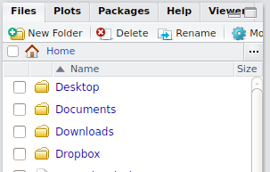

# Mi primer script{#Mi_primer_script}

Antes de empezar, crearemos una carpeta nueva. Para ello, podemos hacer **click en "New Folder"** en el panel que se encuentra abajo a la derecha. Llamaremos a la carpeta `R Workshop`. Usando el mismo panel, **entraremos en la carpeta haciendo doble click sobre ella.**

  
Como vimos antes, en la Consola de RStudio podemos lanzar comandos. Ahora trabajaremos con scripts (archivos de texto que contienen una secuencia de comandos). Para crear un script presiona las teclas: `Ctrl + Shift + N`  

Esto creará una pestaña llamada *Untitled1*. **Guarda el script `Ctrl + S` en la carpeta 'R Workshop'** que hemos creado.   

## Paso a paso
Desde el panel **Files** de RStudio:

1. Creamos nueva carpeta (**click en "New Folder"**) llamada 'R Workshop'  y entramos en ella 
2. Creamos un script: `Ctrl + Shift + N`
3. Guardamos el script `Ctrl + S` en la carpeta 'R Workshop' con el nombre 'Script1.R'


## Establecer nuestro directorio de trabajo
Cuando queramos trabajar con archivos, tenemos que decirle a R donde se encuentran estos. Lo más sencillo es establecer un directorio de trabajo. Para ello, podemos usar la función `setwd()` (de *set working directory*). 

1. Click en More en el panel de abajo a la derecha: 
2. Click en "Set As Working Directory"
3. En la Consola (abajo) aparecerá, en naranja, algo como `setwd("~/R workshop")`
4. Copia y pega esa linea de codigo a tu script. 
5. Borra el '> ' inicial.


## Nuestro primer script

Al finalizar, tendremos un archivo llamado 'Script1.R' en la carpeta 'R Workshop' con el contenido de más abajo. Siempre que creemos un script, empezaremos del mismo modo:
```{r}
# Cargamos librerias
if (!require('pacman')) install.packages('pacman'); library('pacman')
p_load(tidyverse)

# Establecemos directorio de trabajo
setwd("~/R workshop")

```