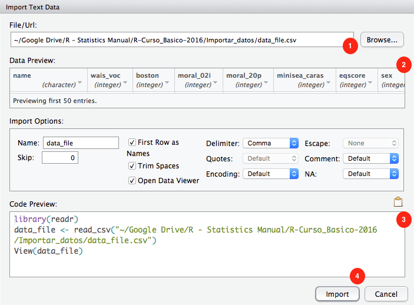

# Basics - Data types, import and export data


## Data types

### Data Frames

Los data frames nos permiten trabajar en el familiar formato de "hoja excel", combinando números, texto, etc. en la misma tabla.

### Matrices

Cuando trabajamos únicamente con datos numéricos, las matrices son el método más rápido.


### Listas

Las listas son una manera de almacenar datos muy potente pero cuya exploración puede resultar algo complicada. A continuación de puede ver una manera de visualizar interactivamente el contenido de una lista compleja.
```{r}
if (!require('pacman')) install.packages('pacman'); library('pacman')
# p_load(repurrrsive)
# listviewer::jsonedit(got_chars)
```


El paquete repurrrsive de Jenny Bryan, contiene algunas listas para usar como ejemplos. Ver su [Github](https://github.com/jennybc/repurrrsive) para más detalles, o mejor, su [página web](https://jennybc.github.io/purrr-tutorial/). Ésta contiene varios tutoriales muy interesantes.


## Import data


### From CSV file

***
Vamos a usar la siguiente [base de datos](Data/04-Data_types_import_export/Import_CSV.csv).

***

Tras descargar el archivo de arriba, lo **moveremos a nuestro directorio de trabajo 'R workshop'**. Una vez ahí, podemos usar alguna de las siguientes funciones para leer el archivo:

* `read_csv()` - comma separated values
* `read_csv2()` - semicolon separated values
* `read_delim( ,  delim = "|")` - values separated by an arbitrary delimiter


```{r, message=FALSE, warning=FALSE}
# Cargamos librerias
if (!require('pacman')) install.packages('pacman'); library('pacman')
p_load(tidyverse)

# Establecemos directorio de trabajo
setwd("R workshop")
``` 


```{r}
#Importar los datos
datos = read_csv("Data/04-Data_types_import_export/Import_CSV.csv")
    
#Muestra las primeras 10 observaciones
datos
```

En el panel 'Environment' veremos que aparece **datos**:  <BR><BR>
  

Haciendo click en **datos** abrimos una pestaña donde podemos ver el contenido de ese data frame. También podemos visualizarlo usando el codigo `View(datos)`  


### From XLS' file (Excel)

***
Vamos a usar la siguiente [base de datos](Data/04-Data_types_import_export/Import_XLS.xls).

***

```{r, message=FALSE, warning=FALSE}
# Cargamos librerias
if (!require('pacman')) install.packages('pacman'); library('pacman')
p_load(readxl)

# Establecemos directorio de trabajo
setwd("R workshop")
``` 

```{r}    
#Importar los datos
datos = read_excel("Data/04-Data_types_import_export/Import_XLS.xls")
    
#Muestra las primeras 10 observaciones
datos
```

### From SAV file (SPSS)

***
Vamos a usar la siguiente [base de datos](Data/04-Data_types_import_export/Import_SAV.sav).

***

```{r, message=FALSE, warning=FALSE}
# Cargamos librerias
if (!require('pacman')) install.packages('pacman'); library('pacman')
p_load(haven)

# Establecemos directorio de trabajo
setwd("R workshop")
```

```{r}
#Importar los datos
datos = read_sav("Data/04-Data_types_import_export/Import_SAV.sav")
    
#Muestra las primeras 10 observaciones
datos
```

### Import all files from a folder

***
Vamos a usar los siguientes [archivos](Data/04-Data_types_import_export/CSVs/CSVs.zip). Tendrás que descomprimirlos en una carpeta antes de usarlos.

***

```{r}
if (!require('pacman')) install.packages('pacman'); library('pacman')
p_load(tidyverse)

# We list all files in the desired folder
Path_Folder = "Data/04-Data_types_import_export/CSVs/"
file.list <- paste0(Path_Folder, list.files(Path_Folder)); file.list

# Read and bind all of them
    # We can use the function read_csv or any other
df = lapply(file.list, read_csv) %>% 
  bind_rows(.id = "ID")

df
```


### Import files using RStudio

***
Vamos a usar la siguiente [base de datos](Data/04-Data_types_import_export/Import_CSV.csv).

***

A partir de la version 1.0 de RStudio podemos importar archivos de datos usando la interfaz gráfica - **Panel Environment > Import Dataset**, arriba a la derecha. En cualquier caso, para que lo que hacemos sea reproducible, es recomendable trabajar con código.





## Export data

### Export data to CSV file

```{r}
# Carga libreria
if (!require('pacman')) install.packages('pacman'); library('pacman')
p_load(tidyverse)
    
# Volcamos datos a archivo
write_csv(datos, "Data/04-Data_types_import_export/Export_saved_file.csv")

```


