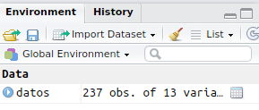

R - Statistics Manual
================
Center for Social and Cognitive Neuroscience - cscn.uai.cl
2018-08-27

# Introduction

Welcome to the **CSCN R Statistics manual**. In time, this will become a
centralized repository with snippets of code for some of the stuff we do
at the [Center for Social and Cognitive Neuroscience -
CSCN](http://cscn.uai.cl). Its primary intention is to become an (open)
**internal resource** for training, learning and increase our
efficiency. As such, **it is bound to be full of inacurate information
and horrible bugs**. Use at your own risk, *but do tell us about the
horrors you find*. Right now, there are tons of things [TODO](#todo-2).

Suggestions and contributions can be sent to: <gorka.navarrete@uai.cl>

## For USERS

The folder *R - Statistics Manual* can be copied and it *should* work as
it is. Just open the *index.html* file in a modern browser.

## For Developers and Statisticians

Please, **do contribute** your code, examples, ideas, criticisms,
improvements, simplifications, etc.

If you want to contribute code:

  - Do your best to follow [Hadley Wickham Style
    guide](http://adv-r.had.co.nz/Style.html)
  - Follow our **Style guide - WIP**
  - Use relative links
  - Thank you\!

## Contributors

Gorka Navarrete, Nicolas Carvajal-Sanchez, Alvaro Rivera, David Huepe,
Roberto Garcia

-----

## TODO

**MOVE THE STUFF BELOW THIS TO ITS PLACE\!**

### Inferential analysis

Here you will find a number of inferential analysis in alphabetical
order, and a table showing which ones would work depending on what kind
of IV / DV you have.  
In the analysis’ page you (normally) will find both the frequentist and
the Bayesian
versions.

#### Which analysis / graficos / tablas / should I use (?)

| DV/IV          | Continuous IV | Categorical IV | Dichotomous IV | Nominal IV |
| -------------- | ------------- | -------------- | -------------- | ---------- |
| Continuous DV  | …             | …              | …              | …          |
| Categorical DV | …             | …              | …              | …          |
| Dichotomous DV | …             | <sup>AST</sup> | …              | …          |
| Nominal DV     | …             | <sup>AST</sup> | …              | …          |

**Analysis**

Para cada analisis \* Assumptions \* Alternatives if failed assumptions
\* How to interpret results \* How to report results

  - Association test <sup>AST</sup> - [WIP](association-test.html):
    Comparison of two groups. Continuous DV
  - ANOVA [WIP](Estadistica-inferencial.html)

<!-- ## Regression -->

<!-- ### Loess regression -->

<!-- ### Logistic regression -->

<!-- *** -->

<!-- ## SEM -->

<!-- *** -->

<!-- # Bayesian -->

<!-- ## T-test -->

<!-- ## ANOVA -->

<!-- ## Regression -->

-----

**Plots**

  - [Asymmetric beanplot <sup>ABP</sup>](Visualizar-datos.html#beanplot)
  - [Density plot <sup>DEP</sup>](Visualizar-datos.html#density-plots)
  - [Pirate plot <sup>PIP</sup>](Visualizar-datos.html#Pirate-Plot)
  - [Scatter plot <sup>SCP</sup>](Visualizar-datos.html#scatterplot)
  - [Correlation plot
    <sup>COP</sup>](Visualizar-datos.html#correlation-plot)

| Plots                                                                                                                                                                       |                                                                                                                                                                 |
| --------------------------------------------------------------------------------------------------------------------------------------------------------------------------- | --------------------------------------------------------------------------------------------------------------------------------------------------------------- |
|  [**Asymmetric beanplots** <BR>Show smothed histograms for an easy comparison between conditions.](Visualizar-datos.html#beanplot) |  [**Pirate plots** <BR>Show all the data points, smothed histogram, mean/median and SD/CI.](Visualizar-datos.html#Pirate-Plot) |
|  [**Density plot** <BR>Publication ready density plots.](Visualizar-datos.html#density-plots)                                             |  [**Scatter plot** <BR> Scatter plots with confidence interval.](Visualizar-datos.html#scatterplot)                           |
|  [**Correlation plot** <BR> Correlatons\!](Visualizar-datos.html#correlation-plot)                                                    |  [**Scatter plot** <BR> Relationship between 3 variables](Visualizar-datos.html#scatterplot-con-3-variables)                 |

#### Learn more about Data visualization

<http://r4ds.had.co.nz/data-visualisation.html>

<!--chapter:end:index.Rmd-->

# Empezando en A-B-C

Para poder iniciar el workshop necesitamos tener R y RStudio instalados,
además de algunas librerias. **Para tener un sistema funcional, completa
los pasos A, B y C.**

## **(A)** Instalar R.

[R](https://www.r-project.org/), es un lenguaje de programación
especializado en el computación estadística y visualización de datos. Es
recomendable [descargar e instalar la última versión de
R](http://dirichlet.mat.puc.cl/). Para instalar la última versión de R,
puedes usar uno de los enlaces siguientes:

  - **Windows**: [Descargar e instalar R para
    Windows](https://cran.r-project.org/bin/windows/base/)  
  - **Mac**: [Descargar e instalar R para
    Mac](https://cran.r-project.org/bin/macosx/)  
  - **Ubuntu Linux**: [más detalles en la web de
    R](https://cran.r-project.org/bin/linux/debian/). En un terminal:
      - `sudo apt-get install r-base`
      - `sudo apt-get install libxml2-dev r-cran-rjava
        libcurl4-gnutls-dev libgsl0-dev libssl-dev libatlas3-base` \#
        Otras librerias
        <!-- TODO: Definir librerias minimas necesarias en ubuntu -->

## **(B)** Instalar RStudio.

RStudio es un entorno integrado de desarrollo (IDE) para la programación
R la cual proporciona una interfaz más amable para el usuario, además de
numerosas funcionalidades.

  - [Descargar e instalar RStudio](http://www.rstudio.com/download).
  - Una vez descargado e instalado, **abre** RStudio. Deberías ver algo
    parecido a lo siguiente:


## Instalar Packages

También será necesario instalar algunos paquetes. Estos son una
colección de funciones, datos y documentación que amplian las
capacidacidades basicas de R. Empezando 2017, el numero de paquetes en
R-cran ha superado los 10,000. Gran parte de las funciones y paquetes
que utilizaremos en este tutorial se encuentran contenidas en el
meta-paquete “tideverse” (este es un paquete de paquetes). Para
instalarlo solo debes ejecutar la siguiente linea en la **consola** de
RStudio ((1) en la imagen de arriba):

  - **Copia y pega la linea de abajo en la consola de R Studio.
    Ejecutala con la tecla ENTER**: `install.packages("tidyverse")`

Si desea instalar otro paquete diferente de “tideverse” solo debe
remplazar su nombre entre comillas dentro de la funcion
`install.packages()`. Tambien es importante saber que una vez instalado
un paquete, no es necesario volver hacerlo, a menos que reinstales R.

## Cargar Packages

Las funciones, datos y documentación dentro de nuestros paquetes no
podran ser utilizadas hasta que se cargen en R. Para cargar los packages
utilizaremos la siguiente función:

``` r
library(pacman)
```

## Todo en uno

El siguiente código permite resumir la instalación y la carga de un
package determinado. En este caso, el codigo primero comprueba primero
si el package se encuentra ya instalado; Si no se encuentra instalado,
lo instala. Finalmente lo carga.

``` r
if (!require('pacman')) install.packages('pacman'); library('pacman')
```

## **(C)** Librerias para el workshop

Usaremos las siguientes librerias: tidyverse, psych, lavaan, semTools,
semPlot, yarrr, ggpubr, corrplot, beanplot…  
El paquete pacman contiene una función llamada p\_load(), que permite
hacer lo de arriba automaticamente. También tiene una función llamada
`p_install_gh` que nos permite instalar directamente la versión en
desarrollo del paquete desde [Github](https://github.com/).

**Copia y pega el codigo de abajo y ejecutalo \[tecla ENTER\] en la
consola de R Studio.** La función p\_load() se encargará de todo por
nosotros. El proceso de instalación requiere internet y durará unos
minutos.

``` r
if (!require('pacman')) install.packages('pacman'); library('pacman')
p_load(tidyverse, tidyverse, lavaan, yarrr, semTools, corrplot, reshape2, stringr, psych, ggpubr, corrplot, beanplot)

# Instalamos la version del desarrollador desde Github: https://github.com/SachaEpskamp/semPlot
p_install_gh("SachaEpskamp/semPlot")
```

<!--chapter:end:Chapters/01-Starting.Rmd-->

# Mi primer script

Antes de empezar, crearemos una carpeta nueva. Para ello, podemos hacer
**click en “New Folder”** en el panel que se encuentra abajo a la
derecha. Llamaremos a la carpeta `R Workshop`. Usando el mismo panel,
**entraremos en la carpeta haciendo doble click sobre ella.**

  
Como vimos antes, en la Consola de RStudio podemos lanzar comandos.
Ahora trabajaremos con scripts (archivos de texto que contienen una
secuencia de comandos). Para crear un script presiona las teclas: `Ctrl
+ Shift + N`

Esto creará una pestaña llamada *Untitled1*. **Guarda el script `Ctrl +
S` en la carpeta ‘R Workshop’** que hemos creado.

## Paso a paso

Desde el panel **Files** de RStudio:

1.  Creamos nueva carpeta (**click en “New Folder”**) llamada ‘R
    Workshop’ y entramos en ella
2.  Creamos un script: `Ctrl + Shift + N`
3.  Guardamos el script `Ctrl + S` en la carpeta ‘R Workshop’ con el
    nombre ‘Script1.R’

## Establecer nuestro directorio de trabajo

Cuando queramos trabajar con archivos, tenemos que decirle a R donde se
encuentran estos. Lo más sencillo es establecer un directorio de
trabajo. Para ello, podemos usar la función `setwd()` (de *set working
directory*).

**IMPORTANTE: Alguna gente recomienda NO establecer directorios de
trabajo, sino trabajar con proyectos de RStudio. La ventaja de estos
últimos es que se puede compartir la carpeta con otras personas y los
scripts funcionaran sin tener que hacer cambios. **

1.  Click en More en el panel de abajo a la derecha:
    
2.  Click en “Set As Working Directory”
3.  En la Consola (abajo) aparecerá, en naranja, algo como `setwd("~/R
    workshop")`
4.  Copia y pega esa linea de codigo a tu script.
5.  Borra el ‘\>’ inicial.

## Nuestro primer script

Al finalizar, tendremos un archivo llamado ‘Script1.R’ en la carpeta ‘R
Workshop’ con el contenido de más abajo. Siempre que creemos un script,
empezaremos del mismo modo:

Mucha gente recomienda NO usar la funcion setwd(), y en su lugar, crear
proyectos de RStudio.

``` r
# Cargamos librerias
if (!require('pacman')) install.packages('pacman'); library('pacman')
p_load(tidyverse)

# Establecemos directorio de trabajo
  # En lugar de esto, trabajar con proyectos.
  # setwd("R workshop")
```

<!--chapter:end:Chapters/02-My_first_script.Rmd-->

# Conseguir ayuda y aprender más

## Cuando sabemos que función usar, pero dudamos de la sintaxis:

Podemos usar la funcion `help()` o podemos hacer click sobre la función
y presionar la tecla F1. Por ejemplo, si queremos usar la función
`summary()` pero dudamos sobre como usarla…

``` r
# Ejemplo para la función summary()
help(summary)
```

## Cuando sabemos lo que queremos hacer pero no la función que debemos usar:

  - Buscar en [Stackoverflow](http://stackoverflow.com)
  - Buscar en google **en ingles\!**: ej. long to wide R
  - RStudio \> Help \> Cheatsheets

-----

## Libros y Web recomendados

### Hadley Wickham’s books

Del creador del tidyverse:


  - [Advanced R](http://adv-r.had.co.nz/)
  - [R for data science](http://r4ds.had.co.nz/)

### Learning statistics with R

Universidad de Adelaide:

  - [Learning statistics with
    R](https://health.adelaide.edu.au/psychology/ccs/teaching/lsr/)

### Pirate guide to R

  - [Pirate guide to
    R](http://nathanieldphillips.com/thepiratesguidetor/)

### Plots

  - [Gallery of plots](http://www.r-graph-gallery.com/all-graphs/)
  - [Ggplot2 Cheatsheet
    - 2016](https://www.rstudio.com/wp-content/uploads/2016/11/ggplot2-cheatsheet-2.1.pdf)
  - [Chartmaker](http://chartmaker.visualisingdata.com/)

### Other references

  - <https://www.r-bloggers.com/>
  - <https://github.com/>
  - <http://www.statmethods.net/>
  - <http://www.sthda.com/english/wiki/ggpubr-r-package-ggplot2-based-publication-ready-plots>  
  - <http://shinyapps.org/apps/RGraphCompendium/index.php>
  - <https://ismayc.github.io/moderndiver-book/>

### Twitter

  - @hadleywickham
  - …

<!--chapter:end:Chapters/03-Getting_help.Rmd-->

# Basics - Data types, import and export data

## Data types

### Data Frames

Los data frames nos permiten trabajar en el familiar formato de “hoja
excel”, combinando números, texto, etc. en la misma tabla.

### Matrices

Cuando trabajamos únicamente con datos numéricos, las matrices son el
método más rápido.

### Listas

Las listas son una manera de almacenar datos muy potente pero cuya
exploración puede resultar algo complicada. A continuación de puede ver
una manera de visualizar interactivamente el contenido de una lista
compleja.

``` r
if (!require('pacman')) install.packages('pacman'); library('pacman')
# p_load(repurrrsive)
# listviewer::jsonedit(got_chars)
```

El paquete repurrrsive de Jenny Bryan, contiene algunas listas para usar
como ejemplos. Ver su [Github](https://github.com/jennybc/repurrrsive)
para más detalles, o mejor, su [página
web](https://jennybc.github.io/purrr-tutorial/). Ésta contiene varios
tutoriales muy interesantes.

## Import data

### From CSV file

-----

Vamos a usar la siguiente [base de
datos](Data/04-Data_types_import_export/Import_CSV.csv).

-----

Tras descargar el archivo de arriba, lo **moveremos a nuestro directorio
de trabajo ‘R workshop’**. Una vez ahí, podemos usar alguna de las
siguientes funciones para leer el archivo:

  - `read_csv()` - comma separated values
  - `read_csv2()` - semicolon separated values
  - `read_delim( , delim = "|")` - values separated by an arbitrary
    delimiter

<!-- end list -->

``` r
# Cargamos librerias
if (!require('pacman')) install.packages('pacman'); library('pacman')
p_load(tidyverse)

# Establecemos directorio de trabajo
# setwd("R workshop")

#Importar los datos
datos = read_csv("Data/04-Data_types_import_export/Import_CSV.csv")
    
#Muestra las primeras 10 observaciones
datos
```

    ## # A tibble: 103 x 8
    ##       X1    ID Genero  Edad Educacion FollowUP condition PPV_DECLARED
    ##    <int> <int>  <int> <int>     <int>    <int> <chr>            <int>
    ##  1     4 41904      1    47         8       80 PPV_Cond1           99
    ##  2     5 95041      2    21         6       90 PPV_Cond1           99
    ##  3     6 74594      2    29         6       10 PPV_Cond1           99
    ##  4    15 72903      2    27         7       75 PPV_Cond1            1
    ##  5    16 21260      1    29         5       35 PPV_Cond1           24
    ##  6    18 50315      2    28         6       14 PPV_Cond1           99
    ##  7    19 21774      2    27         4        2 PPV_Cond1           99
    ##  8    20 20881      2    55         6       89 PPV_Cond1           99
    ##  9    21 39751      2    28         6        6 PPV_Cond1           99
    ## 10    22 99384      1    46         5        0 PPV_Cond1            1
    ## # ... with 93 more rows

En el panel ‘Environment’ veremos que aparece **datos**: <BR><BR>


Haciendo click en **datos** abrimos una pestaña donde podemos ver el
contenido de ese data frame. También podemos visualizarlo usando el
codigo `View(datos)`

### From XLS’ file (Excel)

-----

Vamos a usar la siguiente [base de
datos](Data/04-Data_types_import_export/Import_XLS.xls).

-----

``` r
# Cargamos librerias
if (!require('pacman')) install.packages('pacman'); library('pacman')
p_load(readxl)

# Establecemos directorio de trabajo
# setwd("R workshop")

#Importar los datos
datos = read_excel("Data/04-Data_types_import_export/Import_XLS.xls")
    
#Muestra las primeras 10 observaciones
datos
```

    ## # A tibble: 237 x 13
    ##     name wais_voc boston moral_02i moral_20p minisea_caras eqscore   sex
    ##    <dbl>    <dbl>  <dbl>     <dbl>     <dbl>         <dbl>   <dbl> <dbl>
    ##  1     1       34     28         1         1            29      63     0
    ##  2     2       13     23        NA         0            23      55     0
    ##  3     3       20     16         1         1            26      27     0
    ##  4     4       24     23         1         1            21      33     0
    ##  5     5       20     24         1         1            18      35     1
    ##  6     6        2      3         0         0            23      38    NA
    ##  7     7       13     15         1        NA            19      38     0
    ##  8     8       27     18         1         0            15      42     1
    ##  9     9       37     28         1         0            23      36     0
    ## 10    10       27     24         0         0            20      51     1
    ## # ... with 227 more rows, and 5 more variables: age <dbl>, wais_mp <dbl>,
    ## #   eyes <dbl>, sass_score <dbl>, ifs_score <dbl>

### From SAV file (SPSS)

-----

Vamos a usar la siguiente [base de
datos](Data/04-Data_types_import_export/Import_SAV.sav).

-----

``` r
# Cargamos librerias
if (!require('pacman')) install.packages('pacman'); library('pacman')
p_load(haven)

# Establecemos directorio de trabajo
# setwd("R workshop")


#Importar los datos
datos = read_sav("Data/04-Data_types_import_export/Import_SAV.sav")
    
#Muestra las primeras 10 observaciones
datos
```

    ## # A tibble: 237 x 13
    ##       ID wais_voc boston moral_02i moral_20p minisea_caras eqscore   sex
    ##    <dbl>    <dbl>  <dbl>     <dbl>     <dbl>         <dbl>   <dbl> <dbl>
    ##  1     1       34     28         1         1            29      63     0
    ##  2     2       13     23        NA         0            23      55     0
    ##  3     3       20     16         1         1            26      27     0
    ##  4     4       24     23         1         1            21      33     0
    ##  5     5       20     24         1         1            18      35     1
    ##  6     6        2      3         0         0            23      38    NA
    ##  7     7       13     15         1        NA            19      38     0
    ##  8     8       27     18         1         0            15      42     1
    ##  9     9       37     28         1         0            23      36     0
    ## 10    10       27     24         0         0            20      51     1
    ## # ... with 227 more rows, and 5 more variables: age <dbl>, wais_mp <dbl>,
    ## #   eyes <dbl>, sass_score <dbl>, ifs_score <dbl>

### Import all files from a folder

-----

Vamos a usar los siguientes
[archivos](Data/04-Data_types_import_export/CSVs/CSVs.zip). Tendrás que
descomprimirlos en una carpeta antes de usarlos.

-----

#### Using purrr

From:
<https://gist.github.com/ColinFay/d74d331825868b181860212cd1577b69> by
`@_ColinFay`

``` r
library(tidyverse)
files <- list.files("Data/04-Data_types_import_export/CSVs", pattern = "^0", full.names = TRUE)
full <- map_df(files, read_csv)
dplyr::glimpse(full)
```

    ## Observations: 1,200
    ## Variables: 9
    ## $ Sex       <chr> "male", "male", "male", "male", "male", "male", "mal...
    ## $ Priming   <chr> "Collective", "Collective", "Collective", "Collectiv...
    ## $ trialN    <int> 1, 2, 3, 4, 5, 6, 7, 8, 9, 10, 11, 12, 13, 14, 15, 1...
    ## $ Block     <chr> "we", "we", "we", "we", "we", "we", "we", "we", "we"...
    ## $ Adjective <chr> "ofensivo", "resentido", "ego�sta", "indiscreto", "s...
    ## $ Valence   <chr> "negative", "negative", "negative", "negative", "neg...
    ## $ Answer    <chr> "yes", "no", "yes", "yes", "yes", "yes", "yes", "yes...
    ## $ Arrow     <chr> "left", "right", "left", "left", "left", "left", "le...
    ## $ rT        <int> 623, 1235, 335, 355, 618, 328, 348, 1620, 346, 778, ...

``` r
# Including filenames in a column 
files <- list.files("Data/04-Data_types_import_export/CSVs", pattern = "^0", full.names = TRUE) %>% 
  set_names(basename(.))
full2 <- map_df(files, read_csv, .id = "file")
full2
```

    ## # A tibble: 1,200 x 10
    ##    file   Sex   Priming  trialN Block Adjective Valence Answer Arrow    rT
    ##    <chr>  <chr> <chr>     <int> <chr> <chr>     <chr>   <chr>  <chr> <int>
    ##  1 01.csv male  Collect…      1 we    ofensivo  negati… yes    left    623
    ##  2 01.csv male  Collect…      2 we    resentido negati… no     right  1235
    ##  3 01.csv male  Collect…      3 we    ego�sta   negati… yes    left    335
    ##  4 01.csv male  Collect…      4 we    indiscre… negati… yes    left    355
    ##  5 01.csv male  Collect…      5 we    sumiso    negati… yes    left    618
    ##  6 01.csv male  Collect…      6 we    agradable positi… yes    left    328
    ##  7 01.csv male  Collect…      7 we    clasista  negati… yes    left    348
    ##  8 01.csv male  Collect…      8 we    altruista positi… yes    left   1620
    ##  9 01.csv male  Collect…      9 we    ansioso   negati… yes    left    346
    ## 10 01.csv male  Collect…     10 we    presumido negati… yes    left    778
    ## # ... with 1,190 more rows

#### Traditional way

``` r
if (!require('pacman')) install.packages('pacman'); library('pacman')
p_load(tidyverse)

# We list all files in the desired folder
Path_Folder = "Data/04-Data_types_import_export/CSVs/"
file.list <- paste0(Path_Folder, list.files(Path_Folder)); file.list
```

    ## [1] "Data/04-Data_types_import_export/CSVs/01.csv"  
    ## [2] "Data/04-Data_types_import_export/CSVs/02.csv"  
    ## [3] "Data/04-Data_types_import_export/CSVs/03.csv"  
    ## [4] "Data/04-Data_types_import_export/CSVs/CSVs.zip"

``` r
# Method 1

# Read and bind all of them
    # We can use the function read_csv or any other
df = lapply(file.list, read_csv) %>% 
  bind_rows(.id = "ID")

df
```

    ## # A tibble: 1,600 x 10
    ##    ID    Sex   Priming   trialN Block Adjective Valence Answer Arrow    rT
    ##    <chr> <chr> <chr>      <int> <chr> <chr>     <chr>   <chr>  <chr> <int>
    ##  1 1     male  Collecti…      1 we    ofensivo  negati… yes    left    623
    ##  2 1     male  Collecti…      2 we    resentido negati… no     right  1235
    ##  3 1     male  Collecti…      3 we    ego�sta   negati… yes    left    335
    ##  4 1     male  Collecti…      4 we    indiscre… negati… yes    left    355
    ##  5 1     male  Collecti…      5 we    sumiso    negati… yes    left    618
    ##  6 1     male  Collecti…      6 we    agradable positi… yes    left    328
    ##  7 1     male  Collecti…      7 we    clasista  negati… yes    left    348
    ##  8 1     male  Collecti…      8 we    altruista positi… yes    left   1620
    ##  9 1     male  Collecti…      9 we    ansioso   negati… yes    left    346
    ## 10 1     male  Collecti…     10 we    presumido negati… yes    left    778
    ## # ... with 1,590 more rows

``` r
# Method 2
df = do.call(rbind, lapply(file.list, function(x) read_csv(x)))
      #%>% select(Rut, Nota, Prueba))) # We can add this if we have a set of common columns

df
```

    ## # A tibble: 1,600 x 9
    ##    Sex   Priming    trialN Block Adjective  Valence  Answer Arrow    rT
    ##    <chr> <chr>       <int> <chr> <chr>      <chr>    <chr>  <chr> <int>
    ##  1 male  Collective      1 we    ofensivo   negative yes    left    623
    ##  2 male  Collective      2 we    resentido  negative no     right  1235
    ##  3 male  Collective      3 we    ego�sta    negative yes    left    335
    ##  4 male  Collective      4 we    indiscreto negative yes    left    355
    ##  5 male  Collective      5 we    sumiso     negative yes    left    618
    ##  6 male  Collective      6 we    agradable  positive yes    left    328
    ##  7 male  Collective      7 we    clasista   negative yes    left    348
    ##  8 male  Collective      8 we    altruista  positive yes    left   1620
    ##  9 male  Collective      9 we    ansioso    negative yes    left    346
    ## 10 male  Collective     10 we    presumido  negative yes    left    778
    ## # ... with 1,590 more rows

### Import files using RStudio

-----

Vamos a usar la siguiente [base de
datos](Data/04-Data_types_import_export/Import_CSV.csv).

-----

A partir de la version 1.0 de RStudio podemos importar archivos de datos
usando la interfaz gráfica - **Panel Environment \> Import Dataset**,
arriba a la derecha. En cualquier caso, para que lo que hacemos sea
reproducible, es recomendable trabajar con código.


## Export data

### Export data to CSV file

``` r
# Carga libreria
if (!require('pacman')) install.packages('pacman'); library('pacman')
p_load(tidyverse)
    
# Volcamos datos a archivo
write_csv(datos, "Data/04-Data_types_import_export/Export_saved_file.csv")
```

<!--chapter:end:Chapters/04-Data_types_import_export.Rmd-->

# Manipular datos

-----

**TODO** \* Ver [Data Processing with dplyr &
tidyr](https://rpubs.com/bradleyboehmke/data_wrangling). Hay algunas
buenas ideas ahi que nos deberian servir para mejorar nuestro documento.

  - Preparar un Long to wide que no venga desde wide. Ver ejemplo de
    Experimento 1 Fondecyt 2015 G. Cuando se pasa de long a wide quedan
    muchos NAs, hay q haccer summarise?

-----

-----

  - Vamos a usar la siguiente [base de
    datos](Data/05-Manipulate_data/Manipulate_data_1.csv).

-----

Cargamos librerias

``` r
if (!require('pacman')) install.packages('pacman'); library('pacman')
p_load(tidyverse, stringr)
```

## Leer y guardar datos

### Leer datos

``` r
raw_data = read_csv("Data/05-Manipulate_data/Manipulate_data_1.csv"); raw_data
```

    ## # A tibble: 30 x 11
    ##       ID `Columna basura`  Sexo  Edad   VI1   VI2   VI3 VI1_t VI2_t VI3_t
    ##    <int> <chr>            <int> <int> <int> <int> <int> <int> <int> <int>
    ##  1     1 xx                   0    26    98    29    19  2398  7432   404
    ##  2     2 yy                   0    33    15    35     4  4893  9918   394
    ##  3     3 xx                   1    37     7     6     3  4099  6518   304
    ##  4     4 yy                   1    19    59    32    14  1792  9476   149
    ##  5     5 zz                   0    29    65    12    17  3280  3438    18
    ##  6     6 xx                   1    34    43    17     7  1350   433   168
    ##  7     7 yy                   0    21     8    32     1  3405  1265   413
    ##  8     8 zz                   0    35    93    12    17  1014  8018    50
    ##  9     9 xx                   0    23    81    42     8   516   548   491
    ## 10    10 yy                   1    19    41    42    18  2232  6105   227
    ## # ... with 20 more rows, and 1 more variable: Composited_var <chr>

### Guardar DB a archivo

``` r
write_csv(raw_data, "Data/05-Manipulate_data/Manipulate_saved_data.csv")
```

## Ver output vs asignar output

Cuando usamos `=` o `<-` asignamos lo que ocurre a la derecha a la
variable de la izquierda. En caso contrario, simplemente vemos el
output, pero sin asignarlo.

``` r
# Creamos la variable temp para no sobreescribir raw_data
temp = raw_data
    
# Seleccionamos la columna "Columna basura", pero sin "guardar" el resultado
temp %>% select(`Columna basura`)
```

    ## # A tibble: 30 x 1
    ##    `Columna basura`
    ##    <chr>           
    ##  1 xx              
    ##  2 yy              
    ##  3 xx              
    ##  4 yy              
    ##  5 zz              
    ##  6 xx              
    ##  7 yy              
    ##  8 zz              
    ##  9 xx              
    ## 10 yy              
    ## # ... with 20 more rows

``` r
# temp no ha cambiado
temp
```

    ## # A tibble: 30 x 11
    ##       ID `Columna basura`  Sexo  Edad   VI1   VI2   VI3 VI1_t VI2_t VI3_t
    ##    <int> <chr>            <int> <int> <int> <int> <int> <int> <int> <int>
    ##  1     1 xx                   0    26    98    29    19  2398  7432   404
    ##  2     2 yy                   0    33    15    35     4  4893  9918   394
    ##  3     3 xx                   1    37     7     6     3  4099  6518   304
    ##  4     4 yy                   1    19    59    32    14  1792  9476   149
    ##  5     5 zz                   0    29    65    12    17  3280  3438    18
    ##  6     6 xx                   1    34    43    17     7  1350   433   168
    ##  7     7 yy                   0    21     8    32     1  3405  1265   413
    ##  8     8 zz                   0    35    93    12    17  1014  8018    50
    ##  9     9 xx                   0    23    81    42     8   516   548   491
    ## 10    10 yy                   1    19    41    42    18  2232  6105   227
    ## # ... with 20 more rows, and 1 more variable: Composited_var <chr>

``` r
# Lo mismo de antes pero ahora con "temp =" lo que hace que guardemos el resultado en "temp" 
temp = temp %>% select(`Columna basura`)
  
# temp ha cambiado
temp
```

    ## # A tibble: 30 x 1
    ##    `Columna basura`
    ##    <chr>           
    ##  1 xx              
    ##  2 yy              
    ##  3 xx              
    ##  4 yy              
    ##  5 zz              
    ##  6 xx              
    ##  7 yy              
    ##  8 zz              
    ##  9 xx              
    ## 10 yy              
    ## # ... with 20 more rows

## Verbos de dplyr

**TODO: ORDENAR SECCION PARA QUE SEA COHERENTE CON TABLA **  
dplyr es un conjunto de funciones que nos permiten manipular los datos
de manera relativamente sencilla y con una sintaxis muy legible. Con
dplyr usamos el operador `%>%` que es una “tubería” que traslada lo que
esta a su izquierda hacia la derecha. Esto permite concatenar multiples
funciones (verbos) y realizar operaciones muy complejas en un solo
“paso” y con una sintaxis facil de
leer.

| Tarea                          | Función                | Ejemplo                                                                  |
| ------------------------------ | ---------------------- | ------------------------------------------------------------------------ |
| Filtrar                        | filter()               | `datos %>% filter(Sexo == 1)`                                            |
| Ordenar                        | arrange()              | `datos %>% arrange(Sexo)`                                                |
| Seleccionar/eliminar variables | select()               | `datos %>% select(-Sexo)`                                                |
| Renombrar variables            | rename()               | `datos %>% rename(Genero = Sexo)`                                        |
| Separate contents of variable  | separate()             | `datos %>% separate(Composited_var, c("First", "Second"), sep = "_")`    |
| Extraer valores únicos         | distinct()             | `datos %>% distinct(Edad, .keep_all = T)`                                |
| Crear/modificar variables      | mutate()               | `datos %>% mutate(Viejuno = Edad > 30)`                                  |
| Omitir NAs                     | na.omit() o drop\_na() | `datos %>% drop_na(Sexo)`                                                |
| Wide to long                   | gather()               | `datos %>% gather(Condition, VD, 4:6)`                                   |
| Long to wide                   | spread()               | `datos %>% spread(Condition, VD)`                                        |
| Combinar bases de datos        | left\_join()           | `left_join(datos1, datos2, by = "ID")`                                   |
| Recodificar valores            | ifelse()               | `datos %>% mutate(Edad = ifelse ( Edad > 30, "Viejuno", "Pipiolo"))`     |
| Recodificar valores            | case\_when()           | `datos %>% mutate(Edad = case_when(.$Edad > 30 ~ "Viejuno", "Pipiolo))"` |

### Filtrar datos

``` r
# Nos quedamos solo con Sexo == 1
raw_data %>% filter(Sexo == 1) 
```

    ## # A tibble: 18 x 11
    ##       ID `Columna basura`  Sexo  Edad   VI1   VI2   VI3 VI1_t VI2_t VI3_t
    ##    <int> <chr>            <int> <int> <int> <int> <int> <int> <int> <int>
    ##  1     3 xx                   1    37     7     6     3  4099  6518   304
    ##  2     4 yy                   1    19    59    32    14  1792  9476   149
    ##  3     6 xx                   1    34    43    17     7  1350   433   168
    ##  4    10 yy                   1    19    41    42    18  2232  6105   227
    ##  5    12 xx                   1    27    23    40    19  4407  3987   141
    ##  6    15 xx                   1    20    61     1    15  2140  3305   168
    ##  7    16 yy                   1    21    99     3    16   679  7278   401
    ##  8    17 zz                   1    30    70     3     3  4902  1229   435
    ##  9    18 xx                   1    20    65     5    13  4846  3906    13
    ## 10    19 yy                   1    23    96    15     5  4076  5883   369
    ## 11    20 zz                   1    28    68    12     5   863   847   335
    ## 12    21 xx                   1    23    67    45     4  3368  8611   295
    ## 13    22 yy                   1    32    78     8    11  3311  7164   333
    ## 14    23 zz                   1    28    25    12     8  3558   617    98
    ## 15    24 xx                   1    25    72    48     6  1917  2501   310
    ## 16    25 yy                   1    28    53    34    14  1974   582   493
    ## 17    27 xx                   1    22    68    44     2   537  6455    88
    ## 18    30 xx                   1    35    87    18     5  1682  8256   405
    ## # ... with 1 more variable: Composited_var <chr>

``` r
# Filtramos por sexo, edad, y Tiempo
raw_data %>% filter(Sexo == 1, Edad  > 25, VI1_t < mean(VI1_t)) 
```

    ## # A tibble: 4 x 11
    ##      ID `Columna basura`  Sexo  Edad   VI1   VI2   VI3 VI1_t VI2_t VI3_t
    ##   <int> <chr>            <int> <int> <int> <int> <int> <int> <int> <int>
    ## 1     6 xx                   1    34    43    17     7  1350   433   168
    ## 2    20 zz                   1    28    68    12     5   863   847   335
    ## 3    25 yy                   1    28    53    34    14  1974   582   493
    ## 4    30 xx                   1    35    87    18     5  1682  8256   405
    ## # ... with 1 more variable: Composited_var <chr>

``` r
# Filtramos aquellas respuestas que se han dado 2.5 desviaciones tipicas por encima o debajo de la media
raw_data %>% filter(
  VI1 < mean(VI1) + 2.5 * sd(VI1),
  VI1 > mean(VI1) - 2.5 * sd(VI1)
  ) 
```

    ## # A tibble: 30 x 11
    ##       ID `Columna basura`  Sexo  Edad   VI1   VI2   VI3 VI1_t VI2_t VI3_t
    ##    <int> <chr>            <int> <int> <int> <int> <int> <int> <int> <int>
    ##  1     1 xx                   0    26    98    29    19  2398  7432   404
    ##  2     2 yy                   0    33    15    35     4  4893  9918   394
    ##  3     3 xx                   1    37     7     6     3  4099  6518   304
    ##  4     4 yy                   1    19    59    32    14  1792  9476   149
    ##  5     5 zz                   0    29    65    12    17  3280  3438    18
    ##  6     6 xx                   1    34    43    17     7  1350   433   168
    ##  7     7 yy                   0    21     8    32     1  3405  1265   413
    ##  8     8 zz                   0    35    93    12    17  1014  8018    50
    ##  9     9 xx                   0    23    81    42     8   516   548   491
    ## 10    10 yy                   1    19    41    42    18  2232  6105   227
    ## # ... with 20 more rows, and 1 more variable: Composited_var <chr>

``` r
# Filtrar filas donde aparece determinado texto
raw_data %>% filter(str_detect(`Columna basura`, "zz"))
```

    ## # A tibble: 9 x 11
    ##      ID `Columna basura`  Sexo  Edad   VI1   VI2   VI3 VI1_t VI2_t VI3_t
    ##   <int> <chr>            <int> <int> <int> <int> <int> <int> <int> <int>
    ## 1     5 zz                   0    29    65    12    17  3280  3438    18
    ## 2     8 zz                   0    35    93    12    17  1014  8018    50
    ## 3    11 zz                   0    23    51    45    12  2629  6950   464
    ## 4    14 zz                   0    27    89     9     7  1897  9155    80
    ## 5    17 zz                   1    30    70     3     3  4902  1229   435
    ## 6    20 zz                   1    28    68    12     5   863   847   335
    ## 7    23 zz                   1    28    25    12     8  3558   617    98
    ## 8    26 zz                   0    21    83    26     6  3305  6470   318
    ## 9    29 zz                   0    37    88    12    11  4546  5188   380
    ## # ... with 1 more variable: Composited_var <chr>

### Ordenar DB

``` r
#raw_data %>% arrange(desc(Edad))
raw_data %>% arrange(Edad, Sexo) 
```

    ## # A tibble: 30 x 11
    ##       ID `Columna basura`  Sexo  Edad   VI1   VI2   VI3 VI1_t VI2_t VI3_t
    ##    <int> <chr>            <int> <int> <int> <int> <int> <int> <int> <int>
    ##  1     4 yy                   1    19    59    32    14  1792  9476   149
    ##  2    10 yy                   1    19    41    42    18  2232  6105   227
    ##  3    13 yy                   0    20    24    41     0  4680   192   195
    ##  4    28 yy                   0    20    25     2     2   964  1484    35
    ##  5    15 xx                   1    20    61     1    15  2140  3305   168
    ##  6    18 xx                   1    20    65     5    13  4846  3906    13
    ##  7     7 yy                   0    21     8    32     1  3405  1265   413
    ##  8    26 zz                   0    21    83    26     6  3305  6470   318
    ##  9    16 yy                   1    21    99     3    16   679  7278   401
    ## 10    27 xx                   1    22    68    44     2   537  6455    88
    ## # ... with 20 more rows, and 1 more variable: Composited_var <chr>

### Seleccionar variables

``` r
# Seleccionamos varias columnas
raw_data %>% select(ID, Sexo, Edad, VI1)
```

    ## # A tibble: 30 x 4
    ##       ID  Sexo  Edad   VI1
    ##    <int> <int> <int> <int>
    ##  1     1     0    26    98
    ##  2     2     0    33    15
    ##  3     3     1    37     7
    ##  4     4     1    19    59
    ##  5     5     0    29    65
    ##  6     6     1    34    43
    ##  7     7     0    21     8
    ##  8     8     0    35    93
    ##  9     9     0    23    81
    ## 10    10     1    19    41
    ## # ... with 20 more rows

``` r
# Podemos usar el número de columna    
raw_data %>% select(1,3:4)
```

    ## # A tibble: 30 x 3
    ##       ID  Sexo  Edad
    ##    <int> <int> <int>
    ##  1     1     0    26
    ##  2     2     0    33
    ##  3     3     1    37
    ##  4     4     1    19
    ##  5     5     0    29
    ##  6     6     1    34
    ##  7     7     0    21
    ##  8     8     0    35
    ##  9     9     0    23
    ## 10    10     1    19
    ## # ... with 20 more rows

<BR> Para seleccionar varias columnas rapidamente usaremos la subfunción
de select(), `matches()`. En esta podemos usar algo llamado [Regular
Expressions](http://www.zytrax.com/tech/web/regex.htm), cuyo poder y
dificultad es infinito. Ver por ejemplo, una expresión regular para
validar numeros romanos:
`^M{0,4}(CM|CD|D?C{0,3})(XC|XL|L?X{0,3})(IX|IV|V?I{0,3})$`


Nosotros usaremos la versión para todos los públicos, en la que
simplemente indicaremos un fragmento de texto que buscar en los títulos
de las columnas de nuestro data frame.

``` r
# Seleccionamos las columnas que nos interesan usando matches()
datos = raw_data %>% select(ID, Sexo, Edad, matches("VI"))
   
#Vemos datos
datos
```

    ## # A tibble: 30 x 9
    ##       ID  Sexo  Edad   VI1   VI2   VI3 VI1_t VI2_t VI3_t
    ##    <int> <int> <int> <int> <int> <int> <int> <int> <int>
    ##  1     1     0    26    98    29    19  2398  7432   404
    ##  2     2     0    33    15    35     4  4893  9918   394
    ##  3     3     1    37     7     6     3  4099  6518   304
    ##  4     4     1    19    59    32    14  1792  9476   149
    ##  5     5     0    29    65    12    17  3280  3438    18
    ##  6     6     1    34    43    17     7  1350   433   168
    ##  7     7     0    21     8    32     1  3405  1265   413
    ##  8     8     0    35    93    12    17  1014  8018    50
    ##  9     9     0    23    81    42     8   516   548   491
    ## 10    10     1    19    41    42    18  2232  6105   227
    ## # ... with 20 more rows

### Renombrar variables

``` r
# Renombramos columna X. En este caso, como el nombre de columna contiene espacios, tenemos que usar ``
raw_data %>% rename(Columna_basura = `Columna basura`)
```

    ## # A tibble: 30 x 11
    ##       ID Columna_basura  Sexo  Edad   VI1   VI2   VI3 VI1_t VI2_t VI3_t
    ##    <int> <chr>          <int> <int> <int> <int> <int> <int> <int> <int>
    ##  1     1 xx                 0    26    98    29    19  2398  7432   404
    ##  2     2 yy                 0    33    15    35     4  4893  9918   394
    ##  3     3 xx                 1    37     7     6     3  4099  6518   304
    ##  4     4 yy                 1    19    59    32    14  1792  9476   149
    ##  5     5 zz                 0    29    65    12    17  3280  3438    18
    ##  6     6 xx                 1    34    43    17     7  1350   433   168
    ##  7     7 yy                 0    21     8    32     1  3405  1265   413
    ##  8     8 zz                 0    35    93    12    17  1014  8018    50
    ##  9     9 xx                 0    23    81    42     8   516   548   491
    ## 10    10 yy                 1    19    41    42    18  2232  6105   227
    ## # ... with 20 more rows, and 1 more variable: Composited_var <chr>

**Renombrado avanzado**

Rename using the position of the
column

``` r
raw_data %>% rename(second_column = !!names(.[2]), first_column = !!names(.[1]))
```

    ## # A tibble: 30 x 11
    ##    first_column second_column  Sexo  Edad   VI1   VI2   VI3 VI1_t VI2_t
    ##           <int> <chr>         <int> <int> <int> <int> <int> <int> <int>
    ##  1            1 xx                0    26    98    29    19  2398  7432
    ##  2            2 yy                0    33    15    35     4  4893  9918
    ##  3            3 xx                1    37     7     6     3  4099  6518
    ##  4            4 yy                1    19    59    32    14  1792  9476
    ##  5            5 zz                0    29    65    12    17  3280  3438
    ##  6            6 xx                1    34    43    17     7  1350   433
    ##  7            7 yy                0    21     8    32     1  3405  1265
    ##  8            8 zz                0    35    93    12    17  1014  8018
    ##  9            9 xx                0    23    81    42     8   516   548
    ## 10           10 yy                1    19    41    42    18  2232  6105
    ## # ... with 20 more rows, and 2 more variables: VI3_t <int>,
    ## #   Composited_var <chr>

### Separate contents of a single variable

``` r
raw_data %>% separate(Composited_var, c("First", "Second"), sep = "_")
```

    ## # A tibble: 30 x 12
    ##       ID `Columna basura`  Sexo  Edad   VI1   VI2   VI3 VI1_t VI2_t VI3_t
    ##    <int> <chr>            <int> <int> <int> <int> <int> <int> <int> <int>
    ##  1     1 xx                   0    26    98    29    19  2398  7432   404
    ##  2     2 yy                   0    33    15    35     4  4893  9918   394
    ##  3     3 xx                   1    37     7     6     3  4099  6518   304
    ##  4     4 yy                   1    19    59    32    14  1792  9476   149
    ##  5     5 zz                   0    29    65    12    17  3280  3438    18
    ##  6     6 xx                   1    34    43    17     7  1350   433   168
    ##  7     7 yy                   0    21     8    32     1  3405  1265   413
    ##  8     8 zz                   0    35    93    12    17  1014  8018    50
    ##  9     9 xx                   0    23    81    42     8   516   548   491
    ## 10    10 yy                   1    19    41    42    18  2232  6105   227
    ## # ... with 20 more rows, and 2 more variables: First <chr>, Second <chr>

### Wide to Long format

Cuando tenemos una condición por columna (como en la tabla de arriba)
pero queremos los valores de las condiciones en una columna y los
valores de la VD en otra:

``` r
data_long_RAW = datos %>% 
  gather(Condition, VD, 4:6, factor_key = TRUE, convert = F) %>% 
  gather(Condition_t, VD_t, 4:6, factor_key = TRUE, convert = F)
    
data_long_RAW %>% select(-Condition_t) %>% arrange(ID)
```

    ## # A tibble: 270 x 6
    ##       ID  Sexo  Edad Condition    VD  VD_t
    ##    <int> <int> <int> <fct>     <int> <int>
    ##  1     1     0    26 VI1          98  2398
    ##  2     1     0    26 VI2          29  2398
    ##  3     1     0    26 VI3          19  2398
    ##  4     1     0    26 VI1          98  7432
    ##  5     1     0    26 VI2          29  7432
    ##  6     1     0    26 VI3          19  7432
    ##  7     1     0    26 VI1          98   404
    ##  8     1     0    26 VI2          29   404
    ##  9     1     0    26 VI3          19   404
    ## 10     2     0    33 VI1          15  4893
    ## # ... with 260 more rows

### Long to wide

Cuando tenemos unos datos en formato long y queremos formato wide.

``` r
data_long_RAW %>%
  spread(Condition, VD) %>%
  spread(Condition_t, VD_t) 
```

    ## # A tibble: 30 x 9
    ##       ID  Sexo  Edad   VI1   VI2   VI3 VI1_t VI2_t VI3_t
    ##    <int> <int> <int> <int> <int> <int> <int> <int> <int>
    ##  1     1     0    26    98    29    19  2398  7432   404
    ##  2     2     0    33    15    35     4  4893  9918   394
    ##  3     3     1    37     7     6     3  4099  6518   304
    ##  4     4     1    19    59    32    14  1792  9476   149
    ##  5     5     0    29    65    12    17  3280  3438    18
    ##  6     6     1    34    43    17     7  1350   433   168
    ##  7     7     0    21     8    32     1  3405  1265   413
    ##  8     8     0    35    93    12    17  1014  8018    50
    ##  9     9     0    23    81    42     8   516   548   491
    ## 10    10     1    19    41    42    18  2232  6105   227
    ## # ... with 20 more rows

### Omitir NAs

``` r
#Filter OUT NAs in Follow_UP
# data_long_RAW %>% na.omit(VD) #ESTE NO FUNCIONARA!!!!????
data_long_RAW = data_long_RAW %>% drop_na(VD) 
```

### Eliminar variables

``` r
# Eliminamos columna X
data_long_RAW = data_long_RAW %>% select(-Condition_t)
```

### Crear nuevas variables:

#### A partir de criterios logicos

``` r
data_long_RAW %>% mutate(Viejuno = Edad > 30)
```

    ## # A tibble: 270 x 7
    ##       ID  Sexo  Edad Condition    VD  VD_t Viejuno
    ##    <int> <int> <int> <fct>     <int> <int> <lgl>  
    ##  1     1     0    26 VI1          98  2398 FALSE  
    ##  2     2     0    33 VI1          15  4893 TRUE   
    ##  3     3     1    37 VI1           7  4099 TRUE   
    ##  4     4     1    19 VI1          59  1792 FALSE  
    ##  5     5     0    29 VI1          65  3280 FALSE  
    ##  6     6     1    34 VI1          43  1350 TRUE   
    ##  7     7     0    21 VI1           8  3405 FALSE  
    ##  8     8     0    35 VI1          93  1014 TRUE   
    ##  9     9     0    23 VI1          81   516 FALSE  
    ## 10    10     1    19 VI1          41  2232 FALSE  
    ## # ... with 260 more rows

#### Transformando otras variables

``` r
data_long_RAW %>% mutate(RT_log = log(VD_t))
```

    ## # A tibble: 270 x 7
    ##       ID  Sexo  Edad Condition    VD  VD_t RT_log
    ##    <int> <int> <int> <fct>     <int> <int>  <dbl>
    ##  1     1     0    26 VI1          98  2398   7.78
    ##  2     2     0    33 VI1          15  4893   8.50
    ##  3     3     1    37 VI1           7  4099   8.32
    ##  4     4     1    19 VI1          59  1792   7.49
    ##  5     5     0    29 VI1          65  3280   8.10
    ##  6     6     1    34 VI1          43  1350   7.21
    ##  7     7     0    21 VI1           8  3405   8.13
    ##  8     8     0    35 VI1          93  1014   6.92
    ##  9     9     0    23 VI1          81   516   6.25
    ## 10    10     1    19 VI1          41  2232   7.71
    ## # ... with 260 more rows

### Recodificamos datos

#### Cambiamos el tipo de datos

**TODO: masivamente, todos los integer a algo**

``` r
# Cambiamos a Character
data_long_RAW %>% mutate(Edad = as.character(Edad))
```

    ## # A tibble: 270 x 6
    ##       ID  Sexo Edad  Condition    VD  VD_t
    ##    <int> <int> <chr> <fct>     <int> <int>
    ##  1     1     0 26    VI1          98  2398
    ##  2     2     0 33    VI1          15  4893
    ##  3     3     1 37    VI1           7  4099
    ##  4     4     1 19    VI1          59  1792
    ##  5     5     0 29    VI1          65  3280
    ##  6     6     1 34    VI1          43  1350
    ##  7     7     0 21    VI1           8  3405
    ##  8     8     0 35    VI1          93  1014
    ##  9     9     0 23    VI1          81   516
    ## 10    10     1 19    VI1          41  2232
    ## # ... with 260 more rows

``` r
# Cambiamos a Integer
data_long_RAW %>% mutate(Edad = as.integer(Edad))
```

    ## # A tibble: 270 x 6
    ##       ID  Sexo  Edad Condition    VD  VD_t
    ##    <int> <int> <int> <fct>     <int> <int>
    ##  1     1     0    26 VI1          98  2398
    ##  2     2     0    33 VI1          15  4893
    ##  3     3     1    37 VI1           7  4099
    ##  4     4     1    19 VI1          59  1792
    ##  5     5     0    29 VI1          65  3280
    ##  6     6     1    34 VI1          43  1350
    ##  7     7     0    21 VI1           8  3405
    ##  8     8     0    35 VI1          93  1014
    ##  9     9     0    23 VI1          81   516
    ## 10    10     1    19 VI1          41  2232
    ## # ... with 260 more rows

#### Recodificamos los valores

``` r
data_long_RAW %>% mutate(Edad2 = 
                           ifelse( Edad > 30, "Viejuno", 
                           ifelse( Edad < 30, "Pipiolo", NA)))
```

    ## # A tibble: 270 x 7
    ##       ID  Sexo  Edad Condition    VD  VD_t Edad2  
    ##    <int> <int> <int> <fct>     <int> <int> <chr>  
    ##  1     1     0    26 VI1          98  2398 Pipiolo
    ##  2     2     0    33 VI1          15  4893 Viejuno
    ##  3     3     1    37 VI1           7  4099 Viejuno
    ##  4     4     1    19 VI1          59  1792 Pipiolo
    ##  5     5     0    29 VI1          65  3280 Pipiolo
    ##  6     6     1    34 VI1          43  1350 Viejuno
    ##  7     7     0    21 VI1           8  3405 Pipiolo
    ##  8     8     0    35 VI1          93  1014 Viejuno
    ##  9     9     0    23 VI1          81   516 Pipiolo
    ## 10    10     1    19 VI1          41  2232 Pipiolo
    ## # ... with 260 more rows

``` r
data_long_RAW %>% mutate(Edad2 = 
                           case_when(
                             .$Edad > 30 ~ "Viejuno",
                             .$Edad < 30 ~ "Pipiolo"))
```

    ## # A tibble: 270 x 7
    ##       ID  Sexo  Edad Condition    VD  VD_t Edad2  
    ##    <int> <int> <int> <fct>     <int> <int> <chr>  
    ##  1     1     0    26 VI1          98  2398 Pipiolo
    ##  2     2     0    33 VI1          15  4893 Viejuno
    ##  3     3     1    37 VI1           7  4099 Viejuno
    ##  4     4     1    19 VI1          59  1792 Pipiolo
    ##  5     5     0    29 VI1          65  3280 Pipiolo
    ##  6     6     1    34 VI1          43  1350 Viejuno
    ##  7     7     0    21 VI1           8  3405 Pipiolo
    ##  8     8     0    35 VI1          93  1014 Viejuno
    ##  9     9     0    23 VI1          81   516 Pipiolo
    ## 10    10     1    19 VI1          41  2232 Pipiolo
    ## # ... with 260 more rows

## Combinar bases de datos

Una funcionalidad muy potente (y sencilla\!) es la de combinar bases de
datos que tienen alguna columna en común. Para esto, usamos funciones
como left\_join(), right\_join(), etc. Para más detalles, ver la sección
*Combine Data Sets* del [Cheatsheet de
dplyr](https://www.rstudio.com/wp-content/uploads/2015/02/data-wrangling-cheatsheet.pdf).

-----

  - Vamos a usar las siguientes bases de
        datos:
      - [Manipulate\_data\_2](Data/05-Manipulate_data/Manipulate_data_2.csv).
      - [Manipulate\_data\_3](Data/05-Manipulate_data/Manipulate_data_3.csv).

-----

``` r
# Leemos las bases de datos
datos1 = read_csv("Data/05-Manipulate_data/Manipulate_data_2.csv"); datos1
```

    ## Parsed with column specification:
    ## cols(
    ##   ID = col_integer(),
    ##   Sexo = col_integer(),
    ##   Edad = col_integer()
    ## )

    ## # A tibble: 30 x 3
    ##       ID  Sexo  Edad
    ##    <int> <int> <int>
    ##  1     1     0    26
    ##  2     2     0    33
    ##  3     3     1    37
    ##  4     4     1    19
    ##  5     5     0    29
    ##  6     6     1    34
    ##  7     7     0    21
    ##  8     8     0    35
    ##  9     9     0    23
    ## 10    10     1    19
    ## # ... with 20 more rows

``` r
datos2 = read_csv("Data/05-Manipulate_data/Manipulate_data_3.csv"); datos2
```

    ## Parsed with column specification:
    ## cols(
    ##   ID = col_integer(),
    ##   VI1 = col_integer(),
    ##   VI2 = col_integer(),
    ##   VI3 = col_integer(),
    ##   VI1_t = col_integer(),
    ##   VI2_t = col_integer(),
    ##   VI3_t = col_integer()
    ## )

    ## # A tibble: 30 x 7
    ##       ID   VI1   VI2   VI3 VI1_t VI2_t VI3_t
    ##    <int> <int> <int> <int> <int> <int> <int>
    ##  1     1    98    29    19  2398  7432   404
    ##  2     2    15    35     4  4893  9918   394
    ##  3     3     7     6     3  4099  6518   304
    ##  4     4    59    32    14  1792  9476   149
    ##  5     5    65    12    17  3280  3438    18
    ##  6     6    43    17     7  1350   433   168
    ##  7     7     8    32     1  3405  1265   413
    ##  8     8    93    12    17  1014  8018    50
    ##  9     9    81    42     8   516   548   491
    ## 10    10    41    42    18  2232  6105   227
    ## # ... with 20 more rows

``` r
# Combinamos las bases de datos
datos_combinados = left_join(datos1, datos2, by = "ID"); datos_combinados
```

    ## # A tibble: 30 x 9
    ##       ID  Sexo  Edad   VI1   VI2   VI3 VI1_t VI2_t VI3_t
    ##    <int> <int> <int> <int> <int> <int> <int> <int> <int>
    ##  1     1     0    26    98    29    19  2398  7432   404
    ##  2     2     0    33    15    35     4  4893  9918   394
    ##  3     3     1    37     7     6     3  4099  6518   304
    ##  4     4     1    19    59    32    14  1792  9476   149
    ##  5     5     0    29    65    12    17  3280  3438    18
    ##  6     6     1    34    43    17     7  1350   433   168
    ##  7     7     0    21     8    32     1  3405  1265   413
    ##  8     8     0    35    93    12    17  1014  8018    50
    ##  9     9     0    23    81    42     8   516   548   491
    ## 10    10     1    19    41    42    18  2232  6105   227
    ## # ... with 20 more rows

## Verbos avanzados

### Cambiar multiples columnas de un tipo a otro

``` r
# raw_data %>% mutate_if(is.character, as.double) # BUG: cuando alguna de las columnas tiene un espacio, falla

# Cambiar las columnas numericas a character
raw_data %>% mutate_if(is.numeric, as.character())
```

    ## # A tibble: 30 x 11
    ##       ID `Columna basura`  Sexo  Edad   VI1   VI2   VI3 VI1_t VI2_t VI3_t
    ##    <int> <chr>            <int> <int> <int> <int> <int> <int> <int> <int>
    ##  1     1 xx                   0    26    98    29    19  2398  7432   404
    ##  2     2 yy                   0    33    15    35     4  4893  9918   394
    ##  3     3 xx                   1    37     7     6     3  4099  6518   304
    ##  4     4 yy                   1    19    59    32    14  1792  9476   149
    ##  5     5 zz                   0    29    65    12    17  3280  3438    18
    ##  6     6 xx                   1    34    43    17     7  1350   433   168
    ##  7     7 yy                   0    21     8    32     1  3405  1265   413
    ##  8     8 zz                   0    35    93    12    17  1014  8018    50
    ##  9     9 xx                   0    23    81    42     8   516   548   491
    ## 10    10 yy                   1    19    41    42    18  2232  6105   227
    ## # ... with 20 more rows, and 1 more variable: Composited_var <chr>

``` r
# Cambiamos las variables de VI1 a VI3
raw_data %>% mutate_at(vars(VI1:VI3), as.numeric)
```

    ## # A tibble: 30 x 11
    ##       ID `Columna basura`  Sexo  Edad   VI1   VI2   VI3 VI1_t VI2_t VI3_t
    ##    <int> <chr>            <int> <int> <dbl> <dbl> <dbl> <int> <int> <int>
    ##  1     1 xx                   0    26    98    29    19  2398  7432   404
    ##  2     2 yy                   0    33    15    35     4  4893  9918   394
    ##  3     3 xx                   1    37     7     6     3  4099  6518   304
    ##  4     4 yy                   1    19    59    32    14  1792  9476   149
    ##  5     5 zz                   0    29    65    12    17  3280  3438    18
    ##  6     6 xx                   1    34    43    17     7  1350   433   168
    ##  7     7 yy                   0    21     8    32     1  3405  1265   413
    ##  8     8 zz                   0    35    93    12    17  1014  8018    50
    ##  9     9 xx                   0    23    81    42     8   516   548   491
    ## 10    10 yy                   1    19    41    42    18  2232  6105   227
    ## # ... with 20 more rows, and 1 more variable: Composited_var <chr>

``` r
# Cambiamos todas las variables que contienen "VI" en el nombre
raw_data %>% mutate_at(vars(matches("VI")), as.numeric)
```

    ## # A tibble: 30 x 11
    ##       ID `Columna basura`  Sexo  Edad   VI1   VI2   VI3 VI1_t VI2_t VI3_t
    ##    <int> <chr>            <int> <int> <dbl> <dbl> <dbl> <dbl> <dbl> <dbl>
    ##  1     1 xx                   0    26    98    29    19  2398  7432   404
    ##  2     2 yy                   0    33    15    35     4  4893  9918   394
    ##  3     3 xx                   1    37     7     6     3  4099  6518   304
    ##  4     4 yy                   1    19    59    32    14  1792  9476   149
    ##  5     5 zz                   0    29    65    12    17  3280  3438    18
    ##  6     6 xx                   1    34    43    17     7  1350   433   168
    ##  7     7 yy                   0    21     8    32     1  3405  1265   413
    ##  8     8 zz                   0    35    93    12    17  1014  8018    50
    ##  9     9 xx                   0    23    81    42     8   516   548   491
    ## 10    10 yy                   1    19    41    42    18  2232  6105   227
    ## # ... with 20 more rows, and 1 more variable: Composited_var <chr>

## Regular expressions

The following function can be used to check how a specific regexp is
working.

``` r
library(stringr)
see <- function(rx) str_view_all("abc ABC 123\t.!?\\(){}\n", rx)

see("[aA]")
```

<!-- -->

## Tutoriales externos

  - [Tutorial para modificar datos - Simon
    Ejdemyr](http://stanford.edu/~ejdemyr/r-tutorials/modifying-data/)
  - [dplyr
    cheatsheet](https://www.rstudio.com/wp-content/uploads/2015/02/data-wrangling-cheatsheet.pdf)
  - [Data Processing with dplyr &
    tidyr](https://rpubs.com/bradleyboehmke/data_wrangling)

<!--chapter:end:Chapters/05-Manipulate_data.Rmd-->

# Visualizar datos

## TODO

  - Some interesting simple ideas here <http://pythonplot.com/>
  - **TABLA RESUMEN CON IMAGENES DE GRAFICAS**

WHY Data visualization matters:
<https://www.autodeskresearch.com/publications/samestats>

## Other resources

<http://chartmaker.visualisingdata.com/>  
<https://www.r-graph-gallery.com/>

-----

Vamos a usar la siguiente [base de
datos](Data/06_Visualize_data/Visualize_data.csv).

-----

R es un lenguaje especialmente potente para la visualización de datos.
Librerias como ggplot2 permiten una cantidad abrumadora de opciones.
Aqui presentamos ejemplos de algunas de las posibilidades de R.

## Que gráfica puedo usar (WIP)

 \* Image FROM [Modern
Dive](https://ismayc.github.io/moderndiver-book/4-viz.html#resources)

| DV/IV         | IV continua                                            | IV vategórica                     | IV dicotómica                                        |
| ------------- | ------------------------------------------------------ | --------------------------------- | ---------------------------------------------------- |
| DV continua   | <sup>SCATTER</sup> <sup>PIRATE</sup> <sup>CORREL</sup> | <sup>PIRATE</sup> <sup>CAJA</sup> | <sup>BEAN</sup> <sup>DENSITY</sup> <sup>PIRATE</sup> |
| DV categórica | …                                                      | <sup>PIRATE</sup>                 | …                                                    |
| DV dicotómica | …                                                      | …                                 | …                                                    |

  - Cargamos librerias y leemos datos

<!-- end list -->

``` r
# Cargamos librerias
if (!require('pacman')) install.packages('pacman'); library('pacman')
p_load(tidyverse, yarrr)  
    
# Leemos datos y echamos un vistazo
datos = read_csv("Data/06_Visualize_data/Visualize_data.csv"); datos  
```

    ## # A tibble: 103 x 7
    ##       ID Genero  Edad Educacion FollowUP condition PPV_DECLARED
    ##    <int>  <int> <int>     <int>    <int> <chr>            <int>
    ##  1     1      1    47         8       80 PPV_Cond1           99
    ##  2     2      2    21         6       90 PPV_Cond1           99
    ##  3     3      2    29         6       10 PPV_Cond1           99
    ##  4     4      2    27         7       75 PPV_Cond1            1
    ##  5     5      1    29         5       35 PPV_Cond1           24
    ##  6     6      2    28         6       14 PPV_Cond1           99
    ##  7     7      2    27         4        2 PPV_Cond1           99
    ##  8     8      2    55         6       89 PPV_Cond1           99
    ##  9     9      2    28         6        6 PPV_Cond1           99
    ## 10    10      1    46         5        0 PPV_Cond1            1
    ## # ... with 93 more rows

``` r
# A algunas de las funciones no les gustan las tibbles! 
datos2 = read.csv("Data/06_Visualize_data/Visualize_data.csv") 
```

  - Nota sobre sintaxis

En muchos de los gráficos, análisis estadísticos, etc, usaremos la
sintaxis: `Var_Dep ~ Var_Indep_1 + Var_Indep_2`

## Tipos de gráficas

### Histogramas

La función hist() nos permite crear de manera muy sencilla histogramas
para ver

``` r
# Histograma sencillo
hist(datos$Edad)
```

<!-- -->

``` r
# Dotplot histogram
qplot(datos$Edad, 
      geom="dotplot", 
      fill = I("forestgreen"),
      xlab = "Age", 
      main = "Age dotplot histogram") +
    theme_minimal()
```

    ## `stat_bindot()` using `bins = 30`. Pick better value with `binwidth`.

<!-- -->

``` r
# Y axis shows the proper number
max_bins = datos %>% group_by(Edad) %>% summarise(N = n()) %>% arrange(desc(N))#distinct(N) %>% filter(N == max(N)) 
ggplot(datos, aes(Edad)) +
  geom_dotplot(binwidth = 1, fill = "forestgreen") +
  coord_fixed(ratio=1) +
  ylim(0, max_bins$N[1] * 1.5) +
  theme_minimal() 
```

<!-- -->

Si queremos ver los histogramas de todas las variables numéricas de
nuestro dataset:

``` r
# Metodo 1
if (!require('pacman')) install.packages('pacman'); library('pacman')
p_load(psych) #plyr
# multi.hist(datos) #error, not numeric
multi.hist(datos[,sapply(datos, is.numeric)])
```

<!-- -->

``` r
# Metodo 2
p_load(reshape2, ggplot2)
d <- melt(datos)
```

    ## Using condition as id variables

``` r
ggplot(d,aes(x = value)) + 
    facet_wrap(~variable,scales = "free_x") + 
    geom_histogram(bins = 15) #+ coord_cartesian(ylim = c(0, 100))
```

<!-- -->

### Pirate plot

Ver la web del creador: [Pirate plot](http://nathanieldphillips.com/) y
su página de [Github](https://github.com/ndphillips/yarrr)

``` r
# Cargamos librerias
if (!require('pacman')) install.packages('pacman'); library('pacman')
p_load(yarrr)
    
# Mostramos gráfico con opciones por defecto
pirateplot(formula = PPV_DECLARED ~ condition, datos)
```

<!-- -->

``` r
# Personalizamos el gráfico
pirateplot(formula = PPV_DECLARED ~ condition,
           data = datos,
           main = "PPV by condition",
           avg.line.fun = median,
           #theme.o = 2,
           jitter.val = .2,
           inf.method = "ci", #Show confidence interval (95%)
           inf.f.o = 0.2, #Opacity of ci
           pal = "appletv")
```

<!-- -->

### Barplots with individual responses

``` r
# https://mvuorre.github.io/post/2017/within-subject-scatter/
  

barplot <- ggplot(datos, aes(x = condition, y = PPV_DECLARED, color = condition)) +
  stat_summary( geom = "bar",
                fun.y = "mean",
                # col = "black",
                fill = "gray70",
                alpha = .6 ) +
  geom_point(position = position_jitter(h = 0, w = 0.5)) +
  scale_y_continuous(limits = c(0, 100),
                     expand = c(0, 0))
barplot
```

<!-- -->

``` r
# Adding more geoms
barplot2 <- ggplot(datos, aes(x = condition, y = PPV_DECLARED, color = condition)) +
  stat_summary( geom = "bar",
                fun.y = "mean",
                # col = "black",
                fill = "gray70",
                alpha = .6 ) +
  # stat_summary(fun.data = mean_se, geom = "errorbar") +
  geom_point(position = position_jitter(h = 0, w = 0.5)) +
  geom_boxplot(alpha = .2, outlier.alpha = .1) +
  geom_dotplot(binaxis ="y", stackdir = "center", binwidth = 2) +
  geom_violin(alpha = .2) +
  scale_y_continuous(limits = c(0, 100),
                     expand = c(0, 0))
barplot2
```

<!-- -->

### Diagrama de caja y bigotes

``` r
boxplot(PPV_DECLARED ~ condition, datos)
```

<!-- -->

### Correlation plot

Ver la web del paquete: [Correlation
plot](https://cran.r-project.org/web/packages/corrplot/vignettes/corrplot-intro.html)
y su página de [Github](https://github.com/taiyun/corrplot)

``` r
# Cargamos libreria
if (!require('pacman')) install.packages('pacman'); library('pacman')
p_load(corrplot)

corrplot(cor(datos[,c(2:5,7)]), mar = c(1,0, 0, 0),tl.cex = 0.9, 
         method = "square", type = "lower", tl.col = "black", diag = T)
```

<!-- -->

``` r
# Correlation with ggplot
# From http://r-statistics.co/Top50-Ggplot2-Visualizations-MasterList-R-Code.html
if (!require('pacman')) install.packages('pacman'); library('pacman')
p_load(ggplot2, ggcorrplot)
corr = round(cor(datos[,c(2:5,7)]), 1)

# Plot
ggcorrplot(corr, hc.order = TRUE, 
           type = "lower", 
           lab = TRUE, 
           lab_size = 3, 
           method="circle", 
           colors = c("tomato2", "white", "springgreen3"), 
           title="Correlogram", 
           ggtheme=theme_bw)
```

<!-- -->

### Beanplot

Ver la web del paquete
[Beanplot](https://cran.r-project.org/web/packages/beanplot/index.html)

``` r
# Cargamos libreria
if (!require('pacman')) install.packages('pacman'); library('pacman')
p_load(beanplot)
    
beanplot(FollowUP ~ Genero, data = datos,  side = "both", log = "", names = c("Hombre","Mujer"),
what = c(1,1,1,0), border = NA, col = list("black", c("grey", "white")))
```

<!-- -->

``` r
# legend("bottomleft", fill = c("black", "grey"), legend = c("H", "M"), title = "Genero")
```

### Scatterplot

Ver la web del creador:
[ggpubr](http://www.sthda.com/english/rpkgs/ggpubr/) y su página de
[Github](https://github.com/kassambara/ggpubr)

``` r
# Cargamos libreria
if (!require('pacman')) install.packages('pacman'); library('pacman')
p_load(ggpubr)

ggscatter(datos2, x = "Educacion", y = "Edad",
   color = "black", shape = 21, size = 4, # Points color, shape and size
   add = "reg.line",  # Add regressin line
   add.params = list(color = "blue", fill = "lightgray"), # Customize reg. line
   conf.int = TRUE, # Add confidence interval
   cor.coef = TRUE # Add correlation coefficient
   )
```

<!-- -->

### Scatterplot con 3 variables

Ver la web de documentación de
[ggplot2](http://docs.ggplot2.org/current/) y su página de
[Github](https://github.com/hadley/ggplot2)

``` r
# Cargamos libreria
if (!require('pacman')) install.packages('pacman'); library('pacman')
p_load(tidyverse)

ggplot(datos, aes(PPV_DECLARED, FollowUP, color=factor(Genero))) +
    geom_point(shape=1, size = 2) +
    scale_colour_hue(l=50) + # Palette hue
    geom_smooth(method=lm,   # Linear regression lines
                se=T,        # Confidence interval
                fullrange=F) # Extend regression lines
```

<!-- -->

### Density plots

Ver la web del creador:
[ggpubr](http://www.sthda.com/english/rpkgs/ggpubr/) y su página de
[Github](https://github.com/kassambara/ggpubr)

  - The variable we use to create two different sub-plots has to be a
    factor\!

<!-- end list -->

``` r
if (!require('pacman')) install.packages('pacman'); library('pacman')
p_load(tidyverse, ggpubr)

datos = read_csv("Data/06_Visualize_data/Visualize_data.csv")
```

    ## Parsed with column specification:
    ## cols(
    ##   ID = col_integer(),
    ##   Genero = col_integer(),
    ##   Edad = col_integer(),
    ##   Educacion = col_integer(),
    ##   FollowUP = col_integer(),
    ##   condition = col_character(),
    ##   PPV_DECLARED = col_integer()
    ## )

``` r
datos = datos %>% 
  mutate(Genero = as.factor(unlist(Genero))) %>% #Make Genero a factor
  mutate(PPV_DECLARED = as.numeric(unlist(PPV_DECLARED)))

ggdensity(datos, x = "PPV_DECLARED",
   add = "mean", rug = TRUE,
   color = "Genero", palette = c("#00AFBB", "#E7B800"), fill = "Genero")
```

<!-- -->

### Density Ridges Plots (ggjoy)

``` r
if (!require('pacman')) install.packages('pacman'); library('pacman')
p_load(tidyverse, ggridges)

datos2 = datos %>% drop_na() %>% 
  filter(Educacion < 8) %>% 
  mutate(Educacion = as.factor(Educacion)) %>% 
  mutate(PPV_DECLARED = as.double(PPV_DECLARED))

# datos2 %>% group_by(Genero) %>% dplyr::summarise(N = n())

# Simple version
ggplot(datos2, aes(x = FollowUP, y = Genero)) + 
  geom_density_ridges(scale = 2)
```

    ## Picking joint bandwidth of 12.4

<!-- -->

``` r
# Tweak some aesthetics 
ggplot(datos2, aes(x = FollowUP, y = Genero, fill = Genero)) + 
  geom_density_ridges(scale = 2, alpha = .7, color = "white") + 
  scale_fill_hue(l=30)
```

    ## Picking joint bandwidth of 12.4

<!-- -->

``` r
# Histogram stat
ggplot(datos2, aes(x = FollowUP, y = Genero, fill = Genero)) + 
  geom_density_ridges(scale = 2, alpha = .7, color = "white", stat = "binline", bins = 20) + 
  scale_fill_hue(l=30)
```

<!-- -->

``` r
# Combined
ggplot(datos2, aes(x = FollowUP, y = Genero, fill = Genero)) + 
  geom_density_ridges(scale = 2, alpha = .7, color = "white", stat = "binline", bins = 20) + 
  geom_density_ridges(scale = 2, alpha = .4, color = "white") + 
  scale_fill_hue(l=30)
```

    ## Picking joint bandwidth of 12.4

<!-- -->

### PP plots

Plots of distributional differences… See
<http://www.dandersondata.com/post/esvis-part-1/>

``` r
p_load(esvis)
# devtools::install_github("DJAnderson07/esvis")

pp_plot(reading ~ frl, benchmarks)
```

<!-- -->

``` r
pp_plot(reading ~ ell, benchmarks, ref_group = "Non-ELL")
```

<!-- -->

“*Notice in this plot there is actually a reversal of the effect for
monitor students. On the lower end of the scale, Monitor students are
actually out-performing non-ELL students, but this effect reverses at
the top of the scale. A summary measure would not provide this type of
information, but it may be incredibly valuable for theory development.
For example, for this finding we may theorize that students with very
low achievement receive a benefit from essentially any additional
attention, even if that attention is not directly related to
academics.*”(<http://www.dandersondata.com/post/esvis-part-1/>)

For the sake of comparison, here are the distributions plotted with
geom\_density\_ridges:

``` r
ggplot(benchmarks, aes(x = reading, y = ell, fill = ell)) + 
  geom_density_ridges(scale = 2, alpha = .7, color = "white", stat = "binline", bins = 20) + 
  geom_density_ridges(scale = 2, alpha = .4, color = "white") + 
  scale_fill_hue(l=30)
```

<!-- -->

### Shaded geom area

FROM @kara\_woo:
<https://gist.github.com/karawoo/14f4f46da900b09997d26171d092fb92>

``` r
library(tidyverse, ggplot2)

data_for_plot = read_csv("Data/06_Visualize_data/data_shaded_geom_area.csv")

# Deaths by cause
p_area <- ggplot(data_for_plot, aes(x=year, y=count, group=cat, order=cat)) +
  geom_area(aes(fill=cat), position='stack') + 
  theme_minimal()

p_area
```

<!-- -->

``` r
## Calculate total deaths by year
dat <- data_for_plot %>%
  group_by(year) %>%
  mutate(total = sum(count))

ggplot(dat, aes(x = year, y = count, group = cat, order = cat, fill = cat)) +
  geom_area(data = dat, aes(y = total), fill = "grey", alpha = .5, position = 'stack') +
  geom_area(position = 'stack') + #colour = "black",
  facet_wrap(~ cat) +
  guides(fill = FALSE) +  # to remove the legend
  theme_minimal()              # for clean look overall
```

<!-- -->

``` r
# 
# 
# 
# ## Colors I chose
# mycolors <- c("#00bf7b", "#59004d", "#ffcb89", "#a76e61", "#ac270d", "#7890ff",
#               "#6ca013", "#c2e05e", "#00300d", "#ff7b90")
# 
# 
# ## Plot as small multiples
# #** BUG: If we run the code for this plot in bookdown after loading packages plyr, Rmisc, the y axis gets mangled.**
# p_small_mult <- ggplot(dat, aes(x = year)) +
#   ## Gray background showing total
#   geom_area(aes(y = total), fill = "grey80", alpha = 0.7) +
#   ## Individual areas for each category
#   geom_area(aes(y = count, fill = cat)) +
#   facet_wrap(~ cat, nrow = 2) +
#   ## Further customization
#   scale_fill_manual(values = mycolors) +
#   scale_y_continuous(limits = c(0, max(dat$total) + 5), expand = c(0, 0)) +
#   theme_minimal() +
#   theme(
#     legend.position = "none",
#     axis.text = element_text(size = 7)
#   ) +
#   labs(
#     y = "Total deaths",
#     x = "Year",
#     title = "On-duty police officer deaths",
#     subtitle = "Data: https://github.com/fivethirtyeight/data/police-deaths"
#   )

# p_small_mult
```

### Multiple Scatterplots

``` r
if (!require('pacman')) install.packages('pacman'); library('pacman')
p_load(tidyverse, ggthemes, Rmisc)

a = read_csv("Data/06_Visualize_data/data_multiple_scatterplot.csv")
```

    ## Parsed with column specification:
    ## cols(
    ##   ID = col_integer(),
    ##   `Executive functions` = col_double(),
    ##   `Emotional recognition` = col_integer(),
    ##   ToM = col_integer(),
    ##   `Inhibitory verbal control` = col_integer(),
    ##   `Cryst.Intellig.1 (vocab.)` = col_integer(),
    ##   `Cryst. Intellig.2 (years of studies)` = col_integer(),
    ##   `Fluid intelligence` = col_integer(),
    ##   `Social adaptation` = col_integer(),
    ##   Age = col_integer()
    ## )

``` r
# Si se cambia alguno de estos nombres, cambiar tb abajo (o mejor, find and replace all!)
colnames(a) = c("a", "Executive functions", "Emotional recognition", "ToM", "Inhibitory verbal control", "Cryst. Intellig. (vocab)", "Cryst. Intellig. (years of education)", "Fluid intelligence", "w", "gg")


p1 = ggplot(a, aes(x = `Cryst. Intellig. (vocab)`, y = `Executive functions`)) + geom_point(shape=16, fill="darkgrey", color="black", size=2) +
  geom_smooth(method=lm, fill="grey", color="black", se = F, size = .5) + theme_tufte() + theme(axis.title.x=element_blank())

p2 = ggplot(a, aes(x = `Cryst. Intellig. (vocab)`, y = `Emotional recognition`)) + geom_point(shape=16, fill="darkgrey", color="black", size=2) +
  geom_smooth(method=lm, fill="grey", color="black", se = F, size = .5) + theme_tufte() + theme(axis.title.x=element_blank())

p3 = ggplot(a, aes(x = `Cryst. Intellig. (vocab)`, y = ToM)) + geom_point(shape=16, fill="darkgrey", color="black", size=2) +
  geom_smooth(method=lm, fill="grey", color="black", se = F, size = .5) + theme_tufte()  + theme(axis.title.x=element_blank())

p4 = ggplot(a, aes(x = `Cryst. Intellig. (vocab)`, y = `Inhibitory verbal control`)) + geom_point(shape=16, fill="darkgrey", color="black", size=2) +
  geom_smooth(method=lm, fill="grey", color="black", se = F, size = .5) + theme_tufte() 

p5 = ggplot(a, aes(x = `Cryst. Intellig. (years of education)`, y = `Executive functions`)) + geom_point(shape=16, fill="darkgrey", color="black", size=2) +
  geom_smooth(method=lm, fill="grey", color="black", se = F, size = .5) + theme_tufte() + theme(axis.title.x=element_blank(), axis.title.y=element_blank())

p6 = ggplot(a, aes(x = `Cryst. Intellig. (years of education)`, y = `Emotional recognition`)) + geom_point(shape=16, fill="darkgrey", color="black", size=2) +
  geom_smooth(method=lm, fill="grey", color="black", se = F, size = .5) + theme_tufte() + theme(axis.title.x=element_blank(), axis.title.y=element_blank())

p7 = ggplot(a, aes(x = `Cryst. Intellig. (years of education)`, y = ToM)) + geom_point(shape=16, fill="darkgrey", color="black", size=2) +
  geom_smooth(method=lm, fill="grey", color="black", se = F, size = .5) + theme_tufte() + theme(axis.title.x=element_blank(), axis.title.y=element_blank())

p8 = ggplot(a, aes(x = `Cryst. Intellig. (years of education)`, y = `Inhibitory verbal control`)) + geom_point(shape=16, fill="darkgrey", color="black", size=2) +
  geom_smooth(method=lm, fill="grey", color="black", se = F, size = .5) + theme_tufte() + theme(axis.title.y=element_blank())

p9 = ggplot(a, aes(x = `Fluid intelligence`, y = `Executive functions`)) + geom_point(shape=16, fill="darkgrey", color="black", size=2) +
  geom_smooth(method=lm, fill="grey", color="black", se = F, size = .5) + theme_tufte() + theme(axis.title.x=element_blank(), axis.title.y=element_blank())

p10 = ggplot(a, aes(x = `Fluid intelligence`, y = `Emotional recognition`)) + geom_point(shape=16, fill="darkgrey", color="black", size=2) +
  geom_smooth(method=lm, fill="grey", color="black", se = F, size = .5) + theme_tufte() + theme(axis.title.x=element_blank(), axis.title.y=element_blank())

p11 = ggplot(a, aes(x = `Fluid intelligence`, y = ToM)) + geom_point(shape=16, fill="darkgrey", color="black", size=2) +
  geom_smooth(method=lm, fill="grey", color="black", se = F, size = .5) + theme_tufte() + theme(axis.title.x=element_blank(), axis.title.y=element_blank())

p12 = ggplot(a, aes(x = `Fluid intelligence`, y = `Inhibitory verbal control`)) + geom_point(shape=16, fill="darkgrey", color="black", size=2) +
  geom_smooth(method=lm, fill="grey", color="black", se = F, size = .5) + theme_tufte() + theme(axis.title.y=element_blank())


multiplot(p1, p2, p3, p4, p5, p6, p7, p8, p9, p10, p11, p12, cols=3)
```

<!-- -->

### Background data

FROM:
<https://drsimonj.svbtle.com/plotting-background-data-for-groups-with-ggplot2>

``` r
library(tidyverse)
d <- iris        # Full data set
d_bg <- d[, -5]  # Background Data - full without the 5th column (Species)

ggplot(d, aes(x = Sepal.Width, fill = Species)) +
  geom_histogram(data = d_bg, fill = "grey", alpha = .5) +
  geom_histogram(colour = "black") +
  facet_wrap(~ Species) +
  guides(fill = FALSE) +  # to remove the legend
  theme_bw()              # for clean look overall
```

    ## `stat_bin()` using `bins = 30`. Pick better value with `binwidth`.
    ## `stat_bin()` using `bins = 30`. Pick better value with `binwidth`.

<!-- -->

``` r
ggplot(d, aes(x = Sepal.Width, y = Sepal.Length, colour = Species)) +
  geom_point(data = d_bg, colour = "grey", alpha = .2) +
  geom_point() + 
  facet_wrap(~ Species) +
  guides(colour = FALSE) +
  theme_bw()
```

<!-- -->

### Flip plots

FROM:
<https://www.displayr.com/how-to-create-sankey-diagrams-from-tables-using-r/?utm_medium=Feed&utm_source=Syndication>

``` r
devtools::install_github("Displayr/flipPlots")

library(flipPlots)


my.data = data.frame(Married = c("Yes","Yes", "Yes", "No", "No"),
                     Pet = c("Yes", "Yes", "No", "Yes", "No"),
                     Happy = c("Yes", "Yes", "Yes", "Yes", "No"),
                     freq = 5:1)

SankeyDiagram(my.data[, -4],
              link.color = "Source", 
              weights = my.data$freq) 
```

<!-- -->

``` r
SankeyDiagram(my.data[, -4],
              link.color = "Source", 
              label.show.varname = FALSE,
              weights = my.data$freq) 
```

<!-- -->

<!--chapter:end:Chapters/06-Visualize_data.Rmd-->

# Estadistica descriptiva

-----

  - Vamos a usar la siguiente [base de
    datos](Data/07_Descriptive_statistics/Descriptive_statistics.csv).

-----

Cargamos librerias y leemos los datos

``` r
if (!require('pacman')) install.packages('pacman'); library('pacman')
p_load(tidyverse, findviews)

datos = read_csv("Data/07_Descriptive_statistics/Descriptive_statistics.csv"); datos
```

    ## # A tibble: 261 x 6
    ##       ID  Sexo  Edad Condition    VD  VD_t
    ##    <int> <int> <int> <chr>     <int> <int>
    ##  1     2     0    33 VI1          15  4893
    ##  2     2     0    33 VI1          15  9918
    ##  3     2     0    33 VI1          15   394
    ##  4     3     1    37 VI1           7  4099
    ##  5     3     1    37 VI1           7  6518
    ##  6     3     1    37 VI1           7   304
    ##  7     4     1    19 VI1          59  1792
    ##  8     4     1    19 VI1          59  9476
    ##  9     4     1    19 VI1          59   149
    ## 10     5     0    29 VI1          65  3280
    ## # ... with 251 more rows

## Summary de datos

``` r
# datos %>% group_by(Condition)  %>% summarise(VD = mean(VD), sd = sd(VD))
    
datos %>% 
  group_by(Condition) %>% 
  summarise(sd = sd(VD), VD = mean(VD))
```

    ##         sd       VD
    ## 1 31.20539 20.75862

``` r
# datos %>% filter(Edad > 18) %>% group_by(Condition, Sexo)  %>% summarise(VD = mean(VD), stdev = sd(VD), VD_t = mean(VD_t), num = length(VD))
    
datos %>% 
  filter(Edad > 18) %>%
  group_by(Condition, Sexo) %>%
  summarise(num = length(VD), stdev = sd(VD), VD = mean(VD), VD_t = mean(VD_t))
```

    ##   num    stdev       VD     VD_t
    ## 1 261 31.20539 20.75862 2554.149

``` r
# Todo en uno
datos %>%
  group_by(Condition) %>%
  summarise(num = length(VD), stdev = sd(VD), mean = mean(VD), max(VD), min(VD))
```

    ##   num    stdev     mean max(VD) min(VD)
    ## 1 261 31.20539 20.75862      99       0

### Agrupamos por sujeto

``` r
datos %>%
  group_by(ID) %>%
  summarise(mean = mean(VD))
```

    ##       mean
    ## 1 20.75862

## Descriptive tables latex

Using stargazer we can create tables showing summary statistics or a lm
output. Here we use `type = "html"` to be able to show the table in this
book. `type = "latex"` (default) shows the latex code.

``` r
p_load(stargazer)
stargazer(datos %>% as.data.frame(), type="html") 
```

<table style="text-align:center">

<tr>

<td colspan="8" style="border-bottom: 1px solid black">

</td>

</tr>

<tr>

<td style="text-align:left">

Statistic

</td>

<td>

N

</td>

<td>

Mean

</td>

<td>

St. Dev.

</td>

<td>

Min

</td>

<td>

Pctl(25)

</td>

<td>

Pctl(75)

</td>

<td>

Max

</td>

</tr>

<tr>

<td colspan="8" style="border-bottom: 1px solid black">

</td>

</tr>

<tr>

<td style="text-align:left">

ID

</td>

<td>

261

</td>

<td>

16.000

</td>

<td>

8.383

</td>

<td>

2

</td>

<td>

9

</td>

<td>

23

</td>

<td>

30

</td>

</tr>

<tr>

<td style="text-align:left">

Sexo

</td>

<td>

261

</td>

<td>

0.621

</td>

<td>

0.486

</td>

<td>

0

</td>

<td>

0

</td>

<td>

1

</td>

<td>

1

</td>

</tr>

<tr>

<td style="text-align:left">

Edad

</td>

<td>

261

</td>

<td>

26.207

</td>

<td>

5.767

</td>

<td>

19

</td>

<td>

21

</td>

<td>

30

</td>

<td>

37

</td>

</tr>

<tr>

<td style="text-align:left">

VD

</td>

<td>

261

</td>

<td>

20.759

</td>

<td>

31.205

</td>

<td>

0

</td>

<td>

1

</td>

<td>

41

</td>

<td>

99

</td>

</tr>

<tr>

<td style="text-align:left">

VD\_t

</td>

<td>

261

</td>

<td>

2,554.149

</td>

<td>

2,702.144

</td>

<td>

13

</td>

<td>

380

</td>

<td>

4,099

</td>

<td>

9,918

</td>

</tr>

<tr>

<td colspan="8" style="border-bottom: 1px solid black">

</td>

</tr>

</table>

## Visualize missing values

With Amelia

``` r
if (!require('pacman')) install.packages('pacman'); library('pacman')
p_load(Amelia)

datos = datos %>% mutate(Sexo = ifelse(Edad == 37, NA, Sexo))

missmap(datos)
```

    ## Warning in if (class(obj) == "amelia") {: the condition has length > 1 and
    ## only the first element will be used

    ## Warning: Unknown or uninitialised column: 'arguments'.
    
    ## Warning: Unknown or uninitialised column: 'arguments'.

    ## Warning: Unknown or uninitialised column: 'imputations'.

<!-- -->

With ggplot and reshape2

``` r
# With ggplot
# A function that plots missingness
if (!require('pacman')) install.packages('pacman'); library('pacman')
p_load(reshape2, ggplot2)

ggplot_missing <- function(x){
  
  x %>% 
    is.na %>%
    melt %>%
    ggplot(data = .,
           aes(x = Var2,
               y = Var1)) +
    geom_raster(aes(fill = value)) +
    scale_fill_grey(name = "",
                    labels = c("Present","Missing")) +
    theme_minimal() + 
    theme(axis.text.x  = element_text(angle=45, vjust=0.5)) + 
    labs(x = "Variables in Dataset",
         y = "Rows / observations")
}

ggplot_missing(datos)
```

<!-- -->

## Tutorial externo

  - [Tutorial para colapsar
    datos](http://stanford.edu/~ejdemyr/r-tutorials/collapsing-data/)

## Findviews

Lanzar el siguiente comando para explorar visualmente los datos:

´findviews(datos)´

Ver pagina en
[Github](https://github.com/tsellam/findviews)

<!--chapter:end:Chapters/07-Descriptive_statistics.Rmd-->

# Estadistica inferencial

<!-- # REVISAR -->

<!-- http://www.cookbook-r.com/Statistical_analysis/ANOVA/ -->

<!-- # REVISAR -->

<!-- # Para generar tablas APA de descriptivos y ANOVAS -->

<!-- https://cran.rstudio.com/web/packages/apaTables/vignettes/apaTables.html -->

-----

**WIP: REVISAR PAQUETE AFEX**

  - Permite definir variables intra y entre… y sacar posthocs\!  
    <https://cran.r-project.org/web/packages/afex/afex.pdf>

a = aov\_ez(“ID”, “VD”, datos\_long, within = c(“VI1”, “VI2”, “VI3”))

lsmip(a, VI1 ~ VI2 \* VI3)

lsmeans(a, “VI1”, contr = “pairwise”) lsmeans(a, “VI2”, contr =
“pairwise”) lsmeans(a, “VI3”, contr = “pairwise”)

lsmeans(a, c(“VI1”, “VI2”, “VI3”), contr = “pairwise”)

Why Psychologists Should Always Report the W-test Instead of the F-Test
ANOVA <https://psyarxiv.com/wnezg>

**WIP: REVISAR**

  - <http://www.quantide.com/raccoon-ch-2-4-3-way-anova/>

-----

Luego de tener algo parecido a una base de datos ordenada, y haber
examinado y vizualizado nuestros datos, es posible que quieras
analizarlos.

Para esto aprenderemos algo sobre la lógica de contrucción de modelos y
formulas con los cuales podremos armar varias de las pruebas
estadísticas clásicas y facilitara la comprensión de otras funciones
más complejas como las relacionadas a Modelos re regresión más
complejos y Modelos de Ecuaciones Estructurales.

\#\#Algo sobre Modelos y Fórmulas En terminos sencillos, un modelo es
una conjetura sobre que tipo de relación tienen las variables en juego.

Por ejemplo yo podria suponer que a medida que aumenta el consumo de
alcohol, nuestra percepción de belleza decae.

R tiene sencillas fórmulas para representar este tipo de relaciones.

Si nosotros pensamos que el consumo `Alcohol` predice el `Atractivo` de
la persona con la que filteamos, podemos formularlo como un modelo de la
forma:

``` r
#fórmula básica
formula = "Atractivo ~ Alcohol"
```

Si además pensamos que el `Sexo` tambien puede ser un predictor,
modificamos el modelo inicial:

``` r
#añadir variables predictoras
formula = "Atractivo ~ Alcohol + Sexo"
```

En el caso de que 2 variables, `Alcohol` y `Sexo` sean predictores, es
posible pensar que estas pueden interaccionas. Podemos agregar la
interación de varias formas:

``` r
#versión extendida
formula = "Atractivo ~ Alcohol + Sexo + Alcohol*Sexo"

#versión corta
formula = "Atractivo ~ Alcohol*Sexo"
```

En resumen, todo lo que esta a la derecha del simbolo `~` es considerado
un predictor o variable independiente, y todo lo que esta a la izquierda
es una variable de resultado o una variable dependiente. No utilizamos
el simbolo `=`, `<-` o `==` ya que no estamos ni asignando ni haciendo
una equivalencia lógica, y podriamos confundir a R.

Existen casos (por ejemplo, correlación o chi-cuadrado) en donde no hay
una predicción propiamente tal. En estos casos se elimina del modelo la
variable de resultado:

``` r
#fórmula para modelo sin predictor o asociativo
formula = "~ Atractivo + Alcohol"
```

\#\#Preparación de datos y packages

Para muchos de los análisis que vienen a continuación hemos creado una
base de datos, la cual puedes descargar
[Aquí](Data/08-Data_analysis/ANOVA_1.csv).

``` r
#Packages
if (!require('pacman')) install.packages('pacman'); library('pacman')
p_load(tidyverse, yarrr, car)


#Importar dataframe
df = read_csv("Data/08-Data_analysis/ANOVA_1.csv")
```

    ## Parsed with column specification:
    ## cols(
    ##   Id = col_integer(),
    ##   AccuracyIz = col_integer(),
    ##   Moral = col_integer(),
    ##   Tom = col_integer(),
    ##   Empatia = col_integer(),
    ##   Sexo = col_integer(),
    ##   Edad = col_integer(),
    ##   AccuracyDer = col_integer(),
    ##   AdapSoc = col_integer(),
    ##   FunEjec = col_integer()
    ## )

``` r
#Muestra las primeras 10 observaciones
df
```

    ## # A tibble: 237 x 10
    ##       Id AccuracyIz Moral   Tom Empatia  Sexo  Edad AccuracyDer AdapSoc
    ##    <int>      <int> <int> <int>   <int> <int> <int>       <int>   <int>
    ##  1     1         34     1    29      63     0    62          13      40
    ##  2     2         13    NA    23      55     0    53           8      43
    ##  3     3         20     1    26      27     0    18          14      38
    ##  4     4         24     1    21      33     0    40          14      48
    ##  5     5         20     1    18      35     1    65          15      48
    ##  6     6          2     0    23      38    NA    NA          12      35
    ##  7     7         13     1    19      38     0    56           5      16
    ##  8     8         27     1    15      42     1    70           8      41
    ##  9     9         37     1    23      36     0    43          23      38
    ## 10    10         27     0    20      51     1    52           9      24
    ## # ... with 227 more rows, and 1 more variable: FunEjec <int>

``` r
#Recodificar variable sexo de numérico a factor con etiquetas
df = df %>% mutate(Sexo = ifelse(Sexo == 0, "mujer", "hombre")) %>% mutate(Sexo = as.factor(Sexo))
```

\#\#Prueba t para muestras independientes

\#\#\#Contando la historia… Evaluación de diferencias por `Sexo` en una
prueba de Teoría de la mente `Tom`

\#\#\#Test

``` r
#En primer lugar comprobamos el supuesto de homogeneidad de varianzas

#levene test {car} para homogeneidad de las varianzas
leveneTest(df$Tom ~ df$Sexo)
```

    ## Levene's Test for Homogeneity of Variance (center = median)
    ##        Df F value Pr(>F)
    ## group   1  0.7558 0.3856
    ##       228

``` r
#Ingresamos nuestro modelo en la función t.test()
t.test(Tom ~ Sexo, df,  var.equal = T, paired = F)
```

    ## 
    ##  Two Sample t-test
    ## 
    ## data:  Tom by Sexo
    ## t = -2.4618, df = 228, p-value = 0.01456
    ## alternative hypothesis: true difference in means is not equal to 0
    ## 95 percent confidence interval:
    ##  -2.6763463 -0.2967329
    ## sample estimates:
    ## mean in group hombre  mean in group mujer 
    ##             21.28070             22.76724

``` r
#Reporte descriptivo y Vizualización
df %>% 
  na.omit(Tom) %>% 
  group_by(Sexo) %>% 
  summarise(mean = mean(Tom), sd = sd(Tom))
```

    ##       mean       sd
    ## 1 22.11574 4.495014

``` r
pirateplot(Tom ~ Sexo, 
           data = df, 
           ylim = c(0, 40), 
           xlab = "Metodo", 
           ylab = "Nota", 
           main = "t test Pirateplot", 
           point.pch = 16, 
           pal = "basel")
```

<!-- -->

\#\#Prueba t para muestras dependientes

\#\#\#Contando la historia… En una tarea de disparo a objetivos,
queremos evaluar si existen diferencias en la precisión de los sujetos a
objetivos que aparecen a la Izquierda (`AccuracyIz`) o a la Derecha
(`AccuracyDer`) del monitor.

\#\#\#Test

``` r
#Ingresamos nuestro modelo en la función t.test()
t.test(df$AccuracyIz, df$AccuracyDer, paired = T)
```

    ## 
    ##  Paired t-test
    ## 
    ## data:  df$AccuracyIz and df$AccuracyDer
    ## t = 22.904, df = 233, p-value < 2.2e-16
    ## alternative hypothesis: true difference in means is not equal to 0
    ## 95 percent confidence interval:
    ##  10.05377 11.94623
    ## sample estimates:
    ## mean of the differences 
    ##                      11

\#\#Correlación de Pearson

\#\#\#Contando la historia… Se desea evaluar si existe alguna relación
entre Teoria de la Mente (`Tom`) y el grado de Empatía de los sujetos
(`Empatia`).

\#\#\#Test

``` r
#Correlación de Pearson
cor.test(~ Tom + Empatia, data = df)
```

    ## 
    ##  Pearson's product-moment correlation
    ## 
    ## data:  Tom and Empatia
    ## t = 1.9789, df = 229, p-value = 0.04903
    ## alternative hypothesis: true correlation is not equal to 0
    ## 95 percent confidence interval:
    ##  0.0005956093 0.2544818239
    ## sample estimates:
    ##       cor 
    ## 0.1296633

``` r
#Visualizar Diagrama de Dispersión
ggplot(df, aes(Tom, Empatia)) +
  theme_bw() +
  geom_point(shape = 16, col = transparent("red", .4))
```

    ## Warning: Removed 6 rows containing missing values (geom_point).

<!-- -->

``` r
#Selecione un subconjunto de variables para la correlación multiple
cordata = df %>% select(-Id,-Moral,-Sexo,-AccuracyIz,-AccuracyDer,-Edad)

#carga libreria Hmisc
p_load(Hmisc)

#correlación multiple
rcorr(as.matrix(cordata), type = "pearson")
```

    ##          Tom Empatia AdapSoc FunEjec
    ## Tom     1.00    0.13    0.16    0.10
    ## Empatia 0.13    1.00    0.25    0.06
    ## AdapSoc 0.16    0.25    1.00    0.15
    ## FunEjec 0.10    0.06    0.15    1.00
    ## 
    ## n
    ##         Tom Empatia AdapSoc FunEjec
    ## Tom     232     231     226     231
    ## Empatia 231     235     229     234
    ## AdapSoc 226     229     231     230
    ## FunEjec 231     234     230     236
    ## 
    ## P
    ##         Tom    Empatia AdapSoc FunEjec
    ## Tom            0.0490  0.0130  0.1331 
    ## Empatia 0.0490         0.0001  0.3760 
    ## AdapSoc 0.0130 0.0001          0.0204 
    ## FunEjec 0.1331 0.3760  0.0204

\#\#Regresión Simple

\#\#\#Contando la historia…

Evaluaremos como las Funciones ejecutivas (`FunEjec`) pueden predecir la
Precisión a objetivos en una tarea atencional (`Accuracy`).

Para esto primero añadiremos una nueva variable `Accuracy` la cual será
el promedio de precisión para los objetivos Derechos (`AccuracyDer`) e
Izquierdos (`AccuracyIz`). Lo realizaremos con la función `mutate` antes
revisada en el apartado de manipulación de datos.

Además filtraremos a los sujetos con puntajes bajos (menos de 50
puntos).

``` r
#Creamos nueva variable "Accuracy" con la función mutate() {dplyr}
df = df %>% mutate(Accuracy = (AccuracyIz + AccuracyDer)/2)

#Utilizar observaciones con puntajes de Funcion ejecutiva sobre 50 puntos.
df = df %>% filter(FunEjec > 50)
```

\#\#\#Test

``` r
#Insertamos nuestra fórmula al Modelo de Regresión Simple
fit = lm(Accuracy ~ FunEjec, df)

#Resumen de Coeficientes y Parametros del modelo
summary(fit)
```

    ## 
    ## Call:
    ## lm(formula = Accuracy ~ FunEjec, data = df)
    ## 
    ## Residuals:
    ##     Min      1Q  Median      3Q     Max 
    ## -11.587  -3.087   0.413   2.163  10.038 
    ## 
    ## Coefficients:
    ##             Estimate Std. Error t value Pr(>|t|)    
    ## (Intercept)  5.76939    2.83753   2.033   0.0457 *  
    ## FunEjec      0.06252    0.01457   4.292 5.36e-05 ***
    ## ---
    ## Signif. codes:  0 '***' 0.001 '**' 0.01 '*' 0.05 '.' 0.1 ' ' 1
    ## 
    ## Residual standard error: 4.729 on 73 degrees of freedom
    ##   (2 observations deleted due to missingness)
    ## Multiple R-squared:  0.2015, Adjusted R-squared:  0.1905 
    ## F-statistic: 18.42 on 1 and 73 DF,  p-value: 5.363e-05

``` r
#Intevalos de Confianza de los parámetros del modelo
confint(fit, level = 0.95)
```

    ##                  2.5 %      97.5 %
    ## (Intercept) 0.11419463 11.42458615
    ## FunEjec     0.03349037  0.09155961

``` r
#Visualizar Diagrama de Dispersión para Regresión
ggplot(df, aes(FunEjec, Accuracy)) +
  theme_bw() +
  geom_point(shape = 16, col = transparent("black", .4)) + 
  geom_smooth(method = lm , color = "red", se = T)
```

    ## Warning: Removed 2 rows containing non-finite values (stat_smooth).

    ## Warning: Removed 2 rows containing missing values (geom_point).

<!-- -->

\#\#Análsis de la Varianza (1 Factor) Esta vez trabajaremos con otra
base de datos, la cual puedes descargar
[Aquí](Data/08-Data_analysis/ANOVA_2.csv). Se recomienda en esta
oportunidad limpiar nuestro espacio de trabajo. Para esto podemos
presionar `Ctrl + Shift + F10` o utilizar la función:

``` r
rm(list=ls())
```

\#\#\#Preparación de datos y packages

``` r
#Packages
if (!require('pacman')) install.packages('pacman'); library('pacman')
p_load(tidyverse, stats, car, apaTables)

#Importar dataframe
df = read_csv("Data/08-Data_analysis/ANOVA_2.csv")
```

    ## Parsed with column specification:
    ## cols(
    ##   Metodo = col_integer(),
    ##   Nota = col_integer()
    ## )

``` r
#Muestra las primeras 10 observaciones
df
```

    ## # A tibble: 30 x 2
    ##    Metodo  Nota
    ##     <int> <int>
    ##  1      1    50
    ##  2      1    45
    ##  3      1    48
    ##  4      1    47
    ##  5      1    45
    ##  6      1    49
    ##  7      1    50
    ##  8      1    54
    ##  9      1    57
    ## 10      1    55
    ## # ... with 20 more rows

``` r
#Recodificar variable Metodo de numérico a factor con etiquetas
df = df %>% mutate(Metodo = ifelse(Metodo == 1, "Electroshock", ifelse(Metodo == 2, "Indiferencia", "Buen trabajo"))) %>% mutate(Metodo = as.factor(Metodo))
```

\#\#\#Contando la historia… Se desea evaluar que métodos pueden
contribuir (o no) al aprendizaje de estadísticas en R. Para esto tenemos
las variables `Metodo` (si se uso Electroshock, la fria Indiferencia o
un “Buen trabajo\!”) y la `Nota` nota que se obtuvo en el curso.

\#\#\#Test

``` r
#Introducimos la formula al Modelo con la función de ANOVA aov()
fit = aov(Nota ~ Metodo, df)

#Summario de Parámetros y Coeficientes
summary(fit)
```

    ##             Df Sum Sq Mean Sq F value   Pr(>F)    
    ## Metodo       2 1205.1   602.5   21.01 3.15e-06 ***
    ## Residuals   27  774.4    28.7                     
    ## ---
    ## Signif. codes:  0 '***' 0.001 '**' 0.01 '*' 0.05 '.' 0.1 ' ' 1

``` r
#levene test {car} para homogeneidad de las varianzas
leveneTest(df$Nota ~ df$Metodo)
```

    ## Levene's Test for Homogeneity of Variance (center = median)
    ##       Df F value Pr(>F)
    ## group  2  1.7343 0.1956
    ##       27

``` r
#Comparaciones Multiples mediante función TukeyHSD() {stats}
TukeyHSD(fit)
```

    ##   Tukey multiple comparisons of means
    ##     95% family-wise confidence level
    ## 
    ## Fit: aov(formula = Nota ~ Metodo, data = df)
    ## 
    ## $Metodo
    ##                            diff          lwr       upr     p adj
    ## Electroshock-Buen trabajo -15.4 -21.33834579 -9.461654 0.0000020
    ## Indiferencia-Buen trabajo  -9.4 -15.33834579 -3.461654 0.0015175
    ## Indiferencia-Electroshock   6.0   0.06165421 11.938346 0.0472996

``` r
#Reporte descriptivo y Vizualización
df %>% 
  group_by(Metodo) %>% 
  summarise(mean = mean(Nota), sd = sd(Nota))
```

    ##       mean       sd
    ## 1 57.13333 8.261808

``` r
pirateplot(Nota ~ Metodo, 
           data = df, 
           ylim = c(0, 100), 
           xlab = "Metodo", 
           ylab = "Nota", 
           main = "ANOVA Pirateplot", 
           point.pch = 16, 
           pal = "basel")
```

<!-- -->

\#\#\#Tablas

``` r
apa.1way.table(iv = Metodo, dv = Nota, data = df, filename = "Resultados/Figure1_APA.doc", table.number = 1)
```

    ## 
    ## 
    ## Table 1 
    ## 
    ## Descriptive statistics for Nota as a function of Metodo.  
    ## 
    ##        Metodo     M   SD
    ##  Buen trabajo 65.40 4.30
    ##  Electroshock 50.00 4.14
    ##  Indiferencia 56.00 7.10
    ## 
    ## Note. M and SD represent mean and standard deviation, respectively.
    ## 

``` r
apa.aov.table(fit, filename = "Resultados/Figure2_APA.doc",table.number = 2)
```

    ## 
    ## 
    ## Table 2 
    ## 
    ## ANOVA results using Nota as the dependent variable
    ##  
    ## 
    ##    Predictor       SS df       MS       F    p partial_eta2
    ##  (Intercept) 42771.60  1 42771.60 1491.26 .000             
    ##       Metodo  1205.07  2   602.53   21.01 .000          .61
    ##        Error   774.40 27    28.68                          
    ##  CI_90_partial_eta2
    ##                    
    ##          [.36, .71]
    ##                    
    ## 
    ## Note: Values in square brackets indicate the bounds of the 90% confidence interval for partial eta-squared

\#\#Análsis de la Varianza (2 Factores)

\#\#\#Descarga

Esta vez nuevamente trabajaremos con otra base de datos, la cual puedes
descargar [Aquí](Data/08-Data_analysis/ANOVA_3.csv). Se recomienda
nuevamente limpiar nuestro espacio de trabajo. Para esto podemos
presionar `Ctrl + Shift + F10` o utilizar la función:

``` r
rm(list = ls())
```

\#\#\#Preparación de datos y packages

``` r
#Packages
if (!require('pacman')) install.packages('pacman'); library('pacman')
p_load(tidyverse, yarrr, car, stats)


#Importar dataframe
df = read_csv("Data/08-Data_analysis/ANOVA_3.csv")
```

    ## Parsed with column specification:
    ## cols(
    ##   Sexo = col_integer(),
    ##   Alcohol = col_integer(),
    ##   Atractivo = col_integer()
    ## )

``` r
#Muestra las primeras 10 observaciones
df
```

    ## # A tibble: 32 x 3
    ##     Sexo Alcohol Atractivo
    ##    <int>   <int>     <int>
    ##  1     1       0        65
    ##  2     1       0        70
    ##  3     1       0        60
    ##  4     1       0        60
    ##  5     1       0        60
    ##  6     1       0        55
    ##  7     1       0        60
    ##  8     1       0        55
    ##  9     1       1        55
    ## 10     1       1        65
    ## # ... with 22 more rows

``` r
#Recodificar variable Sexo y Alcohol de numérico a factor con etiquetas
df = df %>% mutate(Sexo = ifelse(Sexo == 0, "mujer", "hombre")) %>% mutate(Sexo = as.factor(Sexo))
df = df %>% mutate(Alcohol = ifelse(Alcohol == 0, "No consume", "Tres Shop")) %>% mutate(Alcohol = as.factor(Alcohol))
```

\#\#\#Contando la historia… A veces cuando bebemos bebidas espirituosas,
podemos sobreestimar el atractivo de otras personas. Esto en psicología
lo conocemos como “Beer Glass Effect”. Deseamos ver este efecto, pero
además ver si el Sexo influye también.

Para esto tenemos las variables `Alcohol` (Si ha bebido o no), el `Sexo`
del bebedor y la puntuación de `Atractivo` de la persona con la que
flirtea aquella noche.

\#\#\#Test

``` r
#Ajustamos el modelo con la funcion de ANOVA aov()
fit = aov(Atractivo ~ Sexo * Alcohol, df)

#Summario de Parámetros y Coeficientes
summary(fit)
```

    ##              Df Sum Sq Mean Sq F value   Pr(>F)    
    ## Sexo          1  488.3   488.3    6.54   0.0163 *  
    ## Alcohol       1 2363.3  2363.3   31.65 5.03e-06 ***
    ## Sexo:Alcohol  1 1582.0  1582.0   21.19 8.20e-05 ***
    ## Residuals    28 2090.6    74.7                     
    ## ---
    ## Signif. codes:  0 '***' 0.001 '**' 0.01 '*' 0.05 '.' 0.1 ' ' 1

``` r
#Comparaciones Multiples mediante función TukeyHSD() {stats}
TukeyHSD(fit)
```

    ##   Tukey multiple comparisons of means
    ##     95% family-wise confidence level
    ## 
    ## Fit: aov(formula = Atractivo ~ Sexo * Alcohol, data = df)
    ## 
    ## $Sexo
    ##                 diff       lwr       upr     p adj
    ## mujer-hombre -7.8125 -14.07042 -1.554575 0.0162548
    ## 
    ## $Alcohol
    ##                          diff       lwr       upr p adj
    ## Tres Shop-No consume -17.1875 -23.44542 -10.92958 5e-06
    ## 
    ## $`Sexo:Alcohol`
    ##                                       diff        lwr        upr     p adj
    ## mujer:No consume-hombre:No consume   6.250  -5.546177  18.046177 0.4820693
    ## hombre:Tres Shop-hombre:No consume  -3.125 -14.921177   8.671177 0.8869596
    ## mujer:Tres Shop-hombre:No consume  -25.000 -36.796177 -13.203823 0.0000186
    ## hombre:Tres Shop-mujer:No consume   -9.375 -21.171177   2.421177 0.1564908
    ## mujer:Tres Shop-mujer:No consume   -31.250 -43.046177 -19.453823 0.0000004
    ## mujer:Tres Shop-hombre:Tres Shop   -21.875 -33.671177 -10.078823 0.0001309

``` r
#Reporte descriptivo y Vizualización
df %>% 
  group_by(Alcohol,Sexo) %>% 
  summarise(mean = mean(Atractivo), sd = sd(Atractivo))
```

    ##       mean       sd
    ## 1 55.15625 14.50719

``` r
df %>% 
  group_by(Alcohol) %>% 
  summarise(mean = mean(Atractivo), sd = sd(Atractivo))
```

    ##       mean       sd
    ## 1 55.15625 14.50719

``` r
df %>% 
  group_by(Sexo) %>% 
  summarise(mean = mean(Atractivo), sd = sd(Atractivo))
```

    ##       mean       sd
    ## 1 55.15625 14.50719

``` r
pirateplot(Atractivo ~ Sexo + Alcohol, 
           data = df, 
           ylim = c(0, 100), 
           xlab = "Sex*Alcohol", 
           ylab = "Attractiveness Score", 
           main = "ANOVA Pirateplot", 
           point.pch = 16, 
           pal = "basel")
```

<!-- -->

\#\#\#Tablas

``` r
apa.2way.table(iv1 = Sexo, iv2 = Alcohol, dv = Atractivo, data = df, filename = "Resultados/Figure3_APA.doc", table.number = 3)
```

    ## 
    ## 
    ## Table 3 
    ## 
    ## Means and standard deviations for Atractivo as a function of a 2(Sexo) X 2(Alcohol) design 
    ## 
    ##            Alcohol                      
    ##         No consume       Tres Shop      
    ##    Sexo          M    SD         M    SD
    ##  hombre      60.62  4.96     57.50  7.07
    ##   mujer      66.88 10.33     35.62 10.84
    ## 
    ## Note. M and SD represent mean and standard deviation, respectively.

``` r
apa.aov.table(fit, filename = "Resultados/Figure4_APA.doc",table.number = 4)
```

    ## 
    ## 
    ## Table 4 
    ## 
    ## ANOVA results using Atractivo as the dependent variable
    ##  
    ## 
    ##       Predictor       SS df       MS      F    p partial_eta2
    ##     (Intercept) 29403.12  1 29403.12 393.80 .000             
    ##            Sexo   156.25  1   156.25   2.09 .159          .07
    ##         Alcohol    39.06  1    39.06   0.52 .475          .02
    ##  Sexo x Alcohol  1582.03  1  1582.03  21.19 .000          .43
    ##           Error  2090.62 28    74.66                         
    ##  CI_90_partial_eta2
    ##                    
    ##          [.00, .24]
    ##          [.00, .16]
    ##          [.19, .58]
    ##                    
    ## 
    ## Note: Values in square brackets indicate the bounds of the 90% confidence interval for partial eta-squared

## Referencias y Fuentes

  - [Field, A. (2012). Discovering statistics using
    R.](https://uk.sagepub.com/en-gb/eur/discovering-statistics-using-r/book236067)

  - [Kabacoff, R. (2015). R in action: data analysis and graphics with
    R.](https://www.manning.com/books/r-in-action)

<!--chapter:end:Chapters/08-01-Introduction_data_analysis.Rmd-->

## Association test

A.K.A. X square test of independence

**WIP - Alternatives**

``` r
# Con datos de estudio Merlin
# prop.test(table(DB_all$Ahorro_Dico, DB_all$Futuro_d))
# chisq.test(table(DB_all$Ahorro_Dico, DB_all$Futuro_d))

# # More powerful
# Exact::exact.test(table(DB_all$Ahorro_Dico, DB_all$Futuro_d))
# BayesFactor::contingencyTableBF(table(DB_all$Ahorro_Dico, DB_all$Futuro_d), sampleType = "indepMulti", fixedMargin = "rows")
```

**Libraries**

``` r
if (!require('pacman')) install.packages('pacman'); library('pacman')
p_load(BayesFactor, lsr)
```

**Import data - WIP** We use the following
[dataset](Data/08-Data_analysis/Association_test.csv).

``` r
#Import to variable "dataset"
dataset = read.csv("Data/08-Data_analysis/Association_test.csv")

#Show first 5 rows
head(dataset)
```

    ##    X    ID Dem_Gender Dem_Age Dem_Education       SET    answer   Time
    ## 1  4 71827          2      34             4 Resp_SET1 0.3333333 12.905
    ## 2  5  1946          1      29             6 Resp_SET1 0.3333333 38.895
    ## 3  6 83294          2      25             6 Resp_SET1 0.3333333 42.473
    ## 4  8 34065          1      29             6 Resp_SET1 0.6666667 16.438
    ## 5  9 39707          1      30             5 Resp_SET1 0.3333333 60.794
    ## 6 10 69772          2      28             2 Resp_SET1 0.5000000 26.169
    ##   Formato Problema Accuracy      Error Accuracy_factor Formato_factor
    ## 1      FN   DECIMA        1  0.0000000               1             FN
    ## 2      FN   DECIMA        1  0.0000000               1             FN
    ## 3      FN   UNIDAD        1  0.0000000               1             FN
    ## 4      PR   UNIDAD        0 -0.3333333               0             PR
    ## 5      PR   DECIMA        1  0.0000000               1             PR
    ## 6      PR   UNIDAD        0 -0.1666667               0             PR
    ##   Problema_factor Time_set1
    ## 1          DECIMA    12.905
    ## 2          DECIMA    38.895
    ## 3          UNIDAD    42.473
    ## 4          UNIDAD    16.438
    ## 5          DECIMA    60.794
    ## 6          UNIDAD    26.169

**Prepare data**

``` r
# Convert to factors
dataset$Accuracy_factor = as.factor(dataset$Accuracy)
dataset$Formato_factor = as.factor(dataset$Formato)
dataset$Problema_factor = as.factor(dataset$Problema)
```

### Frequentist\[1\]

``` r
# Accuracy_factor + Formato_factor
crosstab_Formato <- xtabs(~ Accuracy_factor + Formato_factor, dataset); crosstab_Formato
```

    ##                Formato_factor
    ## Accuracy_factor FN PR
    ##               0 18 24
    ##               1 66 57

``` r
associationTest(formula = ~ Accuracy_factor + Formato_factor, data = dataset )
```

    ## 
    ##      Chi-square test of categorical association
    ## 
    ## Variables:   Accuracy_factor, Formato_factor 
    ## 
    ## Hypotheses: 
    ##    null:        variables are independent of one another
    ##    alternative: some contingency exists between variables
    ## 
    ## Observed contingency table:
    ##                Formato_factor
    ## Accuracy_factor FN PR
    ##               0 18 24
    ##               1 66 57
    ## 
    ## Expected contingency table under the null hypothesis:
    ##                Formato_factor
    ## Accuracy_factor   FN   PR
    ##               0 21.4 20.6
    ##               1 62.6 60.4
    ## 
    ## Test results: 
    ##    X-squared statistic:  1.061 
    ##    degrees of freedom:  1 
    ##    p-value:  0.303 
    ## 
    ## Other information: 
    ##    estimated effect size (Cramer's v):  0.08 
    ##    Yates' continuity correction has been applied

``` r
# Accuracy_factor + Problema_factor
crosstab_Problema <- xtabs(~ Accuracy_factor + Problema_factor, dataset); crosstab_Problema
```

    ##                Problema_factor
    ## Accuracy_factor DECIMA UNIDAD
    ##               0     19     23
    ##               1     61     62

``` r
associationTest(formula = ~ Accuracy_factor + Problema_factor, data = dataset )
```

    ## 
    ##      Chi-square test of categorical association
    ## 
    ## Variables:   Accuracy_factor, Problema_factor 
    ## 
    ## Hypotheses: 
    ##    null:        variables are independent of one another
    ##    alternative: some contingency exists between variables
    ## 
    ## Observed contingency table:
    ##                Problema_factor
    ## Accuracy_factor DECIMA UNIDAD
    ##               0     19     23
    ##               1     61     62
    ## 
    ## Expected contingency table under the null hypothesis:
    ##                Problema_factor
    ## Accuracy_factor DECIMA UNIDAD
    ##               0   20.4   21.6
    ##               1   59.6   63.4
    ## 
    ## Test results: 
    ##    X-squared statistic:  0.095 
    ##    degrees of freedom:  1 
    ##    p-value:  0.757 
    ## 
    ## Other information: 
    ##    estimated effect size (Cramer's v):  0.024 
    ##    Yates' continuity correction has been applied

### Bayesian\[2\]

``` r
# Accuracy_factor + Formato_factor
contingencyTableBF( crosstab_Formato, sampleType = "jointMulti" ) 
```

    ## Bayes factor analysis
    ## --------------
    ## [1] Non-indep. (a=1) : 0.5146257 ±0%
    ## 
    ## Against denominator:
    ##   Null, independence, a = 1 
    ## ---
    ## Bayes factor type: BFcontingencyTable, joint multinomial

``` r
# Accuracy_factor + Problema_factor
contingencyTableBF( crosstab_Problema, sampleType = "jointMulti" ) 
```

    ## Bayes factor analysis
    ## --------------
    ## [1] Non-indep. (a=1) : 0.2811145 ±0%
    ## 
    ## Against denominator:
    ##   Null, independence, a = 1 
    ## ---
    ## Bayes factor type: BFcontingencyTable, joint multinomial

### Results report - WIP

> TODO: Use an example where we have both a null a and a significant
> finding

#### Frequentist - WIP

Pearson’s X<sup>2</sup> revealed a significant association between
species and choice (X<sup>2</sup> = 10.7, p = .01): robots appeared to
be more likely to say that they prefer flowers, but the humans were more
likely to say they prefer data.

#### Bayesian

We ran a Bayesian test of association (see Gunel & Dickey, 1974) using
version 0.9.12-2 of the BayesFactor package (Morey & Rouder, 2015) using
default priors and a joint multinomial sampling plan. The resulting
Bayes factor of 3.65 to 1 in favour of the null hypothesis indicates
that there is moderately strong evidence for the non-independence of
Problem and accuracy.

### References

<!--chapter:end:Chapters/08-02-Association_test.Rmd-->

## ANOVA repeated measures

Perform a repeated measures ANOVA and get posthocs

**Libraries**

``` r
if (!require('pacman')) install.packages('pacman'); library('pacman')
p_load(tidyverse, yarrr, readxl, stringr, afex) 
```

**Import data**  
We use the following
[dataset](Data/08-Data_analysis/ANOVA_repeated_measures.xlsx).

``` r
#Import to variable "datos"
datos = read_excel("Data/08-Data_analysis/ANOVA_repeated_measures.xlsx") %>% 
  dplyr::mutate(ID = 1:n())

datos
```

    ## # A tibble: 29 x 9
    ##     ENDObch  ENDOacm  ENDObcm  ENDOach   EXObch   EXOacm   EXObcm   EXOach
    ##       <dbl>    <dbl>    <dbl>    <dbl>    <dbl>    <dbl>    <dbl>    <dbl>
    ##  1 -1.35e-2  7.96e-3 -1.72e-3  1.24e-4  3.33e-3 -8.77e-4  3.20e-3 -2.77e-3
    ##  2 -7.57e-4  1.35e-4  1.09e-2 -4.40e-3  2.25e-2 -2.55e-2  5.22e-3 -6.68e-3
    ##  3 -2.16e-3  1.89e-3  1.40e-3  2.44e-4 -9.69e-4 -5.20e-4 -1.43e-3  1.89e-3
    ##  4 -2.13e-3  1.70e-3  7.95e-3 -9.56e-4  1.96e-3  1.04e-4 -3.45e-3  9.01e-4
    ##  5 -1.41e-3 -9.02e-4  1.16e-3 -6.91e-4 -8.55e-4 -1.73e-3 -1.36e-2  6.31e-3
    ##  6  3.17e-3 -1.63e-3  1.40e-3 -3.54e-3 -1.76e-3 -1.50e-3 -8.49e-6  3.57e-3
    ##  7 -3.44e-3 -5.72e-4 -7.02e-3  3.40e-3  1.09e-2 -5.72e-3  9.24e-3 -1.99e-3
    ##  8 -3.81e-3  5.49e-3  4.32e-4 -3.36e-3  9.84e-3 -1.10e-2 -4.83e-3  4.47e-3
    ##  9 -3.04e-4 -4.64e-4 -1.07e-2  7.58e-3 -4.67e-3  4.79e-3 -5.55e-3  3.64e-3
    ## 10 -1.60e-3  8.49e-4  6.95e-5  2.65e-4  4.28e-3 -3.72e-3  5.97e-3  1.57e-3
    ## # ... with 19 more rows, and 1 more variable: ID <int>

-----

**EXPERIMENT DESIGN**  
2 x 2 x 2 - Repeated measures

  - VI1 = ENDO / EXO
  - VI2 = Temporal windows (bc - before change vs ac - after change)
  - VI3 = Percepts (h - horse vs m - morse)

-----

**Prepare data**

``` r
# Wide to Long
datos_long = datos %>% gather(Condicion, VD, 1:8)


# We extract conditions from Condicion column. Convert char variables to factor
datos_long = datos_long %>%
  mutate(VI1 = str_sub(datos_long$Condicion, 1,3)) %>%
  mutate(VI2 = 
           ifelse(VI1 == "END", 
                  str_sub(datos_long$Condicion, 5,6), 
                  str_sub(datos_long$Condicion, 4,5))) %>%
  mutate(VI3 = 
           ifelse(VI1 == "END", 
                  str_sub(datos_long$Condicion, 7,7), 
                  str_sub(datos_long$Condicion, 6,6))) %>%
  mutate(VI1 = as.factor(VI1)) %>%
  mutate(VI2 = as.factor(VI2)) %>%
  mutate(VI3 = as.factor(VI3)) %>%
  mutate(Condicion = as.factor(Condicion))

datos_long
```

    ## # A tibble: 232 x 6
    ##       ID Condicion        VD VI1   VI2   VI3  
    ##    <int> <fct>         <dbl> <fct> <fct> <fct>
    ##  1     1 ENDObch   -0.0135   END   bc    h    
    ##  2     2 ENDObch   -0.000757 END   bc    h    
    ##  3     3 ENDObch   -0.00216  END   bc    h    
    ##  4     4 ENDObch   -0.00213  END   bc    h    
    ##  5     5 ENDObch   -0.00141  END   bc    h    
    ##  6     6 ENDObch    0.00317  END   bc    h    
    ##  7     7 ENDObch   -0.00344  END   bc    h    
    ##  8     8 ENDObch   -0.00381  END   bc    h    
    ##  9     9 ENDObch   -0.000304 END   bc    h    
    ## 10    10 ENDObch   -0.00160  END   bc    h    
    ## # ... with 222 more rows

Repeated measures ANOVA

``` r
# AFEX PACKAGE
# https://cran.r-project.org/web/packages/afex/afex.pdf

a = aov_ez("ID", "VD", datos_long,
           within = c("VI1", "VI2", "VI3"))

# Show results
summary(a)
```

    ## 
    ## Univariate Type III Repeated-Measures ANOVA Assuming Sphericity
    ## 
    ##                 Sum Sq num Df   Error SS den Df F value   Pr(>F)   
    ## (Intercept) 0.00000013      1 0.00014494     28  0.0251 0.875310   
    ## VI1         0.00001238      1 0.00022796     28  1.5210 0.227715   
    ## VI2         0.00001502      1 0.00147081     28  0.2859 0.597112   
    ## VI3         0.00004282      1 0.00089968     28  1.3327 0.258083   
    ## VI1:VI2     0.00045494      1 0.00125821     28 10.1241 0.003565 **
    ## VI1:VI3     0.00028700      1 0.00113938     28  7.0531 0.012911 * 
    ## VI2:VI3     0.00000883      1 0.00010388     28  2.3811 0.134039   
    ## VI1:VI2:VI3 0.00000323      1 0.00015865     28  0.5709 0.456198   
    ## ---
    ## Signif. codes:  0 '***' 0.001 '**' 0.01 '*' 0.05 '.' 0.1 ' ' 1

``` r
# Plot results
lsmip(a, VI1 ~ VI2 * VI3)
```

<!-- -->

``` r
pirateplot(VD ~ VI1 * VI2 * VI3, datos_long)
```

<!-- -->

Post-hocs

``` r
lsmeans(a, c("VI1", "VI2", "VI3"), contr = "pairwise")
```

    ## $lsmeans
    ##  VI1 VI2 VI3        lsmean           SE    df      lower.CL      upper.CL
    ##  END ac  h    1.714029e-04 0.0009120423 137.1 -0.0016320858  0.0019748915
    ##  EXO ac  h   -1.788841e-04 0.0009120423 137.1 -0.0019823727  0.0016246046
    ##  END bc  h   -3.764511e-03 0.0009120423 137.1 -0.0055680000 -0.0019610227
    ##  EXO bc  h    1.958877e-03 0.0009120423 137.1  0.0001553885  0.0037623657
    ##  END ac  m    2.628704e-03 0.0009120423 137.1  0.0008252155  0.0044321928
    ##  EXO ac  m   -1.698224e-03 0.0009120423 137.1 -0.0035017124  0.0001052648
    ##  END bc  m   -5.434844e-05 0.0009120423 137.1 -0.0018578371  0.0017491402
    ##  EXO bc  m    7.477451e-04 0.0009120423 137.1 -0.0010557436  0.0025512337
    ## 
    ## Confidence level used: 0.95 
    ## 
    ## $contrasts
    ##  contrast                 estimate          SE     df t.ratio p.value
    ##  END,ac,h - EXO,ac,h  0.0003502869 0.001309353  73.37   0.268  1.0000
    ##  END,ac,h - END,bc,h  0.0039359142 0.001357235  66.25   2.900  0.0890
    ##  END,ac,h - EXO,bc,h -0.0017874742 0.001345954  68.77  -1.328  0.8850
    ##  END,ac,h - END,ac,m -0.0024573013 0.001190476  69.20  -2.064  0.4479
    ##  END,ac,h - EXO,ac,m  0.0018696267 0.001238179  70.69   1.510  0.7996
    ##  END,ac,h - END,bc,m  0.0002257513 0.001713480 108.74   0.132  1.0000
    ##  END,ac,h - EXO,bc,m -0.0005763422 0.001302966  69.79  -0.442  0.9998
    ##  EXO,ac,h - END,bc,h  0.0035856273 0.001345954  68.77   2.664  0.1517
    ##  EXO,ac,h - EXO,bc,h -0.0021377612 0.001357235  66.25  -1.575  0.7631
    ##  EXO,ac,h - END,ac,m -0.0028075882 0.001238179  70.69  -2.268  0.3259
    ##  EXO,ac,h - EXO,ac,m  0.0015193397 0.001190476  69.20   1.276  0.9045
    ##  EXO,ac,h - END,bc,m -0.0001245356 0.001302966  69.79  -0.096  1.0000
    ##  EXO,ac,h - EXO,bc,m -0.0009266291 0.001713480 108.74  -0.541  0.9994
    ##  END,bc,h - EXO,bc,h -0.0057233885 0.001309353  73.37  -4.371  0.0010
    ##  END,bc,h - END,ac,m -0.0063932155 0.001713480 108.74  -3.731  0.0071
    ##  END,bc,h - EXO,ac,m -0.0020662876 0.001302966  69.79  -1.586  0.7570
    ##  END,bc,h - END,bc,m -0.0037101629 0.001190476  69.20  -3.117  0.0512
    ##  END,bc,h - EXO,bc,m -0.0045122564 0.001238179  70.69  -3.644  0.0113
    ##  EXO,bc,h - END,ac,m -0.0006698271 0.001302966  69.79  -0.514  0.9996
    ##  EXO,bc,h - EXO,ac,m  0.0036571009 0.001713480 108.74   2.134  0.4000
    ##  EXO,bc,h - END,bc,m  0.0020132255 0.001238179  70.69   1.626  0.7332
    ##  EXO,bc,h - EXO,bc,m  0.0012111320 0.001190476  69.20   1.017  0.9703
    ##  END,ac,m - EXO,ac,m  0.0043269280 0.001309353  73.37   3.305  0.0302
    ##  END,ac,m - END,bc,m  0.0026830526 0.001357235  66.25   1.977  0.5049
    ##  END,ac,m - EXO,bc,m  0.0018809591 0.001345954  68.77   1.397  0.8553
    ##  EXO,ac,m - END,bc,m -0.0016438754 0.001345954  68.77  -1.221  0.9228
    ##  EXO,ac,m - EXO,bc,m -0.0024459689 0.001357235  66.25  -1.802  0.6209
    ##  END,bc,m - EXO,bc,m -0.0008020935 0.001309353  73.37  -0.613  0.9986
    ## 
    ## P value adjustment: tukey method for comparing a family of 8 estimates

``` r
lsmeans(a, "VI1", contr = "pairwise")
```

    ## NOTE: Results may be misleading due to involvement in interactions

    ## $lsmeans
    ##  VI1        lsmean           SE    df      lower.CL     upper.CL
    ##  END -0.0002546882 0.0002395926 53.36 -0.0007351753 0.0002257989
    ##  EXO  0.0002073786 0.0002395926 53.36 -0.0002731085 0.0006878657
    ## 
    ## Results are averaged over the levels of: VI2, VI3 
    ## Confidence level used: 0.95 
    ## 
    ## $contrasts
    ##  contrast       estimate           SE df t.ratio p.value
    ##  END - EXO -0.0004620668 0.0003746565 28  -1.233  0.2277
    ## 
    ## Results are averaged over the levels of: VI2, VI3

``` r
lsmeans(a, "VI2", contr = "pairwise")
```

    ## NOTE: Results may be misleading due to involvement in interactions

    ## $lsmeans
    ##  VI2        lsmean           SE    df      lower.CL     upper.CL
    ##  ac   0.0002307498 0.0004987291 33.47 -0.0007833862 0.0012448858
    ##  bc  -0.0002780594 0.0004987291 33.47 -0.0012921954 0.0007360766
    ## 
    ## Results are averaged over the levels of: VI1, VI3 
    ## Confidence level used: 0.95 
    ## 
    ## $contrasts
    ##  contrast     estimate           SE df t.ratio p.value
    ##  ac - bc  0.0005088092 0.0009516679 28   0.535  0.5971
    ## 
    ## Results are averaged over the levels of: VI1, VI3

``` r
lsmeans(a, "VI3", contr = "pairwise")
```

    ## NOTE: Results may be misleading due to involvement in interactions

    ## $lsmeans
    ##  VI3        lsmean           SE    df      lower.CL     upper.CL
    ##  h   -0.0004532789 0.0004010121 36.79 -0.0012659605 0.0003594027
    ##  m    0.0004059692 0.0004010121 36.79 -0.0004067123 0.0012186508
    ## 
    ## Results are averaged over the levels of: VI1, VI2 
    ## Confidence level used: 0.95 
    ## 
    ## $contrasts
    ##  contrast      estimate           SE df t.ratio p.value
    ##  h - m    -0.0008592481 0.0007443063 28  -1.154  0.2581
    ## 
    ## Results are averaged over the levels of: VI1, VI2

<!--chapter:end:Chapters/08-03-ANOVA_repeated_measures.Rmd-->

## Mixed Models

<http://mfviz.com/hierarchical-models/>

<!--chapter:end:Chapters/08-08-Mixed_models.Rmd-->

## Meta analysis

Code adapted from an example sent by Miro on 20170509

-----

Meta-analysis of Brase, G. L., & Hill, W. T. (2017). Adding up to good
Bayesian reasoning: Problem format manipulations and individual skill
differences. Journal of Experimental Psychology: General, 146(4),
577–591. <http://doi.org/10.1037/xge0000280>

-----

**Factorial 2x2 design (aggreagted data from Experiment1 &
Experiment2)**

IV1: Representation format (Natural Frequencies x Probabilities)  
IV2: Pictorial aid (No pictorial aid x Pictorial aid)

Experiment1


Experiment2


**Libraries**

``` r
if (!require('pacman')) install.packages('pacman'); library('pacman')
p_load(metafor)
```

### Natural Frequencies Effect

``` r
# input of the data from the two experiments, each is featuring two comparison (note: ai to di are corresponding to the 2x2 table, n1i and n2i are row sums)

Contrast = "NF - Perc"
Comparisons = c("Exp 1a No Picture", "Exp 1b Picture", "Exp 2a No Picture","Exp 2b Picture")

# NF with and without pictures
# E1_NF, E1_NF+Pic, E2_NF, E2_NF+Pic
# (84*.373, 85*.416, 172*.419, 186*.484)
ai <-  c(31, 35, 72, 90)
n1i <- c(84, 85, 172, 186)
bi <- n1i- ai # c(53, 50, 100, 96)

# Prob with and without pictures
# E1_Perc, E1_Perc+Pic, E2_Perc, E2_Perc+Pic
# (83*.049, 84*.194, 172*.087, 181*.265)
ci <- c(4, 16, 15, 48)
n2i <- c(83, 84, 172, 181)
di <- n2i - ci # di <- c(79, 68, 157, 133)

# mod <- c(0, 1, 0, 1)

# fit the fixed model and return its value for OR
rma.overallOR <- rma.uni(ai=ai, bi=bi, ci=ci, di=di, n1i=n1i, n2i=n2i, measure="OR", 
                         method="REML", weighted=TRUE,
                         level=95, digits=3)

summary(rma.overallOR)
```

    ## 
    ## Random-Effects Model (k = 4; tau^2 estimator: REML)
    ## 
    ##   logLik  deviance       AIC       BIC      AICc  
    ##   -3.205     6.410    10.410     8.607    22.410  
    ## 
    ## tau^2 (estimated amount of total heterogeneity): 0.339 (SE = 0.382)
    ## tau (square root of estimated tau^2 value):      0.583
    ## I^2 (total heterogeneity / total variability):   75.66%
    ## H^2 (total variability / sampling variability):  4.11
    ## 
    ## Test for Heterogeneity: 
    ## Q(df = 3) = 12.128, p-val = 0.007
    ## 
    ## Model Results:
    ## 
    ## estimate     se   zval   pval  ci.lb  ci.ub     
    ##    1.542  0.342  4.507  <.001  0.871  2.213  ***
    ## 
    ## ---
    ## Signif. codes:  0 '***' 0.001 '**' 0.01 '*' 0.05 '.' 0.1 ' ' 1

``` r
# rma.overallOR

forest(rma.overallOR, 
       showweight = TRUE,
       slab=Comparisons, 
       xlab="Log Odds Ratio", mlab="FE Model for All Comparisons", main = Contrast )
```

<!-- -->

### Pictures Effect

``` r
# input of the data from the two experiments, each is featuring two comparison (note: ai to di are corresponding to the 2x2 table, n1i and n2i are row sums)
# Here we use the parameter mod to assess moderation (???)

Contrast = "Pictures - No pictures"
Comparisons = c("Exp 1a Perc", "Exp 1b NF", "Exp 2a Perc","Exp 2b NF")


# Prob and  NF with Pictures
# E1_Perc+Pic, E1_NF+Pic, E2_Perc+Pic, E2_NF+Pic
# (84*.194,   85*.416,  181*.265, 186*.484)
ai <-  c(16, 35, 48, 90)
n1i <- c(84, 85, 181, 186)
bi <- n1i- ai # bi <- c(68, 50, 133, 96)

# Prob and  NF without Pictures
# E1_Perc, E1_NF, E2_Perc , E2_NF
# (83*.049,   84*.373,  172*.087, 172*.419)
ci <- c(4, 31, 15, 72)
n2i <- c(83, 84, 172, 172)
di <- n2i - ci # di <- c(79, 53, 157, 100)


mod <- c(0, 1, 0, 1)

# fit the fixed model and return its value for OR
  # Here we use the moderator mod
rma.overallOR <- rma.uni(ai=ai, bi=bi, ci=ci, di=di, n1i=n1i, n2i=n2i, mod=mod, measure="OR", 
                         method="REML", weighted=T,
                         level=95, digits=3)

summary(rma.overallOR)
```

    ## 
    ## Mixed-Effects Model (k = 4; tau^2 estimator: REML)
    ## 
    ##   logLik  deviance       AIC       BIC      AICc  
    ##    0.156    -0.313     5.687     1.767    29.687  
    ## 
    ## tau^2 (estimated amount of residual heterogeneity):     0 (SE = 0.097)
    ## tau (square root of estimated tau^2 value):             0
    ## I^2 (residual heterogeneity / unaccounted variability): 0.00%
    ## H^2 (unaccounted variability / sampling variability):   1.00
    ## R^2 (amount of heterogeneity accounted for):            100.00%
    ## 
    ## Test for Residual Heterogeneity: 
    ## QE(df = 2) = 0.146, p-val = 0.929
    ## 
    ## Test of Moderators (coefficient(s) 2): 
    ## QM(df = 1) = 11.872, p-val < .001
    ## 
    ## Model Results:
    ## 
    ##          estimate     se    zval   pval   ci.lb   ci.ub     
    ## intrcpt     1.377  0.279   4.926  <.001   0.829   1.924  ***
    ## mods       -1.139  0.331  -3.446  <.001  -1.787  -0.491  ***
    ## 
    ## ---
    ## Signif. codes:  0 '***' 0.001 '**' 0.01 '*' 0.05 '.' 0.1 ' ' 1

``` r
# rma.overallOR

forest(rma.overallOR, 
       showweight = TRUE,
       slab= Comparisons, 
       xlab="Log Odds Ratio", mlab="REML Model for All Comparisons", main = Contrast)
```

<!-- -->

### Notes on Meta-analysis

<http://www.nicebread.de/meta-showdown-1/>

<!--chapter:end:Chapters/08-10-Meta_analysis.Rmd-->

# Funciones

-----

Vamos a usar la siguiente [base de
datos](Data/09-Functions/Functions.csv).

-----

  - Cargamos librerias y leemos datos

<!-- end list -->

``` r
# Cargamos librerias
if (!require('pacman')) install.packages('pacman'); library('pacman')
p_load(tidyverse)

# Leemos datos y echamos un vistazo
datos = read_csv("Data/09-Functions/Functions.csv")
```

    ## Parsed with column specification:
    ## cols(
    ##   ID = col_integer(),
    ##   Genero = col_integer(),
    ##   Edad = col_integer(),
    ##   Educacion = col_integer(),
    ##   FollowUP = col_integer(),
    ##   condition = col_character(),
    ##   PPV_DECLARED = col_integer()
    ## )

## Creando mi primera función

Las funciones le añaden potencia y versatilidad a cualquier lenguaje de
programación. Con ellas podemos automatizar tareas complicadas evitando
duplicar codigo, o darle funcionalidad adicional a nuestros scripts.
Para una introducción a la filosofia detras del [Functional
Programming](http://adv-r.had.co.nz/Functional-programming.html), ver el
capítulo homónimo del libro [Advanced
R](http://adv-r.had.co.nz/Functional-programming.html).

### Pirate plot original

Vimos que la función para graficar usando Pirate plot es la siguiente:

``` r
# Cargamos librería
if (!require('pacman')) install.packages('pacman'); library('pacman')
p_load(yarrr)    

pirateplot(formula = PPV_DECLARED ~ condition,
           data = datos,
           main = "PPV by condition",
           avg.line.fun = median,
           #theme.o = 2,
           jitter.val = .2,
           inf = "ci", #Show confidence interval (95%)
           inf.f.o = 0.2, #Opacity of ci
           pal = "appletv")
```

    ## inf is depricated. Use inf.method instead

<!-- --> Ver la web
del creador: [Pirate plot](http://nathanieldphillips.com/)

### Nuestra función

Podemos crear una función propia para simplificar el código del Pirate
Plot, manteniendo fijados aquellos parametros que queramos.  
Creamos una función llamada `Plot.me()` que tiene los siguientes
parámetros:

  - Formula
  - Datos
  - Titulo (por defecto se usa Formula, pero se puede usar un valor
    arbitrario: “Gráfica linda”)
  - Funcion (por defecto se usa *mean*, pero también se puede pedir
    *median*, etc.)

<!-- end list -->

``` r
# Función Plot.me()
Plot.me <- function(Formula, Datos, Titulo = Formula, Funcion = mean) {
  
    pirateplot(formula = Formula,
               data = Datos,
               main = Titulo,
               avg.line.fun = Funcion,
               #theme.o = 2,
               jitter.val = .2,
               inf = "ci", #Show confidence interval (95%)
               inf.f.o = 0.2, #Opacity of ci
               pal = "appletv")
}
```

<BR>

Usamos nuestra nueva función simplificada para crear algunas gráficas:

``` r
Plot.me(PPV_DECLARED ~ condition, datos)
```

    ## inf is depricated. Use inf.method instead

<!-- -->

``` r
Plot.me(PPV_DECLARED ~ Genero, datos)
```

    ## inf is depricated. Use inf.method instead

<!-- -->

``` r
Plot.me(PPV_DECLARED ~ Genero + condition, datos)
```

    ## inf is depricated. Use inf.method instead

<!-- -->

Podemos personalizar algunas cosas:

``` r
Plot.me(PPV_DECLARED ~ condition, datos, "Titulo lindo", median)
```

    ## inf is depricated. Use inf.method instead

<!-- -->

<!--chapter:end:Chapters/09-Functions.Rmd-->

# Pre-processing

## RT filtering

### Function to filter by RT

Here you can see an example on how to use a function to filter by RT
(log filtering version below).

-----

We use the following [dataset](Data/10-Pre_processing/RT_filtering.csv).

-----

``` r
library(tidyverse)

# RT Filtering function
Filter_FUN <- function(DB, Column, Low_PCT = 0.05, High_PCT = 0.95) {
  
  args = as.list(match.call())
  
  # Creamos Column_LOG
  DB = DB %>% mutate(Column_LOG = log(eval(args$Column, DB)))
  lowcut = quantile(DB$Column_LOG, Low_PCT, na.rm = T)
  highcut = quantile(DB$Column_LOG, High_PCT, na.rm = T)
  
  # Returns DB_Filtered
  DB_Filtered <<- subset(DB, DB$Column_LOG > lowcut & DB$Column_LOG < highcut) 
  
  # return(DB_Filtered)
  cat("**** Datos filtrados a partir de la columna", args$Column, ": ", nrow(DB) - nrow(DB_Filtered), "/", nrow(DB), "filas eliminadas ***")
  
}
```

After creating the function, we read the DB and apply the filtering. A
dataframe called DB\_Filtered is created with the filtered data.

``` r
dataset = read_csv("Data/10-Pre_processing/RT_filtering.csv")
```

    ## Parsed with column specification:
    ## cols(
    ##   ID = col_integer(),
    ##   Dem_Gender = col_integer(),
    ##   Dem_Age = col_integer(),
    ##   Time = col_double(),
    ##   Formato = col_character(),
    ##   Accuracy = col_integer()
    ## )

``` r
dataset
```

    ## # A tibble: 200 x 6
    ##       ID Dem_Gender Dem_Age  Time Formato Accuracy
    ##    <int>      <int>   <int> <dbl> <chr>      <int>
    ##  1     1          2      37  2.62 PR             0
    ##  2     2          2      32 23.3  PR             0
    ##  3     3          1     100  6.9  FN             0
    ##  4     4          2      34 12.9  FN             1
    ##  5     5          1      29 38.9  FN             1
    ##  6     6          2      25 42.5  FN             1
    ##  7     7          1      27  3.29 PR             0
    ##  8     8          1      29 16.4  PR             0
    ##  9     9          1      30 60.8  PR             1
    ## 10    10          2      28 26.2  PR             0
    ## # ... with 190 more rows

``` r
Filter_FUN(dataset, Time)
```

    ## **** Datos filtrados a partir de la columna Time :  20 / 200 filas eliminadas ***

``` r
DB_Filtered
```

    ## # A tibble: 180 x 7
    ##       ID Dem_Gender Dem_Age  Time Formato Accuracy Column_LOG
    ##    <int>      <int>   <int> <dbl> <chr>      <int>      <dbl>
    ##  1     1          2      37  2.62 PR             0      0.962
    ##  2     2          2      32 23.3  PR             0      3.15 
    ##  3     3          1     100  6.9  FN             0      1.93 
    ##  4     4          2      34 12.9  FN             1      2.56 
    ##  5     5          1      29 38.9  FN             1      3.66 
    ##  6     6          2      25 42.5  FN             1      3.75 
    ##  7     7          1      27  3.29 PR             0      1.19 
    ##  8     8          1      29 16.4  PR             0      2.80 
    ##  9     9          1      30 60.8  PR             1      4.11 
    ## 10    10          2      28 26.2  PR             0      3.26 
    ## # ... with 170 more rows

### n SD from the median (MAD)\[3\]

> Probably should NOT use n SD from mean

-----

We use the following [dataset](Data/10-Pre_processing/RT_filtering.csv).

-----

``` r
dataset = read.csv("Data/10-Pre_processing/RT_filtering.csv")
head(dataset)
```

    ##   ID Dem_Gender Dem_Age   Time Formato Accuracy
    ## 1  1          2      37  2.618      PR        0
    ## 2  2          2      32 23.303      PR        0
    ## 3  3          1     100  6.900      FN        0
    ## 4  4          2      34 12.905      FN        1
    ## 5  5          1      29 38.895      FN        1
    ## 6  6          2      25 42.473      FN        1

  - Code

<!-- end list -->

``` r
#SD criteria
SD_filter = 2.5

dataset_filtered = dataset %>% 
  filter(Time < (median(Time) + SD_filter * sd(Time)) & Time > (median(Time) - SD_filter * sd(Time)))

# dataset_filtered = dataset[dataset$Time < (median(dataset$Time) + SD_filter * sd(dataset$Time) )  & dataset$Time > (median(dataset$Time) - SD_filter * sd(dataset$Time) ), ]
```

  - Plots

<!-- end list -->

``` r
summary(dataset$Time)
```

    ##    Min. 1st Qu.  Median    Mean 3rd Qu.    Max. 
    ##   1.242   7.686  15.453  24.252  28.858 165.529

``` r
summary(dataset_filtered$Time)
```

    ##    Min. 1st Qu.  Median    Mean 3rd Qu.    Max. 
    ##   1.242   7.585  14.376  19.777  26.109  77.829

``` r
par(mfrow = c(1,2))
    #
    plot(density(dataset$Time), main = "Valid reaction time density")
    plot(density(dataset_filtered$Time), main = "Valid reaction time density")
```

<!-- -->

``` r
par(mfrow = c(1,1))
```

### Gamma law regression analyses\[4\]

-----

We use the following [dataset](Data/10-Pre_processing/RT_filtering.csv).

-----

``` r
#Import to variable "dataset"
dataset = read.csv("Data/10-Pre_processing/RT_filtering.csv")
head(dataset)
```

    ##   ID Dem_Gender Dem_Age   Time Formato Accuracy
    ## 1  1          2      37  2.618      PR        0
    ## 2  2          2      32 23.303      PR        0
    ## 3  3          1     100  6.900      FN        0
    ## 4  4          2      34 12.905      FN        1
    ## 5  5          1      29 38.895      FN        1
    ## 6  6          2      25 42.473      FN        1

  - Code

<!-- end list -->

``` r
#Gamma
glm1 = (glm(Time ~ Formato, data = dataset, family = Gamma))
summary(glm1)
```

    ## 
    ## Call:
    ## glm(formula = Time ~ Formato, family = Gamma, data = dataset)
    ## 
    ## Deviance Residuals: 
    ##     Min       1Q   Median       3Q      Max  
    ## -2.0026  -0.9522  -0.4051   0.1645   2.7565  
    ## 
    ## Coefficients:
    ##              Estimate Std. Error t value Pr(>|t|)    
    ## (Intercept)  0.042011   0.004558   9.217   <2e-16 ***
    ## FormatoPR   -0.001526   0.006330  -0.241     0.81    
    ## ---
    ## Signif. codes:  0 '***' 0.001 '**' 0.01 '*' 0.05 '.' 0.1 ' ' 1
    ## 
    ## (Dispersion parameter for Gamma family taken to be 1.177074)
    ## 
    ##     Null deviance: 195.70  on 199  degrees of freedom
    ## Residual deviance: 195.63  on 198  degrees of freedom
    ## AIC: 1680.6
    ## 
    ## Number of Fisher Scoring iterations: 6

``` r
#Gausian
glm2 = (glm(Time ~ Formato, data = dataset))
summary(glm2)
```

    ## 
    ## Call:
    ## glm(formula = Time ~ Formato, data = dataset)
    ## 
    ## Deviance Residuals: 
    ##     Min       1Q   Median       3Q      Max  
    ## -22.811  -16.245   -8.387    4.293  140.829  
    ## 
    ## Coefficients:
    ##             Estimate Std. Error t value Pr(>|t|)    
    ## (Intercept)  23.8031     2.6346   9.035   <2e-16 ***
    ## FormatoPR     0.8972     3.7258   0.241     0.81    
    ## ---
    ## Signif. codes:  0 '***' 0.001 '**' 0.01 '*' 0.05 '.' 0.1 ' ' 1
    ## 
    ## (Dispersion parameter for gaussian family taken to be 694.0939)
    ## 
    ##     Null deviance: 137471  on 199  degrees of freedom
    ## Residual deviance: 137431  on 198  degrees of freedom
    ## AIC: 1880.1
    ## 
    ## Number of Fisher Scoring iterations: 2

### Logarithms

Log filtering may not be the best option available\[5\]

-----

We use the following
[dataset](Data/Pre-processing/RT_Filtering_data_file.csv).

-----

``` r
#Import to variable "dataset"
dataset = read.csv("Data/10-Pre_processing/RT_filtering.csv")
head(dataset)
```

    ##   ID Dem_Gender Dem_Age   Time Formato Accuracy
    ## 1  1          2      37  2.618      PR        0
    ## 2  2          2      32 23.303      PR        0
    ## 3  3          1     100  6.900      FN        0
    ## 4  4          2      34 12.905      FN        1
    ## 5  5          1      29 38.895      FN        1
    ## 6  6          2      25 42.473      FN        1

  - Code

<!-- end list -->

``` r
#SET low and high PERCENTILES
    lowcutquant = 0.05
    highcutquant = 0.95
    
    # Add log-rt
    # dataset_filtered = data_long_RAW
    dataset$logrt <- log(dataset$Time)
    
    # Take correct answers
        # WE USE CORRECT ANSWERS TO SET TIME LIMITS!!!
        # BETTER USE dataset?
    corr = subset(dataset, dataset$Accuracy == 1)
    lowcut = quantile(corr$logrt, lowcutquant)
    highcut = quantile(corr$logrt, highcutquant)
    dataset_filtered <- subset(dataset, dataset$logrt > lowcut & dataset$logrt < highcut)
```

  - Plots

<!-- end list -->

``` r
plot(density(dataset_filtered$logrt), main = "Log reaction time density")
```

<!-- -->

``` r
par(mfrow = c(1,2))

    #
    plot(density(dataset$Time[dataset$Time < 10]), main = "Density of small reaction times")
    plot(density(dataset_filtered$Time[dataset_filtered$Time < 10]), main = "Density of small reaction times")
```

<!-- -->

``` r
    #
    plot(density(dataset$Time), main = "Valid reaction time density")
    plot(density(dataset_filtered$Time), main = "Valid reaction time density")
```

<!-- -->

``` r
par(mfrow = c(1,1))

    #
    summary(dataset$Time)
```

    ##    Min. 1st Qu.  Median    Mean 3rd Qu.    Max. 
    ##   1.242   7.686  15.453  24.252  28.858 165.529

``` r
    summary(dataset_filtered$Time)
```

    ##    Min. 1st Qu.  Median    Mean 3rd Qu.    Max. 
    ##   3.770   9.318  16.484  21.066  26.824  64.141

### References

<!--chapter:end:Chapters/10-01-RT_filtering.Rmd-->

## Reliability

A continuación mostramos dos sistemas para calcular reliability. Alpha
de Chronbach y Omega.

### Cronbach’s Alpha

<https://www.ncbi.nlm.nih.gov/pubmed/28557467?dopt=Abstract>

\*\* TODO \*\* \* Items negatively correlated \* Alphadrop function para
ordenar

En R hay, al menos, dos funciones:

  - `cronbach.alpha()` - `library(ltm)` - interfeeres with dplyr
    `select()`
  - `alpha()` - `library(psych)`
      - We use `alpha()` - Gives correlation information, etc.
  - Procedure \*\* WIP: references for this procedure (?) \*\*

<!-- end list -->

1.  **Delete** items with correlations (r.drop) \< 0.25 one by one:
      - Eliminate the item with the smaller correlation
        `min(a$item.stats[["r.drop"]])`
      - Run reliability
      - Eliminate the next item with the smaller correlation (\<0.25\!)
        - **Leave at least 3 items\!**
2.  Reasonable Cronbach score: \>0.6. Good score \>0.7

<!-- end list -->

  - Cargamos librerias

<!-- end list -->

``` r
if (!require('pacman')) install.packages('pacman'); library('pacman')
p_load(readr, psych, dplyr)
```

-----

We use the following [dataset](Data/10-Pre_processing/Reliability.csv).

-----

``` r
temp = read_csv("Data/10-Pre_processing/Reliability.csv")
```

    ## Warning: Missing column names filled in: 'X1' [1]

    ## Parsed with column specification:
    ## cols(
    ##   X1 = col_integer(),
    ##   OA.OA01. = col_integer(),
    ##   OA.OA02. = col_integer(),
    ##   OA.OA03. = col_integer(),
    ##   OA.OA04. = col_integer(),
    ##   OA.OA05. = col_integer(),
    ##   OA.OA06. = col_integer()
    ## )

``` r
temp = temp[-1] 

#Convierte todo a integer
# temp = temp %>% dplyr::mutate_each(funs(as.integer))
temp = as.data.frame(sapply(temp, as.integer))

head(temp)
```

    ##   OA.OA01. OA.OA02. OA.OA03. OA.OA04. OA.OA05. OA.OA06.
    ## 1        5        3        5        2        1        5
    ## 2        3        1        5        1        1        3
    ## 3        5        1        5        4        1        5
    ## 4        2        2        1        3        3        5
    ## 5        4        3        4        4        2        4
    ## 6        5        5        5        1        1        5

``` r
alpha(temp)
```

    ## Warning in alpha(temp): Some items were negatively correlated with the total scale and probably 
    ## should be reversed.  
    ## To do this, run the function again with the 'check.keys=TRUE' option

    ## Some items ( OA.OA02. OA.OA04. OA.OA05. ) were negatively correlated with the total scale and 
    ## probably should be reversed.  
    ## To do this, run the function again with the 'check.keys=TRUE' option

    ## 
    ## Reliability analysis   
    ## Call: alpha(x = temp)
    ## 
    ##   raw_alpha std.alpha G6(smc) average_r   S/N   ase mean   sd median_r
    ##      0.062     0.087    0.22     0.016 0.096 0.094  3.5 0.48   -0.048
    ## 
    ##  lower alpha upper     95% confidence boundaries
    ## -0.12 0.06 0.25 
    ## 
    ##  Reliability if an item is dropped:
    ##          raw_alpha std.alpha G6(smc) average_r    S/N alpha se var.r
    ## OA.OA01.    -0.029    -0.075   0.090   -0.0141 -0.070    0.103 0.054
    ## OA.OA02.    -0.011     0.073   0.218    0.0154  0.078    0.105 0.076
    ## OA.OA03.     0.019    -0.053   0.068   -0.0102 -0.050    0.096 0.038
    ## OA.OA04.    -0.013     0.064   0.214    0.0135  0.068    0.104 0.076
    ## OA.OA05.     0.252     0.318   0.356    0.0852  0.466    0.078 0.042
    ## OA.OA06.     0.045     0.022   0.116    0.0045  0.023    0.097 0.036
    ##           med.r
    ## OA.OA01. -0.058
    ## OA.OA02. -0.059
    ## OA.OA03. -0.025
    ## OA.OA04. -0.024
    ## OA.OA05. -0.024
    ## OA.OA06. -0.024
    ## 
    ##  Item statistics 
    ##            n raw.r std.r r.cor r.drop mean   sd
    ## OA.OA01. 238  0.46  0.54  0.45  0.108  4.2 1.04
    ## OA.OA02. 238  0.55  0.43  0.11  0.071  3.2 1.40
    ## OA.OA03. 238  0.43  0.53  0.50  0.057  4.2 1.10
    ## OA.OA04. 238  0.50  0.43  0.12  0.079  2.7 1.25
    ## OA.OA05. 238  0.25  0.15 -0.38 -0.174  2.0 1.20
    ## OA.OA06. 238  0.30  0.47  0.39  0.038  4.6 0.76
    ## 
    ## Non missing response frequency for each item
    ##             1    2    3    4    5 miss
    ## OA.OA01. 0.01 0.08 0.14 0.21 0.55    0
    ## OA.OA02. 0.17 0.14 0.27 0.16 0.25    0
    ## OA.OA03. 0.02 0.10 0.08 0.21 0.58    0
    ## OA.OA04. 0.19 0.24 0.33 0.11 0.13    0
    ## OA.OA05. 0.50 0.21 0.16 0.07 0.05    0
    ## OA.OA06. 0.00 0.03 0.09 0.16 0.73    0

``` r
# temp2 = temp %>% select(-1, -OA.OA05.)
# alpha(temp2)
# temp2 = temp %>% select(-1, -OA.OA05., -OA.OA04.)
# alpha(temp2)
temp2 = temp %>% select(-1, -OA.OA05., -OA.OA04., -OA.OA02.)
alpha(temp2)
```

    ## Warning in matrix(unlist(drop.item), ncol = 10, byrow = TRUE): data length
    ## [16] is not a sub-multiple or multiple of the number of columns [10]

    ## 
    ## Reliability analysis   
    ## Call: alpha(x = temp2)
    ## 
    ##   raw_alpha std.alpha G6(smc) average_r S/N   ase mean   sd median_r
    ##       0.57       0.6    0.43      0.43 1.5 0.051  4.4 0.79     0.43
    ## 
    ##  lower alpha upper     95% confidence boundaries
    ## 0.47 0.57 0.67 
    ## 
    ##  Reliability if an item is dropped:
    ##          raw_alpha std.alpha G6(smc) average_r S/N alpha se var.r med.r
    ## OA.OA03.      0.43      0.43    0.19      0.43  NA       NA  0.43  0.43
    ## OA.OA06.      0.19      0.43      NA        NA  NA       NA  0.19  0.43
    ## 
    ##  Item statistics 
    ##            n raw.r std.r r.cor r.drop mean   sd
    ## OA.OA03. 238  0.90  0.85  0.55   0.43  4.2 1.10
    ## OA.OA06. 238  0.78  0.85  0.55   0.43  4.6 0.76
    ## 
    ## Non missing response frequency for each item
    ##             1    2    3    4    5 miss
    ## OA.OA03. 0.02 0.10 0.08 0.21 0.58    0
    ## OA.OA06. 0.00 0.03 0.09 0.16 0.73    0

### Omega

  - Cargamos librerias

<!-- end list -->

``` r
if (!require('pacman')) install.packages('pacman'); library('pacman')
p_load(readr, psych, MBESS, dplyr, GPArotation)
# install.packages("MBESS", dependencies = TRUE)
```

-----

We use the following [dataset](Data/10-Pre_processing/Reliability.csv).

-----

``` r
temp = read_csv("Data/10-Pre_processing/Reliability.csv")
```

    ## Warning: Missing column names filled in: 'X1' [1]

    ## Parsed with column specification:
    ## cols(
    ##   X1 = col_integer(),
    ##   OA.OA01. = col_integer(),
    ##   OA.OA02. = col_integer(),
    ##   OA.OA03. = col_integer(),
    ##   OA.OA04. = col_integer(),
    ##   OA.OA05. = col_integer(),
    ##   OA.OA06. = col_integer()
    ## )

``` r
temp = temp[-1] 

#Convierte todo a integer
# temp = temp %>% dplyr::mutate_each(funs(as.integer))
temp = as.data.frame(sapply(temp, as.integer))

head(temp)
```

    ##   OA.OA01. OA.OA02. OA.OA03. OA.OA04. OA.OA05. OA.OA06.
    ## 1        5        3        5        2        1        5
    ## 2        3        1        5        1        1        3
    ## 3        5        1        5        4        1        5
    ## 4        2        2        1        3        3        5
    ## 5        4        3        4        4        2        4
    ## 6        5        5        5        1        1        5

#### Method 1 - with Bootstrap <sup>1</sup>

``` r
# Use at least (?) B = 1000

# Execution time is non-trivial
set.seed(1)
ci.reliability(data = temp, type = "omega", conf.level = 0.95, interval.type = "bca", B = 1000)
```

    ## $est
    ## [1] 0.07509823
    ## 
    ## $se
    ## [1] 0.05258192
    ## 
    ## $ci.lower
    ## [1] 0.001385049
    ## 
    ## $ci.upper
    ## [1] 0.1873723
    ## 
    ## $conf.level
    ## [1] 0.95
    ## 
    ## $type
    ## [1] "omega"
    ## 
    ## $interval.type
    ## [1] "bca bootstrap"

#### Method 2 <sup>2</sup>

``` r
# See options
omega(temp)
```

<!-- -->

    ## Omega 
    ## Call: omega(m = temp)
    ## Alpha:                 0.57 
    ## G.6:                   0.56 
    ## Omega Hierarchical:    0.17 
    ## Omega H asymptotic:    0.24 
    ## Omega Total            0.7 
    ## 
    ## Schmid Leiman Factor loadings greater than  0.2 
    ##               g   F1*   F2*   F3*   h2   u2   p2
    ## OA.OA01.-       -0.48             0.26 0.74 0.04
    ## OA.OA02.   0.23              0.35 0.19 0.81 0.29
    ## OA.OA03.-       -0.63             0.44 0.56 0.08
    ## OA.OA04.   0.34        0.94       1.00 0.00 0.12
    ## OA.OA05.   0.23 -0.43             0.26 0.74 0.21
    ## OA.OA06.-  0.28 -0.62             0.47 0.53 0.16
    ## 
    ## With eigenvalues of:
    ##    g  F1*  F2*  F3* 
    ## 0.35 1.20 0.89 0.18 
    ## 
    ## general/max  0.29   max/min =   6.81
    ## mean percent general =  0.15    with sd =  0.09 and cv of  0.61 
    ## Explained Common Variance of the general factor =  0.13 
    ## 
    ## The degrees of freedom are 0  and the fit is  0 
    ## The number of observations was  238  with Chi Square =  0.01  with prob <  NA
    ## The root mean square of the residuals is  0 
    ## The df corrected root mean square of the residuals is  NA
    ## 
    ## Compare this with the adequacy of just a general factor and no group factors
    ## The degrees of freedom for just the general factor are 9  and the fit is  0.42 
    ## The number of observations was  238  with Chi Square =  97.83  with prob <  4.3e-17
    ## The root mean square of the residuals is  0.19 
    ## The df corrected root mean square of the residuals is  0.24 
    ## 
    ## RMSEA index =  0.206  and the 10 % confidence intervals are  0.169 0.242
    ## BIC =  48.58 
    ## 
    ## Measures of factor score adequacy             
    ##                                                   g  F1*  F2*   F3*
    ## Correlation of scores with factors             0.47 0.79 0.94  0.42
    ## Multiple R square of scores with factors       0.22 0.62 0.89  0.18
    ## Minimum correlation of factor score estimates -0.56 0.24 0.78 -0.64
    ## 
    ##  Total, General and Subset omega for each subset
    ##                                                  g  F1*  F2*  F3*
    ## Omega total for total scores and subscales    0.70 0.67 1.00 0.18
    ## Omega general for total scores and subscales  0.17 0.08 0.12 0.05
    ## Omega group for total scores and subscales    0.50 0.59 0.88 0.12

### References

<https://www.ncbi.nlm.nih.gov/pubmed/28557467?dopt=Abstract>

<sup>1</sup>
    <http://onlinelibrary.wiley.com/doi/10.1111/bjop.12046/pdf>

<sup>2</sup>

  - <https://www.researchgate.net/post/Cronbachs_alpha_vs_model_based_reliability_estimates_omega_and_others_is_it_worth_the_effort>
      - <http://personality-project.org/r/psych/HowTo/R_for_omega.pdf>
      - Revelle, W. & Zinbarg, R.E. (2009) Coefficients alpha, beta,
        omega and the glb: comments on Sijtsma. Psychometrika. 74, 1,
        145-154
        (<http://personality-project.org/revelle/publications/rz09.pdf>)
      - Zinbarg, R.E., Revelle, W., Yovel, I., & Li. W. (2005).
        Cronbach’s Alpha, Revelle’s Beta, McDonald’s Omega: Their
        relations with each and two alternative conceptualizations of
        reliability. Psychometrika. 70, 123-133.
        (<http://personality-project.org/revelle/publications/zinbarg.revelle.pmet.05.pdf>)
      - Cronbach’s alpha vs. model based reliability estimates (omega
        and others): is it worth the effort?:
        <https://www.researchgate.net/post/Cronbachs_alpha_vs_model_based_reliability_estimates_omega_and_others_is_it_worth_the_effort>

<!--chapter:end:Chapters/10-02-Reliability_analysis.Rmd-->

## Impute missing data

**TODO: see
<https://www.r-bloggers.com/imputing-missing-data-with-r-mice-package/>**

FROM:
<https://www.r-bloggers.com/graphical-presentation-of-missing-data-vim-package/>

``` r
if (!require('pacman')) install.packages('pacman'); library('pacman')
p_load(VIM, mice, dplyr, tibble)

dat <- read.csv(url("https://goo.gl/4DYzru"), header = TRUE, sep = ",")
head(dat)
```

    ##    Age Gender Cholesterol SystolicBP  BMI Smoking Education
    ## 1 67.9 Female       236.4      129.8 26.4     Yes      High
    ## 2 54.8 Female       256.3      133.4 28.4      No    Medium
    ## 3 68.4   Male       198.7      158.5 24.1     Yes      High
    ## 4 67.9   Male       205.0      136.0 19.9      No       Low
    ## 5 60.9   Male       207.7      145.4 26.7      No    Medium
    ## 6 44.9 Female       222.5      130.6 30.6      No       Low

``` r
set.seed(10)
missing = rbinom(250, 1, 0.3)
dat$Cholesterol = with(dat, ifelse(BMI >= 30 & missing == 1, NA, Cholesterol))
sum(is.na(dat$Cholesterol))
```

    ## [1] 16

``` r
init = mice(dat, maxit = 0) 
meth = init$method
predM = init$predictorMatrix
meth[c("Cholesterol")] = "pmm" 
set.seed(101)
imputed = mice(dat, method = meth, predictorMatrix = predM, m = 1)
```

    ## 
    ##  iter imp variable
    ##   1   1  Cholesterol
    ##   2   1  Cholesterol
    ##   3   1  Cholesterol
    ##   4   1  Cholesterol
    ##   5   1  Cholesterol

``` r
imp = complete(imputed)

dt1 = dat %>% 
  select(Cholesterol, BMI) %>% 
  dplyr::rename(Cholesterol_imp = Cholesterol) %>% 
  mutate(
    Cholesterol_imp = as.logical(ifelse(is.na(Cholesterol_imp), "TRUE", "FALSE"))
  ) %>% 
  rownames_to_column()

dt2 = imp %>% 
  select(Cholesterol, BMI) %>% 
  rownames_to_column()

dt = left_join(dt1, dt2)
```

    ## Joining, by = c("rowname", "BMI")

``` r
head(dt)
```

    ##   rowname Cholesterol_imp  BMI Cholesterol
    ## 1       1           FALSE 26.4       236.4
    ## 2       2           FALSE 28.4       256.3
    ## 3       3           FALSE 24.1       198.7
    ## 4       4           FALSE 19.9       205.0
    ## 5       5           FALSE 26.7       207.7
    ## 6       6           FALSE 30.6       222.5

``` r
vars <- c("BMI","Cholesterol","Cholesterol_imp")
marginplot(dt[,vars], delimiter = "_imp", alpha = 0.6, pch = c(19))
```

<!-- -->

<!--chapter:end:Chapters/10-03-Impute_missing_values.Rmd-->

# Experimental design

## Tamaño de muestra y efecto detectado

En esta simulación se muestra como con tamaños de muestra pequeños, se
sobreestima el tamaño de efecto real. Como se puede ver en el codigo,
solo se muestran los estudios simulados donde la correlacion es
significativa. Ver el [blog de Jim
Grange](https://jimgrange.wordpress.com/2017/03/06/low-power-effect-sizes/)
para una explicación más detallada.

``` r
# https://jimgrange.wordpress.com/2017/03/06/low-power-effect-sizes/
#------------------------------------------------------------------------------
rm(list = ls())

set.seed(50)

# function for generating random draws from multivariate distribution
# n = number of draws; p = number of variables
# u = mean of each variable; s = SD of each variable
# corMat = correlation matrix
mvrnorm <- function(n, p, u, s, corMat) {
  Z <- matrix(rnorm(n * p), p, n)
  t(u + s * t(chol(corMat)) %*% Z)
}

#------------------------------------------------------------------------------

#------------------------------------------------------------------------------
### simulation setup

# declare simulation parameters
means <- c(100, 600)
sds <- c(20, 80)
n_sims = 1000

# declare correlation coefficient & generate cor. matrix
cor <- 0.3
cor_mat <- matrix(c(1, cor, 
                    cor, 1), nrow = 2, ncol = 2, byrow = TRUE)

# sample sizes to simulate
sample_sizes <- c(10, 20, 30, 50, 85, 170, 500, 1000)

# number of simulations

# create variable to store data in
final_data <- matrix(nrow = n_sims, ncol = length(sample_sizes))
colnames(final_data) <- sample_sizes
#------------------------------------------------------------------------------

#------------------------------------------------------------------------------
### simulation execution

for(i in 1:length(sample_sizes)){
  for(j in 1:n_sims){
    
    # get the experiment data
    sim_data <- mvrnorm(sample_sizes[i], p = 2, u = means, s = sds, 
                        corMat = cor_mat)
    
    # perform the correlation
    sim_cor <- cor.test(sim_data[, 1], sim_data[, 2], method = "pearson")
    
    # if the correlation is significant, store the effect size
    if(sim_cor$p.value < 0.05){
      final_data[j, i] <- as.numeric(round(abs(sim_cor$estimate), 3))
    }
  }
}
#------------------------------------------------------------------------------

#------------------------------------------------------------------------------
## draw the plot
boxplot(final_data, na.action=na.omit, xlab = "Simulated Sample Size", 
        ylab = "Measured Effect Size")
abline(h = cor, col = "red", lty = 2, lwd = 3)

legend("topright", "True Effect Size", cex = 1.5,  lty = 2, bty="n", 
       col = "red", lwd = 3)
```

<!-- -->

## Power analysis

Usamos el paquete `pwr`:
<https://cran.r-project.org/web/packages/pwr/vignettes/pwr-vignette.html>.
En este tenemos un conjunto de funciones que nos permiten hacer power
analysis para distintos tipos de diseños:

  - pwr.p.test: one-sample proportion test
  - pwr.2p.test: two-sample proportion test
  - pwr.2p2n.test: two-sample proportion test (unequal sample sizes)
  - vpwr.t.test: two-sample, one-sample and paired t-tests
  - pwr.t2n.test: two-sample t-tests (unequal sample sizes)
  - pwr.anova.test: one-way balanced ANOVA
  - pwr.r.test: correlation test
  - pwr.chisq.test: chi-squared test (goodness of fit and association)
  - pwr.f2.test: test for the general linear model

En cada uno de ellos podemos modificar varios parámetros. El parámetro
que dejemos sin especificar será el que se calculará:

  - k = groups  
  - n = participants (in each group)  
  - f = effect size  
  - sig.level = sig level  
  - power = power  
  - etc.

Conventional effect sizes for all tests in the pwr package (SOURCE:
<https://cran.r-project.org/web/packages/pwr/vignettes/pwr-vignette.html>):

| Test                      | small | medium | large |
| ------------------------- | ----- | ------ | ----- |
| tests for proportions (p) | 0.2   | 0.5    | 0.8   |
| tests for means (t)       | 0.2   | 0.5    | 0.8   |
| chi-square tests (chisq)  | 0.1   | 0.3    | 0.5   |
| correlation test (r)      | 0.1   | 0.3    | 0.5   |
| anova (anov)              | 0.1   | 0.25   | 0.4   |
| general linear model (f2) | 0.02  | 0.15   | 0.35  |

**Libraries**

``` r
if (!require('pacman')) install.packages('pacman'); library('pacman')
p_load(pwr)
```

**Code**

``` r
#T-test
pwr.t.test(n = , d = 0.8, sig.level = 0.05, power = 0.95, type = c("two.sample"))
```

    ## 
    ##      Two-sample t test power calculation 
    ## 
    ##               n = 41.59413
    ##               d = 0.8
    ##       sig.level = 0.05
    ##           power = 0.95
    ##     alternative = two.sided
    ## 
    ## NOTE: n is number in *each* group

``` r
#T-test 
pwr.t2n.test(n1 = 150, n2 = 75, d = , sig.level = 0.05, power = 0.8)
```

    ## 
    ##      t test power calculation 
    ## 
    ##              n1 = 150
    ##              n2 = 75
    ##               d = 0.3979226
    ##       sig.level = 0.05
    ##           power = 0.8
    ##     alternative = two.sided

``` r
#Anova 
pwr.anova.test(k = 3, n = , f = .25, sig.level = 0.05, power = .8)
```

    ## 
    ##      Balanced one-way analysis of variance power calculation 
    ## 
    ##               k = 3
    ##               n = 52.3966
    ##               f = 0.25
    ##       sig.level = 0.05
    ##           power = 0.8
    ## 
    ## NOTE: n is number in each group

``` r
#Effect size that we can detect
pwr.anova.test(k = 6, n = 42, sig.level = 0.05, power = .95)
```

    ## 
    ##      Balanced one-way analysis of variance power calculation 
    ## 
    ##               k = 6
    ##               n = 42
    ##               f = 0.283334
    ##       sig.level = 0.05
    ##           power = 0.95
    ## 
    ## NOTE: n is number in each group

``` r
#Sample size needed to detect an effect of f=0.5
pwr.anova.test(k = 2, f = 0.5, sig.level = 0.05, power = .95)
```

    ## 
    ##      Balanced one-way analysis of variance power calculation 
    ## 
    ##               k = 2
    ##               n = 26.9892
    ##               f = 0.5
    ##       sig.level = 0.05
    ##           power = 0.95
    ## 
    ## NOTE: n is number in each group

``` r
# General linear model
  # See example in https://cran.r-project.org/web/packages/pwr/vignettes/pwr-vignette.html
  pwr.f2.test(u = 2, f2 = 0.3/(1 - 0.3), sig.level = 0.001, power = 0.8)
```

    ## 
    ##      Multiple regression power calculation 
    ## 
    ##               u = 2
    ##               v = 49.88971
    ##              f2 = 0.4285714
    ##       sig.level = 0.001
    ##           power = 0.8

``` r
  #  n=v+u+1. Therefore he needs 50 + 2 + 1 = 53 student records.
```

### Longitudinal designs

Calculate sample size for longitudinal designs

**Libraries**

``` r
if (!require('pacman')) install.packages('pacman'); library('pacman')
p_load(powerMediation)
```

**Code**

``` r
ssLong(es = 0.5, #  effect size of the difference of mean change.
       rho = 0.5, # correlation coefficient between baseline and follow-up values within a treatment group.
       alpha = 0.05, 
       power = 0.95)
```

    ## [1] 104

<!--chapter:end:Chapters/11-01-Power_analysis.Rmd-->

## Anonimizar participantes - Encriptar IDs

**Libraries**

``` r
if (!require('pacman')) install.packages('pacman'); library('pacman')
p_load(hashids, tidyverse)
```

### Encriptando y desencriptando un elemento

``` r
h = hashid_settings(salt = 'this is my salt')

# Numbers to encode
Plain_ID = c(12345678); Plain_ID
```

    ## [1] 12345678

``` r
a = encode(Plain_ID, h); a #"BZ9RNV"
```

    ## [1] "BZ9RNV"

``` r
decode("BZ9RNV", h) #12345678
```

    ## [1] 12345678

### Encriptando y desencriptando la columna RUT de una DB completa.

Generamos aleatoriamente numeros de identificacion “similares” a RUTs,
los encriptamos, y despues desencriptamos.

``` r
# Cargamos librerias y leemos DB
if (!require('pacman')) install.packages('pacman'); library('pacman')
p_load(hashids, tidyverse)

# Pseudo RUTs generadas aleatoriamente
data = round(runif(100)*10000000) %>% as_tibble() %>% 
  dplyr::rename(RUT = value)
```

**BUG: When building book with Bookdown, it ignores the rowwise()
argument\!?**

``` r
h = hashid_settings(salt = 'this is my salt')

# Encriptamos
data = data %>% 
  dplyr::rowwise() %>% 
  mutate(RUT_Encripted = encode(RUT, h))

# Desencriptamos
data = data %>% 
  dplyr::rowwise() %>% 
  mutate(RUT_Decripted = decode(RUT_Encripted, h))
```

    ## Warning in if (hash_str == "") stop("decode: invalid hashid"): the
    ## condition has length > 1 and only the first element will be used

``` r
# Mostramos los resultados
data %>% select(RUT_Encripted, RUT_Decripted, RUT)
```

    ## Source: local data frame [100 x 3]
    ## Groups: <by row>
    ## 
    ## # A tibble: 100 x 3
    ##    RUT_Encripted                                      RUT_Decripted    RUT
    ##  * <chr>                                                      <dbl>  <dbl>
    ##  1 kB3YkhnpJ2WCB7aDLh5knmJcN7oetq9xPmIv59o8C53r8tPR7…       2832261 2.83e6
    ##  2 kB3YkhnpJ2WCB7aDLh5knmJcN7oetq9xPmIv59o8C53r8tPR7…       7583306 7.58e6
    ##  3 kB3YkhnpJ2WCB7aDLh5knmJcN7oetq9xPmIv59o8C53r8tPR7…       3955537 3.96e6
    ##  4 kB3YkhnpJ2WCB7aDLh5knmJcN7oetq9xPmIv59o8C53r8tPR7…       8587857 8.59e6
    ##  5 kB3YkhnpJ2WCB7aDLh5knmJcN7oetq9xPmIv59o8C53r8tPR7…       2879598 2.88e6
    ##  6 kB3YkhnpJ2WCB7aDLh5knmJcN7oetq9xPmIv59o8C53r8tPR7…       9179372 9.18e6
    ##  7 kB3YkhnpJ2WCB7aDLh5knmJcN7oetq9xPmIv59o8C53r8tPR7…       5208890 5.21e6
    ##  8 kB3YkhnpJ2WCB7aDLh5knmJcN7oetq9xPmIv59o8C53r8tPR7…       1422724 1.42e6
    ##  9 kB3YkhnpJ2WCB7aDLh5knmJcN7oetq9xPmIv59o8C53r8tPR7…       5975451 5.98e6
    ## 10 kB3YkhnpJ2WCB7aDLh5knmJcN7oetq9xPmIv59o8C53r8tPR7…       9688978 9.69e6
    ## # ... with 90 more rows

<!--chapter:end:Chapters/11-02-Anonymization.Rmd-->

## Match participants

-----

Usaremos la siguiente [Base de
datos](Data/11-Experimental_design/Match_participants.csv)

-----

``` r
# Cargamos librerias y leemos DBif (!require('pacman')) install.packages('pacman'); library('pacman')
p_load(optmatch, tidyverse)

# Archivo de data crudos
# RUTs y Edades generadas aleatoriamente
data = read_csv("Data/11-Experimental_design/Match_participants.csv")

head(data)
```

    ## # A tibble: 6 x 7
    ##      ID    RUT Sexo    Edad Ocupacion           Educacion Porcentaje_ahor…
    ##   <int>  <int> <chr>  <int> <chr>               <chr>                <dbl>
    ## 1     1 588006 Mujer     29 ASISTENTE DE TESOR… Técnica                 10
    ## 2     2 188576 Mujer     21 Ingeniero Comercial Maestría                50
    ## 3     3 206609 Hombre    46 trabajador          Técnica                  5
    ## 4     4 404898 Mujer     52 Psicóloga           Maestría                 0
    ## 5     5 533281 Mujer     63 Controller Postgra… Maestría                 4
    ## 6     6  60824 Hombre    29 Ingeniro Comercial  Maestría                 8

Preparamos la base de datos

``` r
# Umbrales para ahorradores y no ahorradores
Criterio_ahorradores = 20
Criterio_no_ahorradores = 2

# Mostramos histograma
hist(data$Porcentaje_ahorro, breaks = 100)
```

<!-- -->

``` r
# Creamos grupos de Ahorradores (0) y No ahorradores (1)
data$Ahorro = ifelse(data$Porcentaje_ahorro <= Criterio_no_ahorradores, 1,
                      ifelse(data$Porcentaje_ahorro >= Criterio_ahorradores, 0, NA
                      ))

# Cuantos tenemos en cada grupo?
table(data$Ahorro)
```

    ## 
    ##   0   1 
    ## 113  66

``` r
#Limpiamos NAs en Ahorro y RUTs duplicados
data = data[complete.cases(data),]
data = data[!duplicated(data$ID),]

#Eliminamos a los Estudiantes
data = data[!grepl("studiante", data$Ocupacion),]

#Recreamos columna ID para los registros que quedan
data$ID = seq(1:nrow(data))
```

Realizamos el matching

**TODO: Como evaluamos si el matching es bueno?**

``` r
#Creamos base de parejas
parejas = as.data.frame((optmatch::pairmatch(Ahorro ~ Edad + Sexo + Educacion, data = data)))
    # caliper establece limites para los matchings
    # print(pairmatch(Ahorro ~ Edad + Sexo + Educacion, caliper = 4.9, data = data), grouped = TRUE)

#Como evaluamos si es buena la seleccion?
# summary(lm(Ahorro ~ Edad + Sexo + Educacion, data = data))

#Añadimos columna ID y renombramos columnas
parejas$ID = seq(1:nrow(data))
colnames(parejas) = c("Group", "ID")

#Combinamos ambas bases y limpiamos
datos_combinados = merge(data, parejas, by = "ID")
datos_combinados = datos_combinados[complete.cases(datos_combinados),]

#Ordenamos por Num de grupo y Ahorro
datos_finales = datos_combinados %>% arrange(Group, Ahorro)
```

``` r
#Cuantos en cada grupo?
table(datos_finales$Ahorro)
```

    ## 
    ##  0  1 
    ## 58 58

``` r
# datos_finales %>% dplyr::select(Edad, Sexo, Educacion, Porcentaje_ahorro)
```

<!--chapter:end:Chapters/11-03-Match_participants.Rmd-->

## Determine distribution

FROM:
<https://stats.stackexchange.com/questions/132652/how-to-determine-which-distribution-fits-my-data-best>

Which ditribution best fits our data.

``` r
if(!require('pacman')) install.packages('pacman'); library('pacman')
p_load(fitdistrplus, logspline)
```

``` r
x <- c(37.50,46.79,48.30,46.04,43.40,39.25,38.49,49.51,40.38,36.98,40.00,
       38.49,37.74,47.92,44.53,44.91,44.91,40.00,41.51,47.92,36.98,43.40,
       42.26,41.89,38.87,43.02,39.25,40.38,42.64,36.98,44.15,44.91,43.40,
       49.81,38.87,40.00,52.45,53.13,47.92,52.45,44.91,29.54,27.13,35.60,
       45.34,43.37,54.15,42.77,42.88,44.26,27.14,39.31,24.80,16.62,30.30,
       36.39,28.60,28.53,35.84,31.10,34.55,52.65,48.81,43.42,52.49,38.00,
       38.65,34.54,37.70,38.11,43.05,29.95,32.48,24.63,35.33,41.34)
descdist(x, discrete = FALSE)
```

<!-- -->

    ## summary statistics
    ## ------
    ## min:  16.62   max:  54.15 
    ## median:  40.38 
    ## mean:  40.28434 
    ## estimated sd:  7.420034 
    ## estimated skewness:  -0.551717 
    ## estimated kurtosis:  3.565162

<!--chapter:end:Chapters/11-04-Determine_distribution.Rmd-->

# Classification

## Fast and frugal trees

For more details and the source code, visit the Github page of the
[FFTrees package](https://github.com/ndphillips/FFTrees)

**Libraries**

``` r
if (!require('pacman')) install.packages('pacman'); library('pacman')
p_load(FFTrees)
```

*Example from the [FFTrees
guide](https://cran.r-project.org/web/packages/FFTrees/vignettes/guide.html)*

``` r
# Create an FFT from the heartdisease dataset
heart.fft <- FFTrees(formula = diagnosis ~.,
                     data = heartdisease)
```

    ## Growing FFTs with ifan

    ## 
    [===================>----------------------------------------------]  31%
    [========================>-----------------------------------------]  38%
    [=============================>------------------------------------]  46%
    [===================================>------------------------------]  54%
    [========================================>-------------------------]  62%
    [=============================================>--------------------]  69%
    [==================================================>---------------]  77%
    [=======================================================>----------]  85%
    [============================================================>-----]  92%
    [==================================================================] 100%
    ## Fitting non-FFTrees algorithms for comparison (you can turn this off with do.comp = FALSE) ...

``` r
# Plot the best training tree
plot(heart.fft,
     main = "Heart Disease",
     decision.labels = c("Absent", "Present"))
```

<!-- -->

``` r
# Describe the algorithm
heart.fft$inwords
```

    ## [1] "If thal = {rd,fd}, predict True"                   
    ## [2] "If cp != {a}, predict False"                       
    ## [3] "If ca <= 0, predict False, otherwise, predict True"

<!--chapter:end:Chapters/12-Fast_frugal_trees.Rmd-->

# Other stuff

Interesting stuff not necessarily related to stats :)

## Maps - Generate and locate cities in a world map

-----

``` r
# Cargamos librerias y leemos DBif
if (!require('pacman')) install.packages('pacman'); library('pacman')
p_load(ggplot2, ggmap, tidyverse, ggrepel, stringr)
```

``` r
# Creamos un vector con ciudades y paises
cities_vector = c(
"Cambridge, UK",
"Edinburgh, UK",
"Heidelberg, Alemania",
"Barcelona, Spain", 
"Tenerife, Spain",
"Granada, España",
"Bolonia, Italy",
"Sydney, Australia",
"Toronto, Canada", 
"San Francisco, California",
"Buenos Aires, Argentina",
"Santiago, Chile",
"San Jose, Costa Rica",
"Medellin, Colombia"
)

# Separamos el vector de ciudades para tener ciudades y paises por separado
cities = cities_vector %>% as_tibble() %>% 
  cbind(str_split_fixed(cities_vector, ", ", 2)) %>% 
  dplyr::rename(City_Country = value, City = `1`, Country = `2`) %>% 
  mutate(City_Country = paste0(City, ", ", Country))
```

``` r
# Extraemos coordenadas a partir de las ciudades
Coordinates = geocode(cities$City_Country)
```

``` r
# Combinamos ciudades con coordenadas
Coordinates_cities =  cities %>% cbind(Coordinates)

# Usamos el mapa 
which_map <- map_data("world")
```

    ## 
    ## Attaching package: 'maps'

    ## The following object is masked from 'package:plyr':
    ## 
    ##     ozone

    ## The following object is masked from 'package:purrr':
    ## 
    ##     map

``` r
ggplot() + geom_polygon(data = which_map, aes(x = long, y = lat, group = group, alpha = 0.8)) + #, fill = "none" 
  coord_fixed(1.3) +
  geom_point(data = Coordinates_cities, aes(x = lon, y = lat, color = "none", fill = "none", alpha = 0.8), size = 4, shape = 21) +
  guides(fill = FALSE, alpha = FALSE, size = FALSE, color = F) +
  scale_fill_manual(values = c("orange3")) + 
  scale_colour_manual(values = c("white"))  +
  
  # We plot Universities, or not
  geom_text_repel(data = Coordinates_cities, aes(x = lon, y = lat, label = City), segment.alpha = .5, segment.color = '#cccccc', colour = "orange4", size = 4 ) + #hjust = 0.5, vjust = -0.5,
  
  theme(panel.grid.major = element_blank(), panel.grid.minor = element_blank()) + 
  theme(axis.line = element_blank(), axis.text.x = element_blank(),
        axis.text.y = element_blank(), axis.ticks = element_blank(),
        axis.title.x = element_blank(),
        axis.title.y = element_blank(), legend.position = "none",
        # panel.background=element_blank(),panel.border=element_blank(),panel.grid.major=element_blank(),
        panel.grid.minor = element_blank(), plot.background = element_blank())
```

    ## Warning: Removed 5 rows containing missing values (geom_point).

    ## Warning: Removed 5 rows containing missing values (geom_text_repel).

<!-- -->

<!--chapter:end:Chapters/15-1-OTHER_create_maps.Rmd-->

## Extract tables from the internet

-----

``` r
# Cargamos librerias y leemos DBif (!require('pacman')) install.packages('pacman'); library('pacman')
library(pacman)
p_load(rvest, tidyverse, ggrepel)
```

To extract a table we use the package `rvest`. We need the **XPath** of
the table. To get it, we need to use the Devtools of Chrome or Firefox,
locate the table, and right click, Copy, Copy XPath, as shown in the
Figure below.


-----

Below there is an example using the Shanghai Ranking. First, we extract
the table:

``` r
#http://www.shanghairanking.com/ARWU-Methodology-2016.html

url <- "http://www.shanghairanking.com/ARWU2016.html"
population <- url %>%
  read_html() %>%
  html_nodes(xpath='//*[@id="UniversityRanking"]') %>%
  html_table(fill = TRUE)
  population <- population[[1]]

  # Rename columns 
  colnames(population) = c("World_Rank", "Institution", "Country/Region", "National_Rank", "Total_Score", "Alumni", "Awards", "Higly_Cited_Researchers", "Nature_Science", "Publications", "PCP")

write_csv(population, "Data/15_Extract_tables_web/15_Extract_tables_web_Shanghai_2016.csv")

population %>% dplyr::select(-`Country/Region`) %>% as_tibble()
```

    ## # A tibble: 500 x 10
    ##    World_Rank Institution National_Rank Total_Score Alumni Awards
    ##    <chr>      <chr>       <chr>               <dbl>  <dbl>  <dbl>
    ##  1 1          Harvard Un… 1                   100    100    100  
    ##  2 2          Stanford U… 2                    74.7   42.9   89.6
    ##  3 3          University… 3                    70.1   65.1   79.4
    ##  4 4          University… 1                    69.6   78.3   96.6
    ##  5 5          Massachuse… 4                    69.2   69.4   80.7
    ##  6 6          Princeton … 5                    62     53.3   98  
    ##  7 7          University… 2                    58.9   49.7   54.9
    ##  8 8          California… 6                    57.8   51     66.7
    ##  9 9          Columbia U… 7                    56.7   63.5   65.9
    ## 10 10         University… 8                    54.2   59.8   86.3
    ## # ... with 490 more rows, and 4 more variables:
    ## #   Higly_Cited_Researchers <dbl>, Nature_Science <dbl>,
    ## #   Publications <dbl>, PCP <dbl>

We prepare the DB and create the
plot…

``` r
# Scatter -----------------------------------------------------------------

# Read the DB
population = read_csv("Data/15_Extract_tables_web/15_Extract_tables_web_Shanghai_2016.csv")
  
# We will show the names of this set of universities
Universidades_destacadas = c("University of Cambridge", 
                               "University of Oxford", 
                               "University of Toronto", 
                               "University of Chicago", 
                               "The University of Edinburgh",
                               "California Institute of Technology")

# Prepare DB for plot  
population_scatter = population %>% as_tibble() %>% dplyr::select(-`Country/Region`) %>% drop_na() %>%
  mutate(World_Rank = as.numeric(World_Rank), National_Rank = as.numeric(National_Rank)) %>% 
  mutate(Institution_highlighted = ifelse(Institution %in% Universidades_destacadas, Institution, NA),
         Institution = ifelse(Institution %in% Universidades_destacadas, NA, Institution))


# Plot
ggplot(population_scatter, aes(Nature_Science, World_Rank)) + #, color=factor(P_s)
  geom_point(size = 4, color = 'orange') +
  scale_colour_hue(l=50) + # Palette hue
  geom_smooth(method=lm,   # Linear regression lines
              se=T,# level = .5,        # Confidence interval
              fullrange=F, 
              color = "purple") +
  # geom_text_repel(aes(label=Institution)) + 
  geom_text_repel(aes(label=Institution_highlighted, fontface="bold"), size = 3) +   
  theme_classic(base_size = 16) + 
  scale_y_reverse( breaks=c(1, 25, 50, 75, 100), lim = c(100,1)) +
  labs(x="Publications", y="Shanghai Ranking 2016")
```

<!-- -->

``` r
  # Save the plot
    # file = "Images/Other/Shanghai_ Ranking.png"
    # ggsave(file, device = "png", dpi = 300)
```

When plotting, we can change the function behind the regression
line.

``` r
  ggplot(population_scatter, aes(Nature_Science, World_Rank)) + #, color=factor(P_s)
    geom_point(size = 4, color = 'orange') +
    scale_colour_hue(l=50) + # Palette hue
    geom_smooth(method="lm", aes(color="Log Model"), formula= (y ~ log(x)), se=T, linetype = 1,  level = .999) +
    # geom_smooth(method="lm", aes(color="Log Model"), formula= (y ~  poly(x, 2, raw=TRUE)), se=T, linetype = 1) +
    # geom_smooth(method="lm", aes(color="Log Model"), formula= (y ~  splines::bs(x, 3)), se=T, linetype = 1,  level = .999) +
    # method = "lm", formula = y ~ 
    guides(color = guide_legend("Model Type")) +
    # geom_text_repel(aes(label=Institution)) + 
    geom_text_repel(aes(label=Institution_highlighted, fontface="bold"), size = 3) +   
    theme_classic(base_size = 16) + 
    scale_y_reverse(breaks=c(1, 25, 50, 75, 100)) + #, lim = c(100, 1)
    labs(x="Publications", y="Shanghai Ranking 2016")
```

<!-- -->

<!--chapter:end:Chapters/15-2-OTHER_extract_tables_web.Rmd-->

## Extract tables from the internet

-----

``` r
# Cargamos librerias y leemos DBif (!require('pacman')) install.packages('pacman'); library('pacman')
library(pacman)
p_load(rvest, tidyverse, ggrepel)
```

To extract a table we use the package `rvest`. We need the **XPath** of
the table. To get it, we need to use the Devtools of Chrome or Firefox,
locate the table, and right click, Copy, Copy XPath, as shown in the
Figure below.


-----

Below there is an example using the Shanghai Ranking. First, we extract
the table:

``` r
#http://www.shanghairanking.com/ARWU-Methodology-2016.html

url <- "http://www.shanghairanking.com/ARWU2016.html"
population <- url %>%
  read_html() %>%
  html_nodes(xpath='//*[@id="UniversityRanking"]') %>%
  html_table(fill = TRUE)
  population <- population[[1]]

  # Rename columns 
  colnames(population) = c("World_Rank", "Institution", "Country/Region", "National_Rank", "Total_Score", "Alumni", "Awards", "Higly_Cited_Researchers", "Nature_Science", "Publications", "PCP")

# write_csv(population, "Data/15_Extract_tables_web/15_Extract_tables_web_Shanghai_2016.csv")

population %>% dplyr::select(-`Country/Region`) %>% as_tibble()
```

    ## # A tibble: 500 x 10
    ##    World_Rank Institution National_Rank Total_Score Alumni Awards
    ##    <chr>      <chr>       <chr>               <dbl>  <dbl>  <dbl>
    ##  1 1          Harvard Un… 1                   100    100    100  
    ##  2 2          Stanford U… 2                    74.7   42.9   89.6
    ##  3 3          University… 3                    70.1   65.1   79.4
    ##  4 4          University… 1                    69.6   78.3   96.6
    ##  5 5          Massachuse… 4                    69.2   69.4   80.7
    ##  6 6          Princeton … 5                    62     53.3   98  
    ##  7 7          University… 2                    58.9   49.7   54.9
    ##  8 8          California… 6                    57.8   51     66.7
    ##  9 9          Columbia U… 7                    56.7   63.5   65.9
    ## 10 10         University… 8                    54.2   59.8   86.3
    ## # ... with 490 more rows, and 4 more variables:
    ## #   Higly_Cited_Researchers <dbl>, Nature_Science <dbl>,
    ## #   Publications <dbl>, PCP <dbl>

We prepare the DB and create the
plot…

``` r
# Scatter -----------------------------------------------------------------

# Read the DB
# population = read_csv("Data/15_Extract_tables_web/15_Extract_tables_web_Shanghai_2016.csv")
  
# We will show the names of this set of universities
Universidades_destacadas = c("University of Cambridge", 
                               "University of Oxford", 
                               "University of Toronto", 
                               "University of Chicago", 
                               "The University of Edinburgh",
                               "California Institute of Technology")

# Prepare DB for plot  
population_scatter = population %>% as_tibble() %>% dplyr::select(-`Country/Region`) %>% drop_na() %>%
  mutate(World_Rank = as.numeric(World_Rank), National_Rank = as.numeric(National_Rank)) %>% 
  mutate(Institution_highlighted = ifelse(Institution %in% Universidades_destacadas, Institution, NA),
         Institution = ifelse(Institution %in% Universidades_destacadas, NA, Institution))


# Plot
ggplot(population_scatter, aes(Nature_Science, World_Rank)) + #, color=factor(P_s)
  geom_point(size = 4, color = 'orange') +
  scale_colour_hue(l=50) + # Palette hue
  geom_smooth(method=lm,   # Linear regression lines
              se=T,# level = .5,        # Confidence interval
              fullrange=F, 
              color = "purple") +
  # geom_text_repel(aes(label=Institution)) + 
  geom_text_repel(aes(label=Institution_highlighted, fontface="bold"), size = 3) +   
  theme_classic(base_size = 16) + 
  scale_y_reverse( breaks=c(1, 25, 50, 75, 100), lim = c(100,1)) +
  labs(x="Publications", y="Shanghai Ranking 2016")
```

<!-- -->

``` r
  # Save the plot
  # file = "Images/Other/Shanghai_ Ranking.png"
  # ggsave(file, device = "png", dpi = 300)
```

When plotting, we can change the function behind the regression
line.

``` r
  ggplot(population_scatter, aes(Nature_Science, World_Rank)) + #, color=factor(P_s)
    geom_point(size = 4, color = 'orange') +
    scale_colour_hue(l=50) + # Palette hue
    geom_smooth(method="lm", aes(color="Log Model"), formula= (y ~ log(x)), se=T, linetype = 1,  level = .999) +
    # geom_smooth(method="lm", aes(color="Log Model"), formula= (y ~  poly(x, 2, raw=TRUE)), se=T, linetype = 1) +
    # geom_smooth(method="lm", aes(color="Log Model"), formula= (y ~  splines::bs(x, 3)), se=T, linetype = 1,  level = .999) +
    # method = "lm", formula = y ~ 
    guides(color = guide_legend("Model Type")) +
    # geom_text_repel(aes(label=Institution)) + 
    geom_text_repel(aes(label=Institution_highlighted, fontface="bold"), size = 3) +   
    theme_classic(base_size = 16) + 
    scale_y_reverse(breaks=c(1, 25, 50, 75, 100)) + #, lim = c(100, 1)
    labs(x="Publications", y="Shanghai Ranking 2016")
```

    ## Warning: Removed 94 rows containing missing values (geom_text_repel).

<!-- -->

<!--chapter:end:Chapters/16-Extract_tables_web.Rmd-->

# Exercises solutions

-----

**Please, do try to solve the problems on your own before reading this
section\! :)**

-----

## Exercices 1

Tu misión, si deseas aceptarla, es completar una serie de tareas usando
las funciones aprendidas. Para esto deberás utilizar la siguiente [base
de datos](Data/50-Exercices/Exercices_1.csv).

-----

  - Crea un nuevo script: `Ctrl + Shift + N`

  - Define su directorio de trabajo con la función `setwd()`

  - Instala y cargue el Package `tidiverse`

  - Importa los datos del archivo `data_escala.csv` a una variable de
    nombre `datos_raw` y visualizala en la Consola.

  - Esta base de datos comprende una serie de 60 items. Sin embargo, no
    todos los items nos son útiles. Aquellos que utilizaremos contendrán
    una letra “r” en su nombre. Crea una nueva base de datos llamada
    `datos` que contenga solo los ítems útiles, manteniendo las
    variables demográficas (id, sexo y edad).

  - La memoría es frágil\! Recodifica los valores 0 y 1 de la variable
    “sexo” por “femenino” y “masculino” respectivamente. Además,
    asegurate que estas variables sean de tipo factor.

  - Omite los valores no disponibles `NA` de la base de datos.

  - Imagina que sujetos de más de 30 años no están contemplados en la
    definición de nuestra muestra. Creemos una variable lógica que
    permita identificarlos.

  - Ahora eliminemos de nuestra muestra a estos sujetos y borremos la
    variable que los identificaba.

  - En honor al tiempo, asumiremos que los ítems ir3, ir9, ir16, ir23,
    ir29, ir40, ir31 contituyen una “dimensión” de esta escala. Creemos
    una nueva variable `puntaje_total` que sea la suma de estos items y
    agrégala a la base de datos existente.

  - Haz un breve sumario de los promedios de la variable `puntaje_total`
    según `sexo`.

  - Visualiza estas variables utilizando `Pirate plot`.

-----

Puedes ver las soluciones [aquí](Data/Exercices/Exercices_solutions_1)

-----

## Ejercicios 2

Vamos aplicar lo aprendido\!

Si has llegado hasta aquí significa que has cruzado con exito los
manglares de manipulación y vizualización de datos y algunos análisis y
modelos sencillos.

Ahora tenemos algunas tareas para ponerlo a prueba. Para esto deberá
utilizar la siguiente [base de
datos](Data/50-Exercices/Exercices_2.csv).

-----

  - Crea un nuevo script: `Ctrl + N`

  - Define su directorio de trabajo con la función `setwd()`

  - Instala y carga los Packages `tideverse`, `car` y `stats` usando la
    funcion `p_load()`.

  - Importa los datos del archivo `data_experimento.csv` a una variable
    de nombre `datos_raw` y visualizalos en la Consola.

  - Esta base de datos comprende los resultados experimentales de una
    tarea de RT, además de algunas mediciones Psicometricas.
    Lamentablemente nos faltan muchas mediciones. Si visualizamos los
    datos la variable `Edad` tiene valores extraños. Transforma estos
    valores a `NA`.

  - Recodifica los valores 0 y 1 de la variable `Sexo` por ‘femenino’ y
    ‘masculino’ respectivamente. Además, asegurate que estas variables
    sean de tipo factor. Haz lo mismo para la variable `Cond` de tal
    modo que 0 y 1 sean ‘control’ y ‘experimental’, respectivamente.

  - Los items de la escala `Psy` están incluidos en la base de datos
    además de su puntaje total `PsyScore`. Elimina los items.

  - Elimina las observaciones donde las variables tengan `NA`.

  - Crea un modelo factorial de ANOVA de 2 vias para ver como `Sexo` y
    `Cond` predicen la tarea de `RT`. Agrega un analisis de
    comparaciones multiples para todos los predictores.

  - Opcional: Ingresa la misma fórmula que ingresaste a ANOVA en un
    modelo de Regresión. Compara los resultados.

  - Explora la posible relación en ausencia de predictor claro entre
    `RT` y `PsyScore`. Visualiza los datos con un `pirateplot`.

  - Examina si existen diferencias de `Sexo` para la variable
    `PsyScore`. Visualiza los datos con un `pirateplot`.

-----

Puedes ver las soluciones [aquí](Data/Exercices_solutions_2.R)

-----

<!--chapter:end:Chapters/50-Exercises_solutions.Rmd-->

# Exercises

A continuación tienes algunos ejercicios sugeridos para practicar
habilidades clave. Al final de cada sección podrás descargar un script
con respuestas para cada ejercicio. Intenta resolverlo por ti misma
antes de descargar el script\! :)

## Ejercicios 1

Tu misión, si deseas aceptarla, es completar una serie de tareas usando
las funciones aprendidas. Para esto deberás utilizar la siguiente [base
de datos](Data/50-Exercices/Exercices_1.csv).

-----

  - Crea un nuevo script: `Ctrl + Shift + N`

  - Define su directorio de trabajo con la función `setwd()`

  - Instala y cargue el Package `tidiverse`

  - Importa los datos del archivo `data_escala.csv` a una variable de
    nombre `datos_raw` y visualizala en la Consola.

  - Esta base de datos comprende una serie de 60 items. Sin embargo, no
    todos los items nos son útiles. Aquellos que utilizaremos contendrán
    una letra “r” en su nombre. Crea una nueva base de datos llamada
    `datos` que contenga solo los ítems útiles, manteniendo las
    variables demográficas (id, sexo y edad).

  - La memoría es frágil\! Recodifica los valores 0 y 1 de la variable
    “sexo” por “femenino” y “masculino” respectivamente. Además,
    asegurate que estas variables sean de tipo factor.

  - Omite los valores no disponibles `NA` de la base de datos.

  - Imagina que sujetos de más de 30 años no están contemplados en la
    definición de nuestra muestra. Creemos una variable lógica que
    permita identificarlos.

  - Ahora eliminemos de nuestra muestra a estos sujetos y borremos la
    variable que los identificaba.

  - En honor al tiempo, asumiremos que los ítems ir3, ir9, ir16, ir23,
    ir29, ir40, ir31 contituyen una “dimensión” de esta escala. Creemos
    una nueva variable `puntaje_total` que sea la suma de estos items y
    agrégala a la base de datos existente.

  - Haz un breve sumario de los promedios de la variable `puntaje_total`
    según `sexo`.

  - Visualiza estas variables utilizando `Pirate plot`.

-----

Puedes ver las soluciones [aquí](Data/Exercices/Exercices_solutions_1)

-----

## Ejercicios 2

Vamos aplicar lo aprendido\!

Si has llegado hasta aquí significa que has cruzado con exito los
manglares de manipulación y vizualización de datos y algunos análisis y
modelos sencillos.

Ahora tenemos algunas tareas para ponerlo a prueba. Para esto deberá
utilizar la siguiente [base de
datos](Data/50-Exercices/Exercices_2.csv).

-----

  - Crea un nuevo script: `Ctrl + N`

  - Define su directorio de trabajo con la función `setwd()`

  - Instala y carga los Packages `tideverse`, `car` y `stats` usando la
    funcion `p_load()`.

  - Importa los datos del archivo `data_experimento.csv` a una variable
    de nombre `datos_raw` y visualizalos en la Consola.

  - Esta base de datos comprende los resultados experimentales de una
    tarea de RT, además de algunas mediciones Psicometricas.
    Lamentablemente nos faltan muchas mediciones. Si visualizamos los
    datos la variable `Edad` tiene valores extraños. Transforma estos
    valores a `NA`.

  - Recodifica los valores 0 y 1 de la variable `Sexo` por ‘femenino’ y
    ‘masculino’ respectivamente. Además, asegurate que estas variables
    sean de tipo factor. Haz lo mismo para la variable `Cond` de tal
    modo que 0 y 1 sean ‘control’ y ‘experimental’, respectivamente.

  - Los items de la escala `Psy` están incluidos en la base de datos
    además de su puntaje total `PsyScore`. Elimina los items.

  - Elimina las observaciones donde las variables tengan `NA`.

  - Crea un modelo factorial de ANOVA de 2 vias para ver como `Sexo` y
    `Cond` predicen la tarea de `RT`. Agrega un analisis de
    comparaciones multiples para todos los predictores.

  - Opcional: Ingresa la misma fórmula que ingresaste a ANOVA en un
    modelo de Regresión. Compara los resultados.

  - Explora la posible relación en ausencia de predictor claro entre
    `RT` y `PsyScore`. Visualiza los datos con un `pirateplot`.

  - Examina si existen diferencias de `Sexo` para la variable
    `PsyScore`. Visualiza los datos con un `pirateplot`.

-----

Puedes ver las soluciones
[aquí](Data/Exercices_solutions_2.R)

-----

<!--chapter:end:Chapters/50-Exercises.Rmd-->

# Bibliography and interesting resources

## Bibliography

## Interesting resources - potentially

<https://www.r-bloggers.com/moderndive-a-free-introduction-to-statistics-and-data-science-with-r/amp/>

<!--chapter:end:Chapters/90-bibliography.Rmd-->

# TODO - Curso Basico R - 2016

## EN EJERCICIOS:

library(readr) datos\_raw = read\_csv(“data\_escala.csv”) datos\_raw

  - anovatables es usada ahora en algunos de los analisis de datos a
    traves de las funciones apa.1way.table, apa.aov.table, etc.
      - Describir el uso de la funcion con detalle la primera vez que
        aparece.
      - Crear una seccion para anovatables? y apa.xxx?
  - Funcion para tablas bonitas (Ver Checks.R en Merlin:

formattable(Check\_04, list( N = formatter(“span”, style =
style(font.weight = “bold”)), MEAN\_Age = formatter(“span”, style =
style(font.weight = “bold”)) ))

  - Meter Manipulando datos para explicar el ifelse y para justificar
    as.factor
    
      - La memoria es frágil\! Recodifique los valores 0 y 1 de la
        variable “sexo” por “femenino” y “masculino” respectivamente.
        Además, asegurese que estas variables sean de tipo factor. datos
        = datos %\>% mutate(sexo = ifelse(sexo == 0, “femenino”,
        “masculino”)) %\>% mutate(sexo = as.factor(sexo))
      - Se puede ademas usar un segundo ejemplo anidando varios ifelses
        y acabando con NA (cajon de sastre)
      - Introducir \# is()???

  - Renombrado de variables: usar ejemplos de Analisis Alejandra.R,
    donde se busca y reemplazan nombres de variables masivamente usando
    regexp.

  - Como crear tablas bonitas
    
      - libreria sjPlot ?
      - sjt.lm(fit)
      - COMO mostrar en R Notebook??? sjt.lm(fit, no.output =
        TRUE)$knitr

  - Creacion de nuevo script: Libreria, setwd, lectura de archivo. 123.
    Recalcar. Incluir (dejando comentado el setwd) al empezar todas las
    secciones (Visualizar: 123, etc…)

  - Explicar funcion unique() y distinct()

  - Añadir segundo ejemplo a omit para quitar filas donde el omit esta
    en columnas concretas
    
      - datos %\>% na.omit()
      - datos %\>% na.omit(sexo, edad)

  - Nombres de webs de plots (en varias pone Pirate plot\!)

  - En creacion de nuevas variables, poner un ejemplo mas complejo
    (media +- 2sd…), o calcular la dimension de una escala con items
    directos e inversos. O correccion de WAIS Matrices, usando lo de
    Merlin\!\!\! (o t())

## TODO - Limpieza general

  - Cada seccion deberia tener 1 sola base de datos en su carpeta. El
    nombre tiene que ser adecuado:
      - datos\_manipular.csv
      - datos\_visualizar.csv
      - …
  - Usar pacman para instalar y cargar paquetes

<!--chapter:end:Chapters/98-TODO_basic_workshop.Rmd-->

# TODO

## Urgent stuff

  - Review Shaded geom area BUG and move to the end of Visualize data
  - Replace setwd() part with create RStudio projects (leave setwd as
    legacy…)

-----

## Important

  - Name all the R chunks
  - use “, cache=TRUE” in time-consuming chunks
  - Complete most commonly used analysis
  - ANOVA with afex\!
  - Reorganize a bit the sections/files.
  - Include info about cheatsheets\!

## Various

  - Long to wide in a between participants experiment.

-----

## **INDEX PROPOSAL**

``` r
# # Before we start
# 
# ## Installing R & R Studio
# ## R Basics
# * Instalacion de paquetes
# * Cargar paquetes
# 
# # Preparacion de datos
# ## Importar datos
# * CSV, XLS, SPSS (usar tibble?)
# 
# ## Ver datos
# * Columnas / filas - head() o tibble!
# * Tipos de variables (tibble)
# * Summary - incluyendo NAs, etc.
# 
# ## Preprocesamiento basico
# * Cambiar nombres variables
# * Cambiar tipos de variable
# * Filtrar valores
# * Filtrar NAs
# * Recodificar variables
# * Deteccion outliers
# * Filtrado a partir de RT (avanzado?)
# 
# ## Preprocesamiento avanzado y Construccion de variables
# * Manipulacion datos - wide to long
# * tydr y dplyr et al.
# * Confiabilidad
#     + Alpha
#     + Omega
# * Creacion variables
# * Filtrado variables
# * Sumas, promedios...
# * Segmentacion/categorizacion a partir de criterios logicos (si x>5 entonces A, else B)
# 
# # Analisis descriptivo y visualizacion
# 
# ## Variables individuales
# * Ver (## Visualizar datos) frecuencias, etc.
# * Histogramas, etc
# 
# ## Relacion entre variables - tablas
# * USAR tabla como en inferenciales y visualizacion...
# * En funcion de tipo de variables, usamos unas u otras tablas
# 
# ## Relacion entre variables - VISUALIZACIONES
# * USAR tabla como en inferenciales y visualizacion...
# * En funcion de tipo de variables, usamos unas u otras visualizaciones
# 
# 
# # Analisis inferenciales
# 
# * (APARTADOS)
#     + Assumptions
#         - Normalidad
#         - Independencia error
#         - Homocedasticidad
#     + Potencia
#     + Tamaño efecto
#     + Interpretacion resultados
#     + Como reportar resultados
# 
# ## Normalidad
# 
# ## t's
# * Pareadas
# * Independientes
# * 1 muestra
# 
# ## ANOVA
# * ANOVA simple
# * ANOVA factorial
# * ANOVA medidas repetidas
# * Modelos mixtos
# * ANCOVA
# 
# ## Correlacion y regresion
# * Correlacion pearson (continuas)
# * Correlacion spearman (ordinales o dist no parametricas)
# * Correlacion parcial / semiparcial
# * Correlacion items dicotomicos (?)
# * Regresion multiple
#     + Construccion variables dummy
#     + Analisis de residuos
#     + Efectos palanca y outliers
#     + Beta estandarizada / no estandarizada
#     + Interaccion
#     + Multicolinealidad
# 
# * Regresion logistica
#     + Binaria
#     + Multinomial
# 
# * Chi2!
# * test de Asociacion
# 
# ## Estadistica multivariada
# * Analisis discriminante
# * Analisis de conglomerados
# * MANOVA
# 
# # Analisis avanzados
# 
# ## Analisis de variables latentes
# * SEM
#     + Analisis de invariancia
# * Path analysis
# * Mediacion / Moderacion
# * Analisis factorial exploratorio
# * Analisis factorial confirmatorio
# * Analisis componentes principales
# 
# ## IRT Analisis respuesta al item
# 
# ## Multinivel - Modelos anidados/jerarquicos
```

## Style guide

### Sections

Each type of page should have a common layout. Please, do your best to
keep a common and clean structure.

  - Remember to separate sections (H1?) using `***`

#### Inferential analysis

  - Libraries
  - Import data
  - Prepare data
  - Code
      - Frequentist
      - Bayesian
  - Results report
      - Frequentist
      - Bayesian

#### Data visualization

  - Libraries
  - Data
  - Code

-----

### General

  - Spell check\!

-----

## NOTAS - REMEMBER

### REFS

<https://sites.google.com/site/ullrtoolbox/home> \* Gorka:JA Toolbox
EEG/ERP R???

### NOTAS

  - Ejemplo con datos de EEG
  - Ejemplo con experimento medidas repetidas
  - Ejemplo con dif bases de datos

<!--chapter:end:Chapters/99-TODO_general.Rmd-->

1.  Leys, C., Ley, C., Klein, O., Bernard, P. & Licata, L. Detecting
    outliers: Do not use standard deviation around the mean, use
    absolute deviation around the median. J. Exp. Soc. Psychol. 49,
    764–766 (2013).

2.  [See **Serban C. Musca**
    post](https://www.researchgate.net/post/For_decision_times_do_you_first_take_the_logarithm_and_then_exclude_extreme_outliers_or_the_other_way_around_And_how_do_you_define_outliers)

3.  Leys, C., Ley, C., Klein, O., Bernard, P. & Licata, L. Detecting
    outliers: Do not use standard deviation around the mean, use
    absolute deviation around the median. J. Exp. Soc. Psychol. 49,
    764–766 (2013).

4.  [See **Serban C. Musca**
    post](https://www.researchgate.net/post/For_decision_times_do_you_first_take_the_logarithm_and_then_exclude_extreme_outliers_or_the_other_way_around_And_how_do_you_define_outliers)

5.  [See **Serban C. Musca**
    post](https://www.researchgate.net/post/For_decision_times_do_you_first_take_the_logarithm_and_then_exclude_extreme_outliers_or_the_other_way_around_And_how_do_you_define_outliers)
