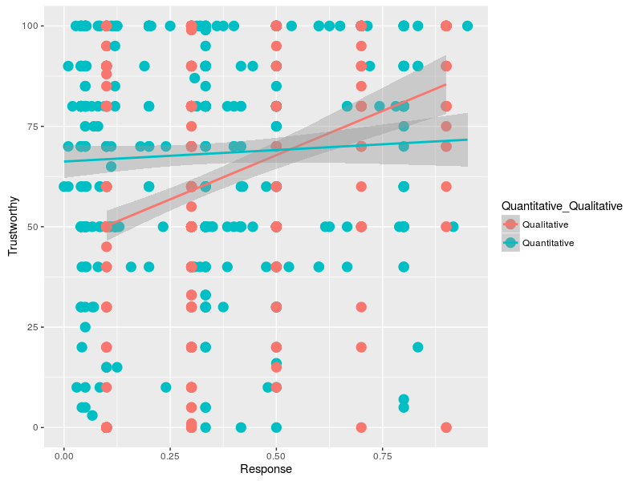

--- 
title: "R - Statistics Manual"
author: "Center for Social and Cognitive Neuroscience - cscn.uai.cl"
date: "`r Sys.Date()`"
site: bookdown::bookdown_site
output: bookdown::gitbook
documentclass: book
bibliography: [book.bib, packages.bib]
biblio-style: apalike
link-citations: yes
github-repo: gorkang/R_Statistics_Manual
description: "Statistics manual from CSCN."
---
<!-- output: github_document  -->

```{r}
# Install ubuntu dependencies
# command_to_execute = "apt-get -y install libgsl0-dev"
# system(command_to_execute, input = rstudioapi::askForPassword("sudo password"))

```

```{r load_packages, message=FALSE, warning=FALSE, include=FALSE}
if (!require('pacman')) install.packages('pacman'); library('pacman')
p_load(p_depends(MBESS)$Imports, character.only = TRUE)
p_load(p_depends(MBESS)$Depends, character.only = TRUE)
p_load(tidyverse, Amelia, psych, MBESS, GPArotation)
```


# Introduction
Welcome to the **CSCN R Statistics manual**. In time, this will become a centralized repository with snippets of code for some of the stuff we do at the [Center for Social and Cognitive Neuroscience - CSCN](http://cscn.uai.cl). Its primary intention is to become an (open) **internal resource** for training, learning and increase our efficiency. As such, **it is bound to be full of inacurate information and horrible bugs**. Use at your own risk, *but do tell us about the horrors you find*. Right now, there are tons of things [TODO].

Suggestions and contributions can be sent to: gorka.navarrete@uai.cl  


## For USERS  
The folder *R - Statistics Manual* can be copied and it *should* work as it is. Just open the *index.html* file in a modern browser.

## For Developers and Statisticians
Please, **do contribute** your code, examples, ideas, criticisms, improvements, simplifications, etc.  

If you want to contribute code: 

* Do your best to follow [Hadley Wickham Style guide](http://adv-r.had.co.nz/Style.html)
* Follow our **Style guide - WIP**
* Use relative links
* Thank you!

##  Contributors
Gorka Navarrete, Nicolas Carvajal-Sanchez, Alvaro Rivera, David Huepe, Roberto Garcia

***

## TODO

**MOVE THE STUFF BELOW THIS TO ITS PLACE!**

### Inferential analysis
Here you will find a number of inferential analysis in alphabetical order, and a table showing which ones would work depending on what kind of IV / DV you have.  
In the analysis' page you (normally) will find both the frequentist and the Bayesian versions.  

#### Which analysis / graficos / tablas / should I use (?)

DV/IV           | Continuous IV   | Categorical IV  | Dichotomous IV | Nominal IV
-------------   | -------------   | -------------   | -------------  | -------------  
Continuous DV   | ...             | ...             | ...            | ... 
Categorical DV  | ...             | ...             | ...            | ... 
Dichotomous DV  | ...             | ^AST^           | ...            | ...
Nominal     DV  | ...             | ^AST^           | ...            | ...

**Analysis**  

Para cada analisis
* Assumptions
* Alternatives if failed assumptions
* How to interpret results
* How to report results

* Association test ^AST^ - [WIP](association-test.html): Comparison of two groups. Continuous DV
* ANOVA [WIP](Estadistica-inferencial.html)

<!-- ## Regression -->
<!-- ### Loess regression -->
<!-- ### Logistic regression -->
<!-- *** -->
<!-- ## SEM -->
<!-- *** -->
<!-- # Bayesian -->
<!-- ## T-test -->
<!-- ## ANOVA -->
<!-- ## Regression -->

***  

**Plots**  

* [Asymmetric beanplot ^ABP^](Visualizar-datos.html#beanplot) 
* [Density plot ^DEP^](Visualizar-datos.html#density-plots)
* [Pirate plot ^PIP^](Visualizar-datos.html#Pirate-Plot)
* [Scatter plot ^SCP^](Visualizar-datos.html#scatterplot)
* [Correlation plot ^COP^](Visualizar-datos.html#correlation-plot)


Plots | 
-------------------------------------- | -------------------------------------- 
 [**Asymmetric beanplots** <BR>Show smothed histograms for an easy comparison between conditions.](Visualizar-datos.html#beanplot)|   [**Pirate plots** <BR>Show all the data points, smothed histogram, mean/median and SD/CI.](Visualizar-datos.html#Pirate-Plot)
 [**Density plot** <BR>Publication ready density plots.](Visualizar-datos.html#density-plots)|  [**Scatter plot** <BR> Scatter plots with confidence interval.](Visualizar-datos.html#scatterplot)
 [**Correlation plot** <BR> Correlatons!](Visualizar-datos.html#correlation-plot) |  [**Scatter plot** <BR> Relationship between 3 variables](Visualizar-datos.html#scatterplot-con-3-variables)


#### Learn more about Data visualization
http://r4ds.had.co.nz/data-visualisation.html


```{r bibliography, include=FALSE}
# automatically create a bib database for R packages
knitr::write_bib(c(
.packages(), 'bookdown', 'knitr', 'rmarkdown'
), 'packages.bib')
```